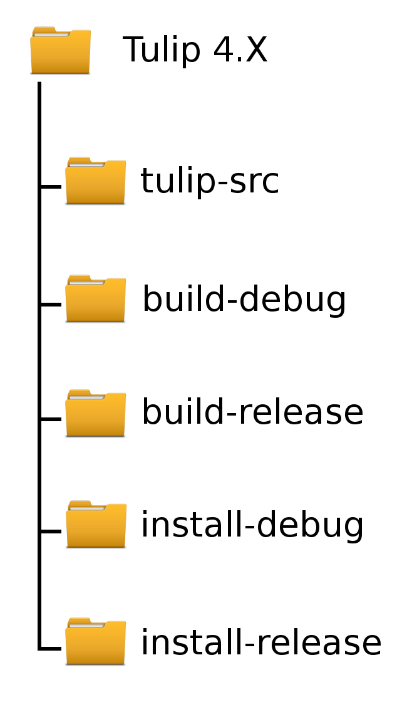
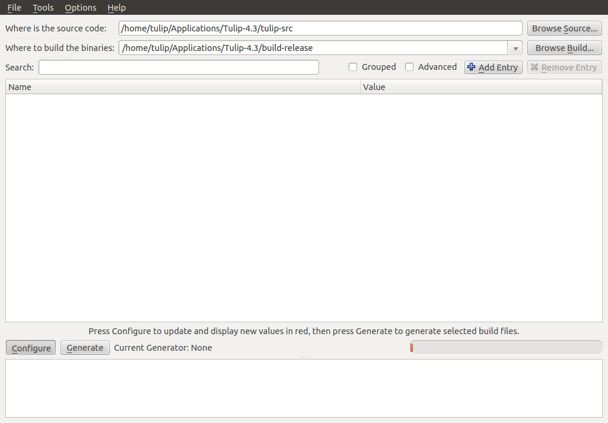
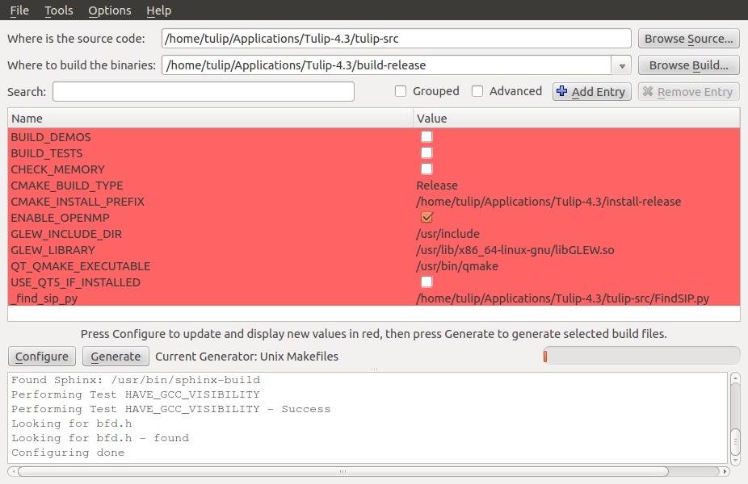

.. _installation:

********************************************
Installation instructions : Ready to compile
********************************************

The classic installation details are specified in the *INSTALL.[linux,mac,win]* files available in the tulip source code root directory. However, if you are reading this tutorial/documentation, you may be interested in using Tulip in a more advanced fashion whether by creating new perspectives, plug-ins or algorithms. The following instructions will help you to prepare your system by installing the Tulip program ready to be compiled and modified to your convenience.

.. _installation_how_to:

How to proceed ?
================

The installation process is not complicated, it can however take some time depending on your computer. Before starting the Tulip set-up, as a developer, you must be aware of some of the Tulip intern behaviours. 

Foreword: Debug and Release mods
--------------------------------

Tulip can be compiled and thus executed in two different modes. The first one, called *Release*, is the classic Tulip execution mode. The application should be executed this way when you are only using the originaly integrated tool of Tulip or the add-ons included with the plug-in library. Most of the user will only be interested of this mod.

Nevertheless, because Tulip is a research tool, the users testing their algorithms or plug-ins may not be sure of their code source reliability. These persons should be more concerned with the second mode available, the *Debug* mode. With it, the whole program will be slightly slower as the execution is monitored with sanity assertions. If an unexpected behaviour happens and one of the assertion detect it, Tulip will pop an error message expliciting the problem encounter. 

These modes must be separated as their behaviour are entirely different. A program instance compiled in *Debug* mod can not be used to launch a *Release* version of Tulip and vice versa. For instance, a few functionalities will need assertions only checked in debug mode to run correctly, some of these cases are presented in the :ref:`Tulip library tutorial section <tulip_library_tutorial>`.

.. _installation_how_to_setup:

Setting up the system
---------------------

If you want to be able to recompile Tulip, you have to organize the different directories which will contain the source code, the libraries and the executables. The disposition we propose here and use in the following steps is just a suggestion. It allows a clear distinction between each directory and their use and gives you the ability to have several working versions of Tulip at the same time on your computer.

First, select the directory in which you want to set the application (you must have the appropriate permissions from the OS) and create here the directory *Tulip-4.X* (where *X* is adapted to the current version number).
Into that folder, create five subdirectories: 

* *tulip-src* : the source files will be kept here
* *build-debug* : where we stock the generated build file (with the mod *Debug*)
* *build-release* : where we stock the generated build file (with the mod *Release*)
* *install-debug* : the program will be installed here (with the mod *Debug*)
* *install-release* : the program will be installed here (with the mod *Release*)

You should obtain a directory hierarchy similar to this one:

.. _installation_linux:

Installation on a UNIX-like OS
==============================

.. _installation_linux_requirements:

Requirements
------------

To compile and run Tulip, you will need the following tools/libraries:

* libqt4-dev
* libfreetype6-dev
* zlib1g-dev
* libglew-dev
* libjpeg-dev
* libpng12-dev
* build-essential
* cmake
* doxygen
* libxml2-dev
* qt4-dev-tools

Plus, one of the following version of the python library:

* python2.5-dev
* python2.6-dev
* python2.7-dev

You will have to use system dedicated package installer (apt-get, yum ...)
to install or update directly all the previously listed packages. This action will modify your current system so you may need administrator or super-user access and rights on the OS.

.. _installation_linux_download:

Download the source code
------------------------

You can obtain the Tulip source code in several ways. The easiest is to pick them directly from the Sourceforge website (by following this `link <http://sourceforge.net/projects/auber/files/tulip/>`_). This method, nevertheless, is not always the best choice. If you want to work actively with Tulip, you will need to keep your project up to date.

The other, slightly more complicated, solution is to use the subversion development repository. This allows you to easily keep your Tulip version up to date. The Unix/Linux based systems should be able to run the `svn tool <http://subversion.apache.org/>`_ with the following commands::

  cd [...]/Tulip-4.X/

  svn checkout svn://svn.code.sf.net/p/auber/code/tulip tulip-src

You can choose the access path and the target dir *tulip-src* according to your preference. Do not forget where the source code is located, you will need the path for completing the compilation and for specifying it to your API.

Once you have import the source code using *svn*, you can easily update it with the commands::

  cd [...]/Tulip-4.X/tulip-src

  svn update

.. _installation_linux_gen_makefiles:

Generate the MakeFiles
----------------------

Tulip uses *cmake* to generate the build instructions. In the following instructions we will use *cmake-gui*, offering a compliant graphic interface, to create the appropriate package files.

You must start by indicating the source code path and the file in which the binaries will be build:

In the example, we are showing the steps for a *Release* type build. The given paths must be modified according to your own preferences.

Then press on the *Configure* button, select the project generator (*Unix Makefiles* by default), use the default compilers or specify new ones and validate. *cmake-gui* will create empty folders in the build directory. We can now specify the installation informations.

The two important fields to fill are the *CMAKE_BUILD_TYPE* and the *CMAKE_INSTALL_PREFIX*. The build type value must be set to *Release* or *Debug* (with capitals) and the install prefix indicates where the program will be installed. We do not want to use the default */user/local/* path as we may wish to exploit different versions of the application. In our case, the install directory will be in *[...]/Tulip-4.3/install-release*.

Click again on the *Configure* button to turn the red colour of the fields off. If this operation failed, ensure you have installed all the needed dependencies, filled appropriatly the fields, then try again.

Press the *Generate* button. If you have correctly set all the values, the two last lines of the prompt should be::

  Configuring done
  Generating done

You can now close *cmake-gui*.
 

.. _installation_linux_use_makefiles:

Use the Makefiles
-----------------

Compile the packages
~~~~~~~~~~~~~~~~~~~~

With the makefiles generated, we just have to execute them. Using your terminal, go into your build directory and use the command::

  make -jY

where Y is not greater than the number of cores on your processor.

This operation can take several minutes, so here comes the time for a well deserved break!

Install the packages
~~~~~~~~~~~~~~~~~~~~

Once the make instruction is finished, you can install Tulip by using the command::

  make install

This operation can take a little time too. At the end, your installation path specified to *cmake-gui* will contained the binaries and the libraries of the application. You can now launch Tulip in its *Release* version by using the commands::

  cd [...]/Tulip-4.3

  install-release/bin/tulip

You now just have to repeat the previously detailed steps while specifying to the appropriate fields the value *debug* instead of *release* to achieve the second build configuration.

.. _installation_win:

Installation on a Windows system
================================

.. _installation_win_requirements:

Requirements
------------

You will need to download the following packages in order to compile Tulip.

For a 64-bits build :
~~~~~~~~~~~~~~~~~~~~~

* the **MinGW64** toolchain from the mingw-builds project (`MinGW-x64-4.8.1 <http://sourceforge.net/projects/mingwbuilds/files/host-windows/releases/4.8.1/64-bit/threads-posix/seh/x64-4.8.1-release-posix-seh-rev1.7z/download>`_)

* the precompiled **Qt 4.8.5** binaries from the mingw-builds project (`MinGW-x64-Qt-4.8.5 <http://sourceforge.net/projects/mingwbuilds/files/external-binary-packages/Qt-Builds/x64-Qt-4.8.5%2Bqtcreator-2.8.0-RC-%28gcc-4.8.1-seh-rev1%29.7z/download>`_)

* **Python** for 64 bits windows: either version `2.7-x64 <http://python.org/ftp/python/2.7.5/python-2.7.5.amd64.msi>`_ or `3.3-x64 <http://python.org/ftp/python/3.3.2/python-3.3.2.amd64.msi>`_.

For a 32-bits build :
~~~~~~~~~~~~~~~~~~~~~

* the **MinGW32** toolchain from the mingw-builds project (`MinGW-x32-4.8.1 <http://sourceforge.net/projects/mingwbuilds/files/host-windows/releases/4.8.1/32-bit/threads-posix/dwarf/x32-4.8.1-release-posix-dwarf-rev1.7z/download>`_)

* the precompiled **Qt 4.8.5** binaries from the mingw-builds project (`MinGW-x32-Qt-4.8.5 <http://sourceforge.net/projects/mingwbuilds/files/external-binary-packages/Qt-Builds/x32-Qt-4.8.5%2Bqtcreator-2.8.0-RC-%28gcc-4.8.1-dwarf-rev1%29.7z/download>`_)

* **Python** for 32 bits windows : either version `2.7-x32 <http://python.org/ftp/python/2.7.5/python-2.7.5.msi>`_ or `3.3-x32 <http://python.org/ftp/python/3.3.2/python-3.3.2.msi>`_

For both builds :
~~~~~~~~~~~~~~~~~

* the **MSYS** shell from the mingw-builds project (`MinGW-Msys <http://sourceforge.net/projects/mingwbuilds/files/external-binary-packages/msys%2B7za%2Bwget%2Bsvn%2Bgit%2Bmercurial%2Bcvs-rev13.7z/download>`_)

* **CMake** (`CMake-2.8.12 <http://www.cmake.org/files/v2.8/cmake-2.8.12-win32-x86.exe>`_)

* **GLEW** (`Glew-1.10.0 <https://sourceforge.net/projects/glew/files/glew/1.10.0/glew-1.10.0.zip/download>`_)

* the **NSIS**, for Nullsoft Scriptable Install System (`NSIS 2.46 <http://prdownloads.sourceforge.net/nsis/nsis-2.46-setup.exe?download>`_)  

.. _installation_win_setup_env:

Setting up the build environment
--------------------------------

The installation described on this page can be run on both 32 and 64-bits systems. In order to simplify the documentation, the steps will be explained using an x64 architecture by default. If you are completing this installation on a 32-bits operating system, please change the *64* value in the proposed paths with *32*.

First install **Python**, **CMake** and **NSIS** (use default options). For the last one, you will need to add its root directory to the *PATH* environment variable. This can be achieved in the *System Properties*, tab *Advanced System Parameters*. You will need to click on the *Environment Variables* button and create or modify the user variable named *PATH* by adding the value ::

  C:\Program FIles (x86)\NSIS

in it (if you have used the default installation path).

MinGW
~~~~~

Extract the **MinGW** toolchain to ::

  C:\mingw64 

Open the **Qt4** archive and extract the content of the *ported64* directory to ::

  C:\mingw64 

It provides some precompiled dependencies Tulip needs (zlib, freetype).

Qt4
~~~

Extract then the directory *Qt64-4.8.5* (resp. *Qt32-4.8.5*) from it to your directory of choice, for instance ::

  C:\Qt

Then, create a file named *qt.conf* to ::

  C:\Qt\Qt64-4.8.5

with the following content ::

  [Paths]
  Prefix = ../

It is needed by CMake to correctly setup the Tulip build.

Before proceeding, launch the script to reset the Qt path to its actual one.

Msys
~~~~

Extract the content of the **Msys** archive to ::

  C:\mingw64 

Edit or create the file ::

  C:\mingw64\msys\etc\fstab 

and set its contents to ::

  C:/mingw64 /mingw

It is needed by CMake to find the compilers.

To launch the MSYS shell easily, we will create a new shortcut. Its target will be::

  C:\mingw64\msys\msys.bat --mintty 

The option enables the use of MinTTY, an alternative to *rxvt*. Move the shortcut to a location where it will be easily accessible (on the desktop, in the taskbar or in the start menu) and run it.

Glew
~~~~

Extract the **Glew** archive to your directory of choice (for instance *C:/*). 
With a MSYS shell launch from the previously created shortcut, navigate to the Glew folder through the command ::

  cd /c/glew-1.10.0
  
Then compile GLEW by simply entering the command ::

  make
  
Once GLEW compiled, copy the *include* and *lib* directories to ::

  C:\mingw64

Everything is now set up to build Tulip.

.. _installation_win_prepare:

Preparing the build
-------------------

Importing the Tulip source code
~~~~~~~~~~~~~~~~~~~~~~~~~~~~~~~

If you have followed the recommandations given at the :ref:`top of this page <installation_how_to_setup>`, you should have created somewhere a directory called *Tulip-4.X* in which you can find the folder *tulip-src*.

To import the Tulip source into it, you can either get a release tarball or checkout the subversion repository with `svn <http://subversion.apache.org/>`_. The *Msys* shell can provide such tool or you may try a solution with a graphic interface, like `Tortoise SVN <http://tortoisesvn.net/>`_.

With the MSYS shell, use the command ::

  cd /c/[...]/Tulip-4.X

to navigate to the designated folder and get the Tulip files with the instruction ::

  svn checkout svn://svn.code.sf.net/p/auber/code/tulip tulip-src

With *Tortoise SVN*, after a right click on *tulip-src*, select the action *SVN Checkout* a specify the checkout repository with the address ::

  svn://svn.code.sf.net/p/auber/code/tulip

CMake and the build options
~~~~~~~~~~~~~~~~~~~~~~~~~~~

As explained previously, Tulip can be build using two different modes: *Release* and *Debug*. In the current demonstration, we will use the *Release* profile. If you want to use the other one, just adapt the appropriate fields by remplacing the term *Release* with *Debug*.

With the *Msys* shell, enter the *build-release* folder ::

  cd /c/[...]/Tulip-4.X/build-release

and launch the following command ::

  cmake-gui ../tulip-src

You can also run *CMake-gui* with its executable (in *C:\\Program Files (x86)\\CMake 2.8*). You will, however, need to specify the source and build directories.  

Once the CMake GUI appear click on *Configure* and then select "MinGW Makefiles" generator.

CMake will then display an error message. If you have run CMake through the *Msys* shell, just reclick on *Configure*, otherwise, if you have run the executable directly, you will need to specify the filepath to the *make* tool::

  CMAKE_MAKE_PROGRAM = C:/mingw64/bin/mingw32-make.exe

then click again on *Configure*.

CMake will once more display an error message. This time, it did not find Qt4. Just fill the CMake variable *QT_QMAKE_EXECUTABLE* with the path to qmake.exe ::

  QT_QMAKE_EXECUTABLE = C:/Qt/Qt64-4.8.5/bin/qmake.exe

Relaunch CMake configuration. You will then have to specify the following CMake variables (check "Grouped" and "Advanced" if you don't see them)::

  FREETYPE_INCLUDE_DIR_freetype2 = C:/mingw64/include/freetype2
  FREETYPE_INCLUDE_DIR_ft2build = C:/mingw64/include/
  FREETYPE_LIBRARY = C:/mingw64/bin/libfreetype-6.dll

  ZLIB_INCLUDE_DIR = C:/mingw64/include/
  ZLIB_LIBRARY = C:/mingw64/bin/zlib1.dll

  GLEW_INCLUDE_DIR = C:/mingw64/include/
  GLEW_LIBRARY = C:/mingw64/lib/glew32.dll

You can use the *Add entry* button to add them, CMake will automatically merge variables using the same name (the * *_LIBRARY* are of type *FILEPATH* and the others are of type *PATH*).

Python should be automatically found, nevertheless, if you are using a *64-bits* OS, you will have to replace the content of the variable *PYTHON_LIBRARY* by the path of the *dll* corresponding to the Python version used. If you have installed the 2.7, set it to::

  PYTHON_LIBRARY = C:/Windows/System32/python27.dll

and if you are using the 3.3, change it to::

  PYTHON_LIBRARY = C:/Windows/System32/python33.dll

Finish the CMake configuration by setting::

  CMAKE_BUILD_TYPE = Release

and by changing the variable *CMAKE_INSTALL_PREFIX* to your installation directory of choice, for instance::

  CMAKE_INSTALL_PREFIX = C:/[...]/Tulip-4.X/install-release

The default value is incorrect as you can not write in *C:\\Program Files (x86)\\tulip* without admin privileges. Finally, add a new CMake variable (click on *Add Entry* for that) of type *PATH* ::

  CMAKE_LIBRARY_PATH = C:/mingw64/bin;C:/mingw64/lib

Relaunch one last time the CMake configuration, everything should be alright now (except the Python documentation generation but it is not critical, you will need to install the Sphinx Python module in order to generate it).

Click on *Generate* to produce the Makefiles and exit the CMake GUI.

.. _installation_win_build:

Building Tulip
--------------

To build the Tulip software, return in the MSYS shell and, from the build directory, just enter the command ::

  mingw32-make.exe

You can use parallel build to speed things up by adding the *-jX* option (set *X* to your number of processors).

.. _installation_win_install:

Installing Tulip
----------------

Once Tulip is fully compiled, enter the following command to install it ::

  mingw32-make.exe install

Once it is finished, you can run the executable ::

  tulip.exe

located in the bin folder of the Tulip installation directory to launch the software.

