.. _installation_win:

********************************
Installation on a Windows system
********************************

This tutorial aims to provide a short and straightforward explanation for windows developers to get a valid Tulip development environment on Windows operating systems.

Operations described in this document have been tested on several versions of Windows, both 32 and 64 bits. If you encounter any problem while following this tutorial, feel free to post on our forums to ask for help.

All tools listed in this tutorial are free and will not require any registration or subscription.

Why should I build Tulip instead of using the precompiled versions available on your website ?
When developing along with Tulip, you might want to get on our latest updates before they are released on our website.

If you want to create your own plugins for Tulip on Windows, you will have to set-up a the same building environment as we use to build our Tulip releases. The part I to V will help you setting up an environment which contains the same versions of external libraries we use to build Tulip. This will ensure a perfect compatiblity between your libraries and the Tulip environment. So you may skip the part VI and VII of this tutorial if you only want to create plugins for a pre-compiled version of Tulip.

Note: When using Tulip, you can extend its features by downloading plugins directly from the main window (Help > Plugins). Those plugins are built for a specific version (ie. the latest ones are for Tulip 3.4.1). When you compile Tulip from our SVN (see the Tortoise SVN chapter), your Tulip will not be compatible with pre-compiled plugins available on the plugin server. The source code of those plugins is currently not available on our website but we will soon release it on our SourceForge page.

CHANGELOG :

2010-12-16 :
* Rewrited some parts of the tutorial to simplify operations
* Provided a ZIP archive containing external libraries needed to build Tulip in a single package
* Added srceenshots
* Added an External tools part containing additional informations about IDE and external tools setup

2010-10-01 :
* First version of this tutorial.

Note :  This tutorial is divided between different sections, each one describes a part of the installation. At the end of every section, we will summarize what you should be able to do at this point of the tutorial. This should ensure that every section is fairly independent. However, operations in a same section are dependent and should be strictly followed in the same order.

Installing Qt
=============

The first thing you should do is getting the Qt framework for Windows. Qt is an open-source framework written in C/C++ available on several plateforms (Linux, Windows, Mac OS…)

On Windows plateforms, Qt is built along with MinGW. MinGW provides GNU libraries and compiler on Windows. Even if Tulip can be build with native Windows compilers, this tutorial will only describe how to build Tulip with MinGW.

Download Qt framework `here <http://qt-project.org/downloads>`_. You will get a setup file called qt-windows-opensource-*version*-mingw48_opengl-x86-offline.exe sdk-win-opensource-YYYY-MM.exe

Run the setup and follow the instructions. Note the path were you installed Qt (usually C:\\Qt\\YYYY.MM\\)

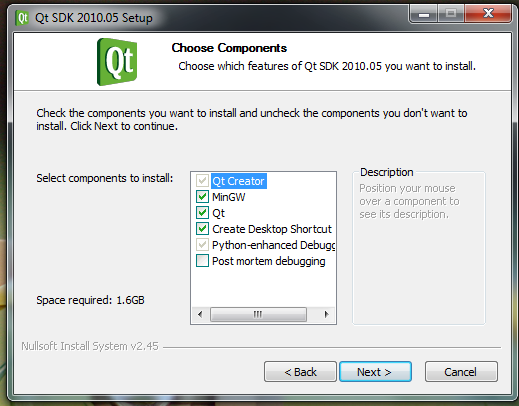

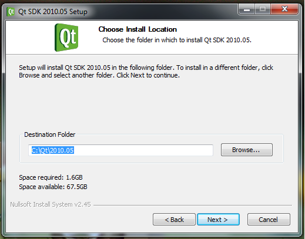

Installing CMake
================

CMake is an opensource, cross-plateform tool that manages the build process in an operating system and in a compiler-independent manner. Tulip was originally built using autotools. But support for those is to be removed in the future versions so any new project should be built using CMake.

You can download CMake for Windows trough this `page <http://www.cmake.org/cmake/resources/software.html>`_.

Download the Windows (WIN32 installer). You will get a file called cmake-version-win32-x86.exe. Run it and follow the installation process. Be sure to select Add CMake to the system PATH option.

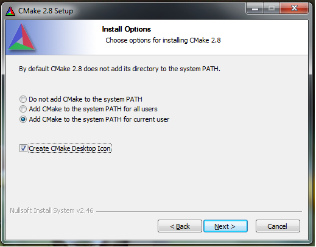

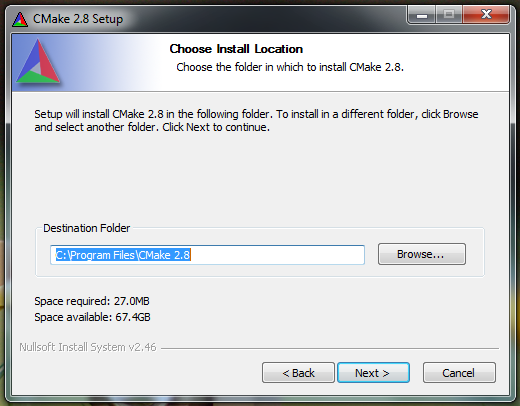

You should now have a valid install of CMake and be able to run the cmake-gui utility from its icon in the start menu.

Installing MSYS
===============

MSYS is a collection of GNU utilities such as bash, make, gawk, to provide an UNIX-like development environment on Windows plateform.

MSYS can be download `on this page <http://www.mingw.org/wiki/msys>`_ There should be a link called MSYS version directing on a SourceForge page. You’ll get a MSYS-version.exe file.

Run it and follow the installation process.

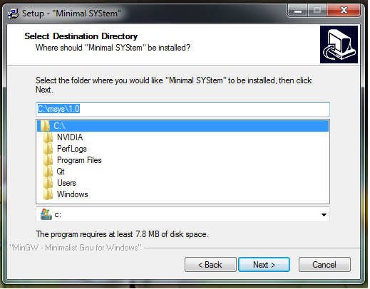

Note the MSYS installation path. We will later refer to it as %MSYS_DIR%

After installation of files, you will see a command prompt asking if you want to follow the post-install process. Answer y.

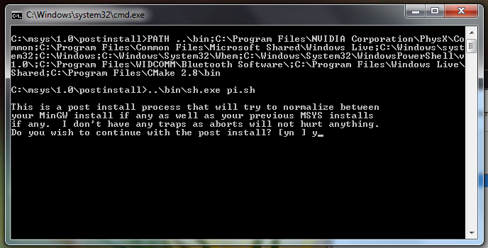

Then answer y when you are asked if MinGW is installed

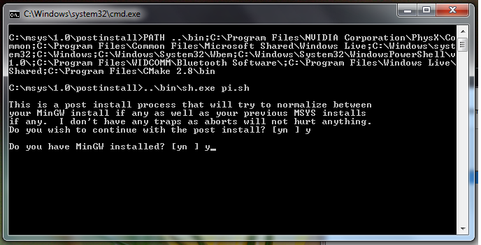

When asked for the mingw installation directory, input %MINGW_DIR% in the format described by the installer

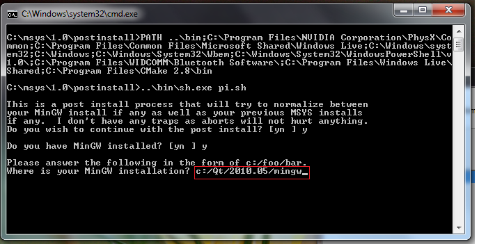

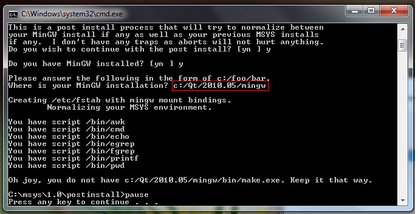

You should now have a valid MSYS installation on your system. You can run MSYS shell from the start menu by selecting MSYS (rvxt). The standard MSYS does not seem to correctly handle stdio and you may have problem with your cout when running your application.

Download and install external libraries
=======================================

Tulip uses several external libraries that you’ll need when compiling. Those libraries are available in a single ZIP archive provided with this tutorial through this :download:`link <_documents/Tulip35_extlibs.zip>`.

Download the ZIP file, you will get a tulip_external_libs.zip archive. Right click it and select the Extract All… option. Select the %MINGW_DIR% as folder for file extraction :

.. image:: _images/install_win_ext_zip.png

Select Yes when asked to replace existing directories.

.. image:: _images/install_win_ext_replace.png

You should now have a patched MinGW containing external libraries used by Tulip and able to compile with OpenMP.

Setting up environment variables
================================

At this point, you should have Qt, Mingw and MSYS installed on your computer. As we said, we will referer to those installation paths like this :

* %QT_DIR% : Folder where you installed Qt.
* %MINGW_DIR% : Folder where MinGW is located (%QT_DIR%\mingw).
* %MSYS_DIR% : Folder where you installed MSYS.

First, wee need to open environment variables configuration window :

Open the Control Panel from the Start panel, click on System and Security, then click on System. A window should popup.  Click on Advanced system settings on your left

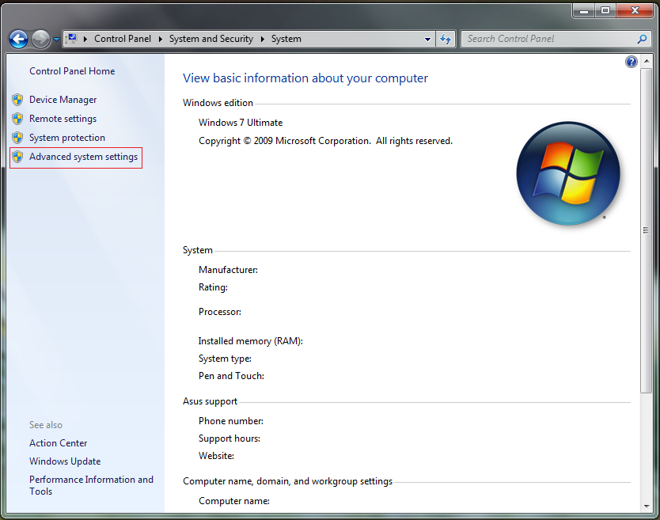

A new window should come up, select the Advanced tab then click on the Environment variables button.

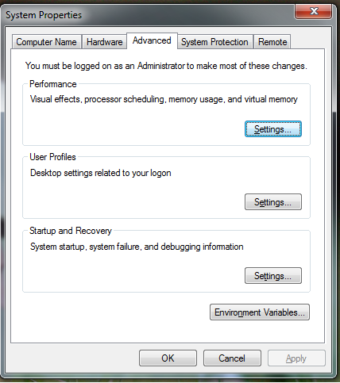

You will finally see the environment variables configuration panel.

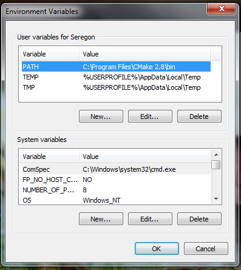

Note : in the following operations, we will setup a configuration for the current user only. If you have sufficient administrative rights and want to setup a system-wide configuration, edit the environment variables in the System variables section instead of the User variables.

When compiling Tulip, CMake will try to find automatically the required external libraries and headers by looking in the default system paths and in some environment variables. Two of those variables are CMAKE_INCLUDE_PATH and CMAKE_LIBRARY_PATH

Click on the New button

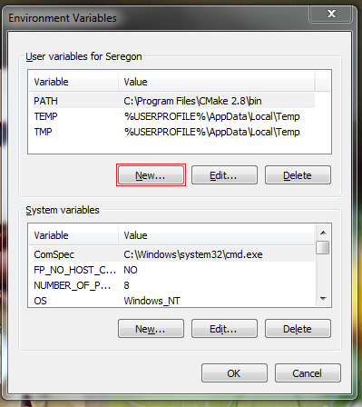

A window will popup :
* In the Variable name, set CMAKE_INCLUDE_PATH
* In the Variable value, set %MINGW_DIR%\include

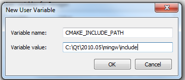

Then click Ok.

Click on the New button :
* In the Variable name, set CMAKE_LIBRARY_PATH
* In the Variable value, set %MINGW_DIR%\bin

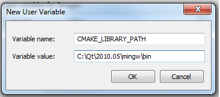

We will now edit the Path variable to provide an easy access to mingw binaries inside MSYS.
Look into the list of User variables list for the Path variable. Select it and click on the Edit button.

.. image:: _images/install_win_env_system_variables_edit.png

Note : If no such variable exist, just click on the New button and set PATH in the Variable name box.

The PATH variable contains several paths, separated by the ; character. You will have to add the following values to your PATH environment variable :

* %MINGW_DIR%\bin
* %MSYS_DIR%\bin
* %QT_DIR%\qt\bin

So, if you already add something in your PATH variable, it should look like this::

  <Original PATH value>;%MINGW_DIR%\bin ;%MSYS_DIR%\bin ;%QT_DIR%\qt\bin

If PATH was previously empty, it should look like this::

  %MINGW_DIR%\bin ;%MSYS_DIR%\bin ;%QT_DIR%\qt\bin

Then click OK.

Click OK to close System environment variable configuration panel, then OK to close System settings and finally close your Control Panel.
We’re almost there ! You should now have a valid system configuration. You can check your PATH settings by opening a command prompt (Start Menu > All programs > Accessories > Command prompt) and try the following commands :
. mingw32-make –version : Check your MINGW settings.
. make –version : Check your MSYS settings.
. qmake –version : Check your Qt settings.

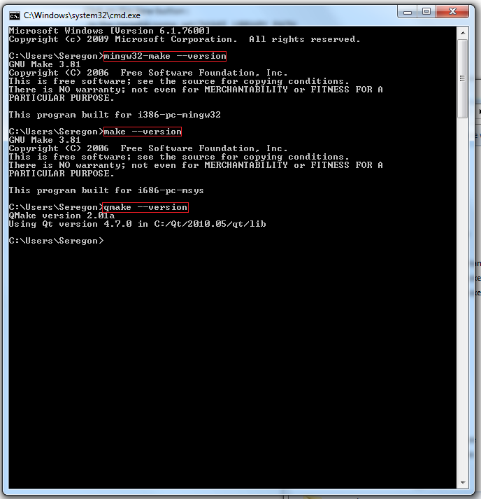

If you get a ‘…..’ is not recognized as an internal or external command error for any of those commands, it means that the corresponding configuration is invalid. Check that the path you set in your PATH environment is valid and try again.
You are now ready to compile Tulip.

Downloading Tulip sources
=========================

CMake build for Tulip on windows is only valid from version 3.5 and higher. You can download sources archive on our website or retrieve Tulip from SVN (see Tortoise SVN section).
Download Tulip sources archives here : http://sourceforge.net/projects/auber/files/tulip/

Select your Tulip version (>= 3.5.0), then download the corresponding tar.bz2 source archive.
Warning : On Windows plateforms, you will need a special tool (like 7zip) to extract the content of this archive.
Extract the content of the archive to a directory of your choice.
You now have Tulip sources along with a valid build environment on your computer. You’re ready to compile Tulip.

Compiling Tulip in release and debug mode
=========================================

When building with CMake, you need to specify several parameters :
* The source directory : The folder containing Tulip source files.
* The build directory : CMake keeps objects (.obj) and all other files generated at compilation time in a separate folder in order to keep the source directory clean. This can be any folder on your file system.
* The installation directory : The folder where files will be installed when running the make install command.
* The build type : Which can have several values. The most common are Release and Debug. Those values have a direct influence on Tulip generated binaries and software performance.

The Debug mode provides gcc debugger symbols (-g) and allows debugging with GDB. It also includes a lot of extra verification when using Tulip data structures. When compiling your code in Debug mode, the NDEBUG variable is unset, allowing you to add code that will only be executed in debug mode::

  int f() {
    std ::cout << ‘’This message will always be displayed’’ << std ::endl ;
  #ifndef NDEBUG
    std ::cout << ‘’This message will only be displayed in Debug mode’’ << std ::endl
  #endif /* NDEBUG */
  }

The Release mode disable extra debug operations and removes debugging symbols. Allowing Tulip to run much faster but removing almost every verification on the data structure.
Note : Unfortunately, there is currently no way to run Tulip in ‘’pure’’ Debug mode. When you select Debug mode in CMake, it will automatically select debug version of its libraries. Causing critical bugs when running Tulip. At the end of this section, you will see how to tweak your CMake configuration in order to generate a debug version of Tulip while using the Qt release libraries.

Run the cmake-gui utility from your start menu :
  1. Input the source code location
  2. Input thebuild folder location.
  3. Click on Configure

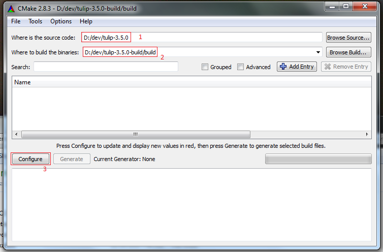

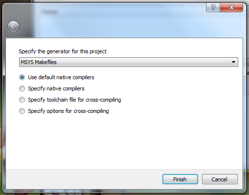

Note: If you are not sure how you can organize your development folders, you can follow this scheme :
Development : The root directory ::

  |__tulip-sources : Contains the source files
  |__tulip-build
       |__release : Tulip Release mode folder
       |     |__build : Where you will ask to put the build files
       |     |__install : Where you will ask to install Tulip
       |__debug : Tulip Debug mode folder
              |__build : Where you will ask to put the build files
              |__install : Where you will ask to install Tulip

After you clicked on Configure, CMake will process for some time then popup an error message::

  Error in configuration process : project files may be invalid.

Click OK. You will be asked to fill several values in the CMake variables below :

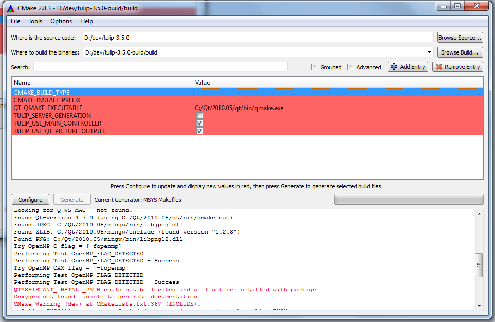

* In CMAKE_BUILD_TYPE, input Release (we will see how to build In Debug mode at the end of this section)
* In CMAKE_INSTALL_PREFIX, input the folder where you want to install files after running the make install command.
* Leave QT_QMAKE_EXECUTABLE and other values as they are.

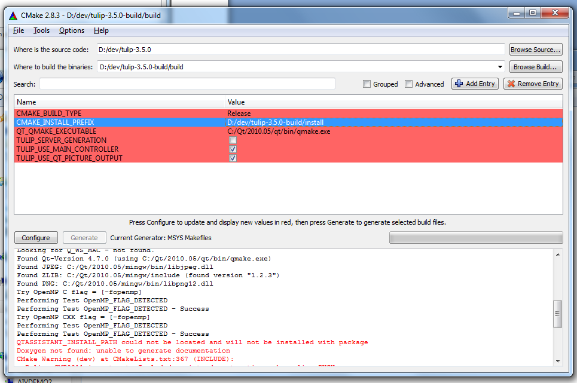

Once again, click on Configure.

The Generate button will then become available, click it and wait for the Generating done message below.
You can now close CMake.

Time to build Tulip. Open MSYS (rvxt) from your Start Menu and cd to the directory where you choosed to put build files.

Note : MSYS is a UNIX shell environment emulator. You can then use any of the usual shell commands (like ls, cat, etc) or even execute bash scripts. File path are also similar to a UNIX system. So the Windows C:\Windows will become /c/Windows in MSYS.

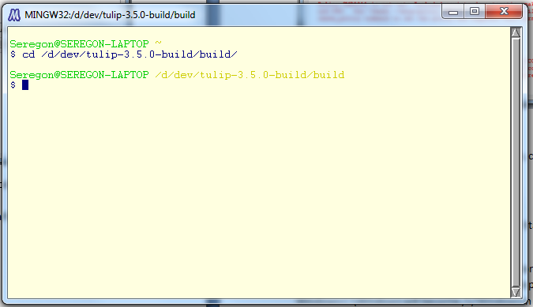

If you run the ls command, you will see several files generated by CMake. Along with a Makelist file. You can then type make to start compiling as you would normally do on UNIX.

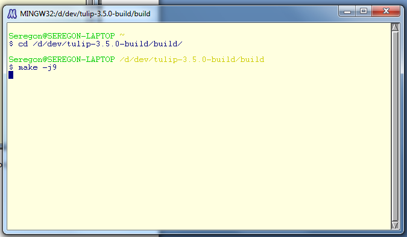

You will notice that compilation output format is slightly different than with a classical Makefile or with autotools. CMake adds extra output to provide information about advancement in compilation stage.

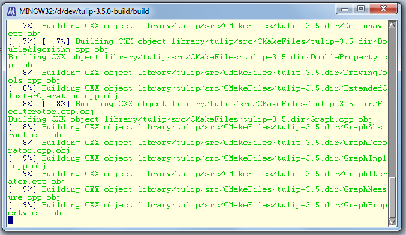

UNIX users will notice that compilation on Windows is pretty much slower than UNIX. It seems to come from the disk access gcc has to do to read source files and write objects.
Tulip compilation can be rather slow, depending of the number of processors you have, so time to get some coffee and come back when it’s all done
When your finished, run the usual make install command.

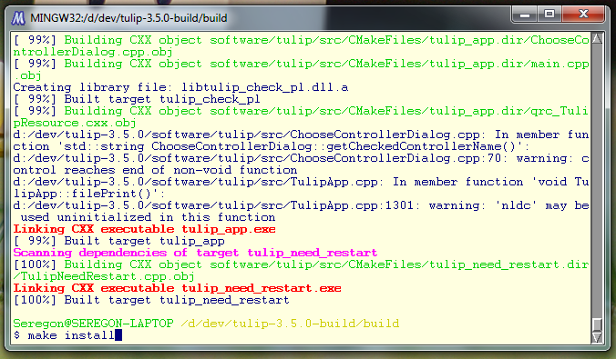

Tulip binaries, include files and libraries will be installed in the directory you specified at CMake configuration stage. You can now open this folder, go into the bin directory and run tulip.exe

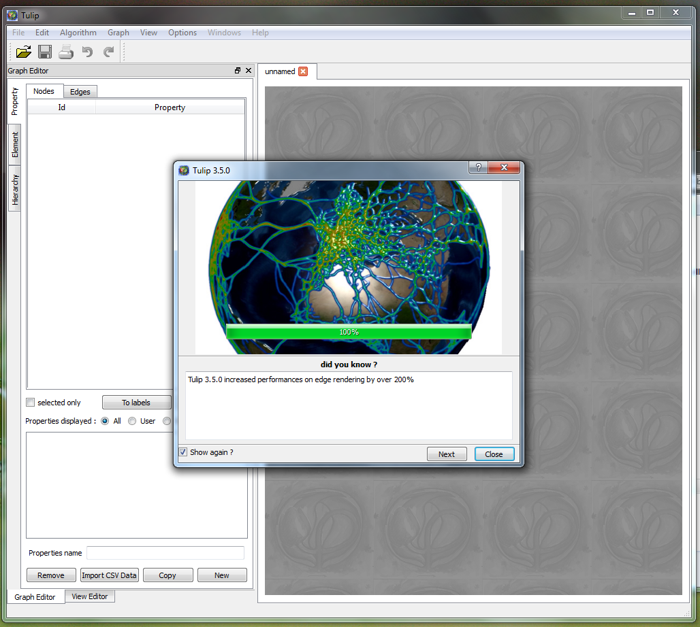

Note on Debug build: If you want to build in Tulip in Debug mode, you’ll have to follow those extra steps :
Run the cmake-gui utility and specify the build, source and install folder (as we previously explained).
Leave Release as build type, then check the Advanced box:

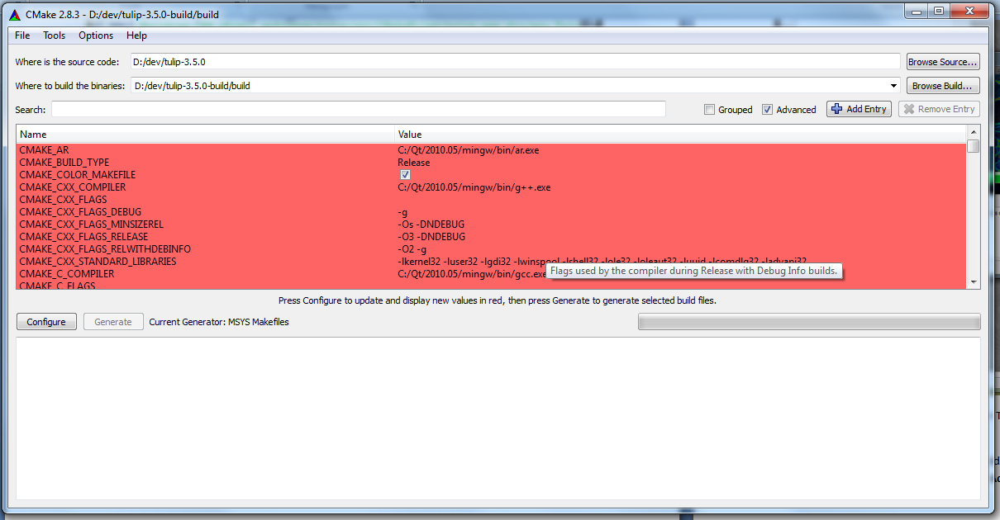

In the Search box, type the following : CXX_FLAGS
You will see several variables containing compiler flags. Modify the CMAKE_CXX_FLAGS_RELEASE variable:

* Erase everything in the value box
* Put –g instead

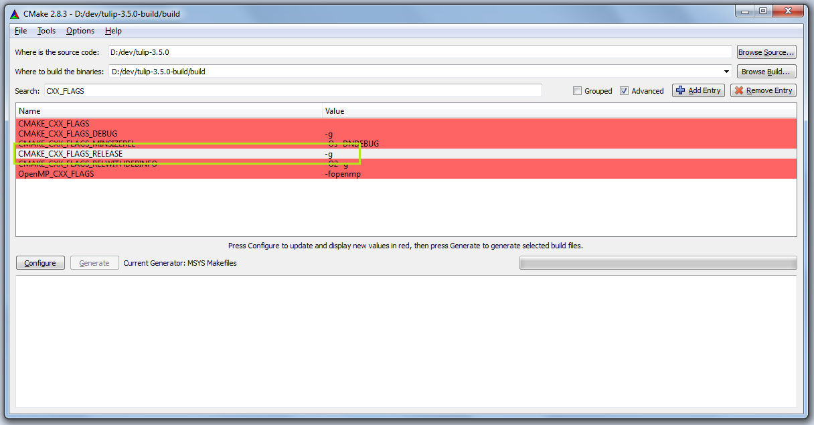

This will build a version of Tulip with debugger symbols. Click on configure, then Generate. And build Tulip as we previously explained.
Congratulations ! You now have a valid installation of Tulip in Debug and Release mode on your computer, you now have a base setup to start developing and packaging your own plugins. The rest of this tutorial will cover the use of some external tools that can help you while developing along with Tulip.

Specifications if you are willing to use VS
===========================================

Please keep in mind Visual Studio support is very young, and you may encounter some difficulties.

Please report them to us so we can ease compilation for everyone :)

The Visual Studio compilation is pretty easy, once you have your environment set up.

Setting up the environement
---------------------------

First, you will need Qt and CMake.

If you are using Visual Studio 2008, you can just use the version distributed by nokia.

However, if you want to use VS2010, you will need to compile Qt yourself, or use this version I compiled myself for you.

 

All the other dependencies of Tulip can be found in the SDK.

The Visual Studio 2010 SDK can be found at the bottom of this page, while the Visual Studio 2008 SDK can be found here.

Extract the SDK to the location of your choice, and you have set up your environment.

Generating Visual Studio Project Files
--------------------------------------

To generate Visual Studio Solutions, you need to run CMake on the Tulip source root directory, and select any directory as build output (CMake conventions point to a directory named 'build' placed at the project root).

Add the following variables:

CMAKE_LIBRARY_PATH, pointing to the /bin and /lib folders of the SDK (separated by semi colons ";")

CMAKE_INCLUDE_PATH, pointing to the /include folder of the SDK.

Now, run 'configure'.

Cmake will prompt you for the compilers, tell him to use you version of Visual Studio (2008 and 2010 are the only supported versions at this time), and continue.

Once this is finished, run 'generate', and CMake will create .sln files for you to use with VS2010.

 You can open these solutions within Visual Studio and compile as you would any other project.

Be aware that modifying any CMakeLists.txt will cause CMake to re-generate the solution and projects, and Visual Studio will ask you to reload every modified project (Tulip is decomposed into 103 project).

This applies when you update the source, so try and close the solution, re-run cmake, and re-open the solution.

