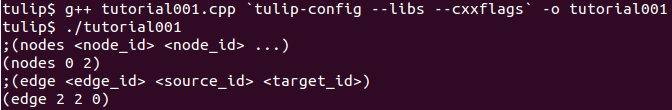
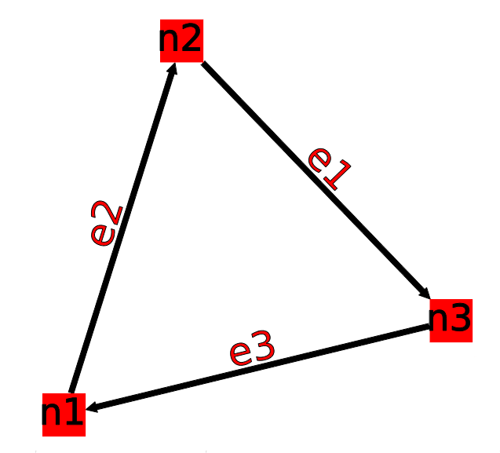
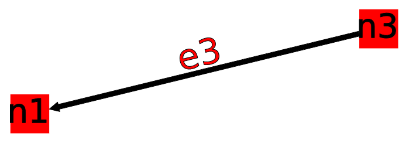
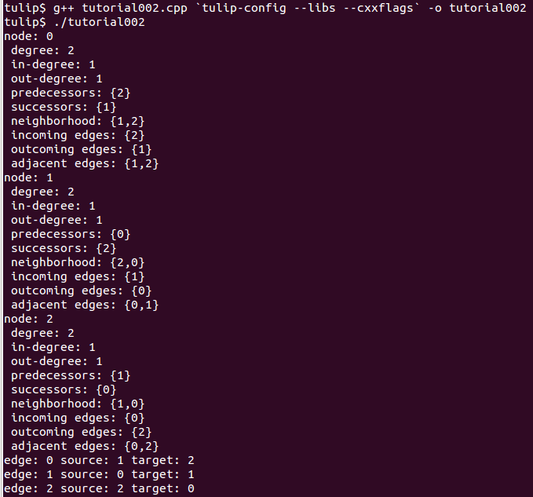
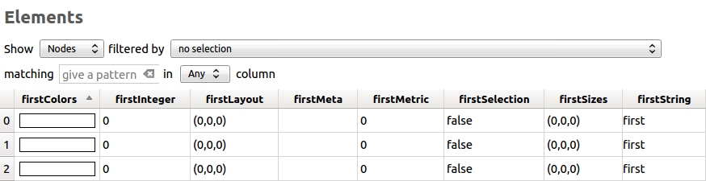
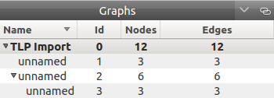
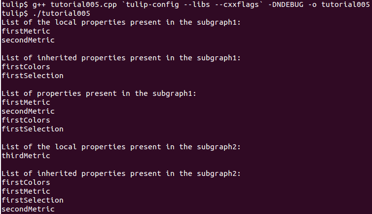
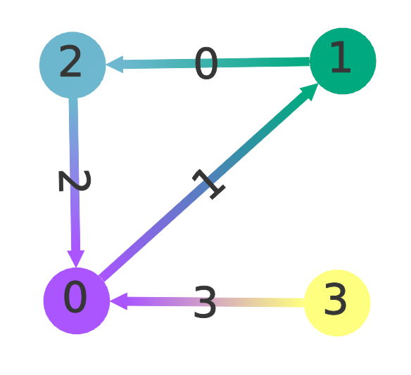
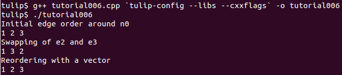

.. _tulip_library_tutorial:

*******************************
Starting with the Tulip library
*******************************

Before doing any of the tutorials please read the following warnings :

* Follow the tutorials, one by one, from the first one to the last one.
	
* you can find at the end of each tutorial, the integral source code that we used.
	
* If you want more details on a specific function or class please read the `Tulip API documentation <http://tulip.labri.fr/Documentation/4_4/doxygen/>`_. 

Tutorial compilation instructions
=================================

The present tutorials are only here to help you familiarize with the Tulip tool while using some of the classic graph manipulation operations. To compile the tutorial files, you will first need a C++ compiler (see the minimal compatible versions in the *INSTALL.[linux, mac, win]* file).

The second needed element is the *tulip-config* file. If you have followed the standard installation procedures, such file should exists in the directory ::

  /usr/local/bin

along with *tulip* and *tulip_perspective*.
If you have, however, followed the customized installation procedures, the files should be in the directory ::

  [...]/Tulip-4.3/install-[debug,release]/bin/*

You can either add this folder address to the path or specify the whole address in the compilation command line.

This command will be formed as ::

  g++ [name of your file].cpp `[whole path to]tulip-config --libs --cxxflags` -o [name of your executable]

.. _tulip_library_tutorial_001:

TUTORIAL 001 : Graphs creation, adding and deleting nodes or edges.
===================================================================

In this first tutorial, we will show you how to create a graph, add three nodes and three edges, remove an edge and a node, and finally, print the result on the standard output.

.. _code-examples-graphs-headfile:

1. Header files
---------------

Let's start with the files we need to include ::

  #include <iostream>
  #include <tulip/TlpTools.h>
  #include <tulip/Graph.h

* *iostream :* This "file" contains the C++ standard declarations for input and output streams. We need it in this tutorial to print the final graph on the standard output.
        	
* *tulip/TlpTools.h :* This file gives access to the standard tools for Tulip.
        	
* *tulip/Graph.h :* This file is the core of the tulip graph API. It provides declarations for graphs (edges, nodes) and functions to load one from a file, to save one, and a lot more. You can find a list in the Tulip Graph library `documentation <../../doxygen/tulip-lib/Graph_8h.html>`_.
        	
The namespaces usage declarations, so that we can omit namespace prefix. ::

  using namespace std;
  using namespace tlp;

.. _code-examples-graphs-import:

2. Initialization of the Tulip library
-------------------------------------------

Before starting using the Tulip functions, we must first initialize the Tulip library with *initTulipLib()*. ::

  int main() {
    //initialize the Tulip lib
    initTulipLib();

.. _code-examples-graphs-create:

3. Creation of a Graph
----------------------

We then proceed by creating an empty graph with the function *Graph * tlp::newGraph( )*. This function returns a pointer on a empty Graph. ::

  //create an empty graph
  Graph *graph = newGraph();

.. _code-examples-graphs-addnodes:

4. Add nodes
------------

In the following, we are adding three nodes with the member function *node Graph::addNode ()* that will create an instance of a 'node', add it to the graph, and return it.

Using this function, the node is also added in all the graph ancestors (if any) to maintain the subgraph relation between graphs. ::

  //add three nodes
  node n1 = graph->addNode();
  node n2 = graph->addNode();
  node n3 = graph->addNode();

.. _code-examples-graphs-addedges:

5. Add edges
------------

Now that nodes are created, we can create the edges. To do so, we can use the function *edge Graph::addEdge  ( const node, const node )* that will add a new edge in the graph and return it.

The edge is also added in all the ancestors of the graph (if any) to maintain the subgraph relation between graphs.

The first parameter is the "source node", and, of course, the second is the "target node" (in tulip, every edge are directed but you can choose to not consider the direction). We will see later (TUTORIAL 005) that the edges enumeration order is the one in which they are added. ::
  	
  //add three edges
  edge e1 = graph->addEdge(n2,n3);
  edge e2 = graph->addEdge(n1,n2);
  edge e3 = graph->addEdge(n3,n1);

Following is a picture of the graph that we just have created. It is being displayed with Tulip.

.. _code-examples-graphs-delEdgeNode:

6. Delete an edge and a node
----------------------------
  	
The Graph class provides member functions to delete edges and nodes.

* *void tlp::Graph::delEdge (const edge, bool deleteInAncestorGraphs = false)* :
  delete an edge of the graph. This edge is also removed in all the subgraphs hierarchy to maintain the subgraph relation between graphs; if the second argument is set to *true*, the edge is also removed from the graph ancestors. The ordering of edges is preserved. 
  		
* *void tlp::Graph::delNode (const node, bool deleteInAncestorGraphs = false)* :
  delete a node of the graph. This node is also removed in all the subgraph of the graph to maintain the subgraph relation between graphs; if the second argument is set to *true*, the node is also removed from the graph ancestors. When the node is deleted, all its edges are deleted (in and out edges).
  		
The class Graph implements member functions like *void delAllNode (const node)*, and, *void delAllEdge (const edge)*. ::

  //delete an edge
  graph->delEdge(e1);

  //delete a node
  graph->delNode(n2);

Following is our graph with node n2 deleted.

.. _code-examples-graphs-print:

7. Displaying the graph
-----------------------

The class graph has a friend function which is an overload of the stream operator <<. This function will print the graph (only nodes and edges) in an output stream (here, the standard output, "cout"), in the tulip format. ::

  //print the result on the standard output
  cout << graph << flush;

.. _code-examples-graphs-save:

8. Saving a graph
-----------------

Instead of having our graph printed on the standard output, we can save it in a .tlp (tulip format) suffixed file that can be read by tulip : ::

  //Save  the graph :
  tlp::saveGraph(graph,"tutorial001.tlp");

.. _code-examples-graphs-del:

9. Graph deletion
------------------

Before exiting the main function, do not forget memory leaks (even it's not important at the end of the program), and delete the graph to free memory usages. ::

  //delete the graph
  delete graph;
  return EXIT_SUCCESS;

.. _code-examples-graphs-run:

10. Compiling and running the program
-------------------------------------

Compile this program with the following command::

  g++ tutorial001.cpp `tulip-config --libs --cxxflags` -o tutorial001

And run it to have a look::

  ./tutorial001

You can download the source by clicking on this :download:`link <./_documents/tutorial001.cpp>`.

.. _tulip_library_tutorial_002:

TUTORIAL 002 : Iterating the structures of a graph (class Iterator and the macro forEach)
=========================================================================================

In this tutorial, we will, display on the standard output, all the structures using iterators. For each node, we will display its ancestors, successors, neighbors, and, its incoming and outgoing edges.

In this tutorial, the graph created is the same that in Tutorial 1 (after the 3 edges were added) see the following picture :

    	
.. _code-examples-iterator-headfile:

1. Header files (Same as Tutorial 1)
------------------------------------

Let's start with the files we need to include ::

  #include <iostream>
  #include <tulip/TlpTools.h>
  #include <tulip/Graph.h>

* *iostream* : This "file" contains the C++ standard declarations for in and out streams. We need it in this tutorial to print the final graph on the standard output.
        	
* *tulip/TlpTools.h* : This file gives access to the standard tools for Tulip.
        	
* *tulip/Graph.h* : This file is the core of the tulip graph API. It provides declarations for graphs (edges , nodes) and functions to load one from a file, to save one, and a lot more. You can find a list in the Tulip Graph library `documentation <../../doxygen/tulip-lib/Graph_8h.html>`_.
        	
As you can see, we just need the "Graph.h" header file to create a graph and iterate its nodes, even though the declaration of the abstract class "Iterator" is in Iterator.h

.. _code-examples-iterator-allnode:

2. Iterating over all nodes
---------------------------

To iterate all the nodes, we need to create an Iterator over the graph nodes with the member function *Iterator<node> * Graph::getNodes () const*, we will make it point on the graphs nodes. ::

  Iterator<node> *itNodes = graph->getNodes();

The documentation of the interface Iterator can be found `here <http://tulip.labri.fr/doxygen/tulip-lib/structtlp_1_1Iterator.html>`_.

With the functions *template <class itType> bool tlp::Iterator<itType>::hasNext ( )* and *node next ( )*, we can iterate our graph nodes with a simple while ::

  while(itNodes->hasNext()) {
    node n = itNodes->next();

In this *while* loop, we display some node topological properties ::

    cout << "node: " <<  n.id << endl;
    cout << " degree: " << graph->deg(n) << endl;
    cout << " in-degree: " << graph->indeg(n) << endl;
    cout << " out-degree: " << graph->outdeg(n) << endl;

At the end of the loop, we will need to delete the iterator: *delete itNodes;*

Following is the output of this simple while loop ::

  tulip$ ./tutorial002
  node: 0
   degree: 2
   in-degree: 1
   out-degree: 1
  node: 1
   degree: 2
   in-degree: 1
   out-degree: 1
  node: 2
   degree: 2
   in-degree: 1
   out-degree: 1

.. _code-example-graphit-pred:

3. Iterating the predecessors of a node
----------------------------------------

To iterate the predecessors of a node, we use the same type of Iterator, but, instead of using the function getNodes() of the class Graph, we will use the function *Iterator<node> * getInNodes (const node) const* that will return an iterator over the predecessors of a node. ::
    		
    //===========================
    //iterate all the predecessors of a node
    cout << " predecessors: {";
    Iterator<node> *itN=graph->getInNodes(n);
    while(itN->hasNext()) {
      cout << itN->next().id;
      if (itN->hasNext()) cout << ",";
    } delete itN; //!!!Warning : do not forget to delete iterators (memory leak)
    cout << "}" << endl;

.. _code-example-graphit_succs:

4. Iterating the successors of a node
--------------------------------------

To iterate the successors of a node, we just need to use the function *Iterator<node> * Graph::getOutNodes (const node) const* to have an Iterator over its successors. ::
    		
    //===========================
    //iterate all the successors of a node
    cout << " successors: {";
    itN = graph->getOutNodes(n);
    while (itN->hasNext()) {
      cout << itN->next().id;
      if (itN->hasNext()) cout << ",";
    } delete itN; //!!!Warning : do not forget to delete iterators (memory leak)
    cout << "}" << endl;

.. _code-example-graphit-all:

5. Iterating the neighbors of a node (predecessors and successors)
-------------------------------------------------------------------

For neighbors, we will use the function *Iterator<node> * Graph::getInOutNodes (const node) const* to have an Iterator over its neighbors. ::
    		
    //===========================
    //iterate the neighborhood of a node
    cout << " neighborhood: {";
    itN = graph->getInOutNodes(n);
    while(itN->hasNext()) {
      cout << itN->next().id;
      if (itN->hasNext()) cout << ",";
    } delete itN; //!!!Warning : do not forget to delete iterators (memory leak)
    cout << "}" << endl;

.. _code-example-graphit-inedges:

6. Iterating the incoming edges of a node
------------------------------------------

For incoming edges, we will use an Iterator over edges with the member function *Iterator<edge> * Graph::getInEdges (const node) const*. ::
    		
    //===========================
    //iterate the incoming edges
    cout << " incoming edges: {";
    Iterator<edge> *itE=graph->getInEdges(n);
    while(itE->hasNext()) {
      cout << itE->next().id;
      if (itE->hasNext()) cout << ",";
    } delete itE; //!!!Warning : do not forget to delete iterators (memory leak)
    cout << "}" << endl;
    cout << " outcoming edges: {";

.. _code-example-graphit-outedges:

7. Iterating the outcoming edges of a node
------------------------------------------

For outgoing edges, we will use the function *Iterator<edge> * Graph::getOutEdges (const node) const*. ::
    		
    //===========================
    //iterate the outcoming edges
    itE = graph->getOutEdges(n);
    while(itE->hasNext()) {
      cout << itE->next().id;
      if (itE->hasNext()) cout << ",";
    } delete itE; //!!!Warning : do not forget to delete iterators (memory leak)
    cout << "}" << endl;

.. _code-example-graphit:

8. Iterating the adjacent edges of a node
------------------------------------------

For adjacent edges, we will use the function *Iterator<edge> * Graph::getInOutEdges (const node) const*. ::
    		
    //===========================
    //iterate the adjacent edges
    cout << " adjacent edges: {";
    itE = graph->getInOutEdges(n);
    while(itE->hasNext()) {
      cout << itE->next().id;
      if (itE->hasNext()) cout << ",";
    } delete itE; //!!!Warning : do not forget to delete iterators (memory leak)
    cout << "}" << endl;

.. _code-example-endwhile:

Don't forget memory leaks
-------------------------

As we are still in the first while (iterating through all nodes) we need to delete the Iterator on Nodes::

    }// end while 
    delete itNodes; //!!!Warning : do not forget to delete iterators (memory leak)

.. _code-example-graphit-edges:

9. Iterating the edges (all edges)
----------------------------------

Some times it can be useful to iterate all the edges, for example in the algorithm of Kruskal. That is why the graph class owns the function *Iterator<edge> * Graph::getEdges (const node) const*, that return a pointer on an Iterator of type edge. Following is an exemple of its use. ::
    		 
  //===========================
  //Iterate all the edges
  Iterator<edge> * itEdges=graph->getEdges();
  while(itEdges->hasNext()) {
    edge e = itEdges->next();
    cout << "edge: " << e.id;
    cout << " source: " << graph->source(e).id;
    cout << " target: " << graph->target(e).id;
    cout << endl;
  } delete itEdges; //!!!Warning : do not forget to delete iterators (memory leak)

.. _code-example-foreach:

10. The forEach Macro
---------------------

To simplify the use of Iterators, the API of tulip provides a macro forEach which is quite similar to the foreach of C# or Java. It takes two parameters :

*  A variable
    			
* An Iterator for the same type as the variable, for example : Variable of type node, Graph::getNodes().
    			
This macro function is defined in the header file : tulip/ForEach.h

Following is a small example of its use. ::

  #include <tulip/ForEach.h>

  //...
  //main
  //load Graph 
  //... 
  
  node n = graph->getOneNode();	
  cout << "In Edges :" << endl;		
  edge e;
  forEach(e, graph->getInEdges(n))
  {
    cout << e.id << ",";
  }
  
  //...

Note that you should always declare the variable used in the forEach before the macro. This implementation does not support a call in the form of *forEach(edge e, graph->getInEdges(n))*.

.. _tuto002:

Compiling and running the program
---------------------------------

Compile this program with this command::

  g++ tutorial002.cpp `tulip-config --libs --cxxflags` -o tutorial002

Run it to have a look::

  ./tutorial002

You can download the :download:`source using the iterator <./_documents/tutorial002i.cpp>` or the :download:`one using the forEach <./_documents/tutorial002f.cpp>` by clicking on these links.
   

.. _tulip_library_tutorial_003:

TUTORIAL 003 : Properties
=========================

This tutorial will show you how to add/create properties to a Graph. For local or inherited properties, see tutorial 005. An instance of a property is owned by a graph and is an association table between the elements of graph (nodes and edges) and values of a predefined type.

.. _code-example-headfiles:

1. Header files and predefined properties
-----------------------------------------

In tulip API, every type of property is declared in its own header file. Following is a list of those header files and the type of value which can be associated to an element of the graph:

* DoubleProperty : tulip/DoubleProperty.h
        			value type for edge = double, node = double
        		
* BooleanProperty : tulip/BooleanProperty.h
        			value type for edge = bool, node = bool
        		
* IntegerProperty: tulip/IntegerProperty.h
        			value type for edge = int, node = int
        		
* LayoutProperty : tulip/LayoutProperty.h
        			value type for edge = Coord(), node = vector<Coord>()
        		
* ColorProperty : tulip/ColorProperty.h
        			value type for edge = Color(), node = Color()
        		
* SizeProperty : tulip/SizeProperty.h
        			value type for edge = Size(), node = Size()
        		
* StringProperty : tulip/StringProperty.h
        			value type for edge = string, node = string
        		 
* GraphProperty : tulip/GraphProperty.h
        			value type for edge = graph, node = graph

.. _code-example-create-prop:

2. Creation of a property
-------------------------

The creation of a property is accomplished by the function *Graph::getLocalProperty <TypeProperty> ("name of the property")*. This function returns a pointer to a property. The real type of the property is given with the template parameter. If the property of the given name does not yet exists, a new one is created and returned. 

*Using of delete on that property will cause a segmentation violation (use delLocalProperty instead).*

Following is a sample of code that creates 8 properties ::

  //Get and create several properties
  DoubleProperty *metric = graph->getLocalProperty<DoubleProperty>("firstMetric");
  BooleanProperty *select = graph->getLocalProperty<BooleanProperty>("firstSelection");
  LayoutProperty *layout = graph->getLocalProperty<LayoutProperty>("firstLayout");
  IntegerProperty *integer = graph->getLocalProperty<IntegerProperty>("firstInteger");
  ColorProperty *colors = graph->getLocalProperty<ColorProperty>("firstColors");
  SizeProperty *sizes = graph->getLocalProperty<SizeProperty>("firstSizes");
  GraphProperty *meta = graph->getLocalProperty<GraphProperty>("firstMeta");
  StringProperty *strings = graph->getLocalProperty<StringProperty>("firstString");

.. _code-example-init-props:

3. Initialize all properties
----------------------------

One property has to be initialized for both edges and nodes. It is done with the functions *setAllNodeValue(value)* and *setAllEdgeValue(value)* which are both member functions of the property.

Following is an example::

  //initialize all the properties
  metric->setAllNodeValue(0.0);
  metric->setAllEdgeValue(0.0);
  select->setAllNodeValue(false);
  select->setAllEdgeValue(false);
  layout->setAllNodeValue(Coord(0,0,0)); //coordinates
  layout->setAllEdgeValue(vector<Coord>());//Vector of bends
  integer->setAllNodeValue(0);
  integer->setAllEdgeValue(0);
  sizes->setAllNodeValue(Size(0,0,0)); //width, height, depth
  sizes->setAllEdgeValue(Size(0,0,0)); //start_size, end_size, arrow_size
  colors->setAllNodeValue(Color(0,0,0,0));//Red, green, blue, alpha
  colors->setAllEdgeValue(Color(0,0,0,0));//Red, green, blue, alpha
  strings->setAllNodeValue("first");
  strings->setAllEdgeValue("first");
  meta->setAllNodeValue(graph); //an existing graph

Following is the display (in the tulip GUI) of the list of a node associated values for the properties previously created :

.. _code-example-iter-props:

4. Iterating the properties
----------------------------

Once again, iteration is made with Iterators. The class graph has a member function *Iterator <std::string> * getLocalProperties ()* that returns an iterator over the local properties.
        	
Following is an example::

  cout << "List of the properties present in the graph:" << endl;
  Iterator<string> *it=graph->getLocalProperties();
  while (it->hasNext()) {
    cout << it->next() << endl;
  } delete it;

You can also use the macro forEach. ::

  ...
  string p;
  cout << "List of the properties present in the graph:" << endl;
  forEach (p, graph->getLocalProperties()) {
    cout << p << endl;
  } 
  ...

.. _code-example-003-codesource:

Source Code
-----------

The source is available this :download:`way <./_documents/tutorial003.cpp>`.

.. _tulip_library_tutorial_004:

TUTORIAL 004 : Create your first subgraph
=========================================

This tutorial will teach you how to create subgraphs. At the end of it, we will have a hierarchy of 3 graphs. Before anything consider the following function that creates 3 nodes and 3 edges (same as in the previous tutorials)::

  void buildGraph(Graph *graph) 
  {
    //add three nodes
    node n1 = graph->addNode();
    node n2 = graph->addNode();
    node n3 = graph->addNode();
    //add three edges
    graph->addEdge(n2,n3);
    graph->addEdge(n1,n2);
    graph->addEdge(n3,n1);
  }

The creation of a subgraph is quite simple. You just have to use the function *Graph * addSubGraph (BooleanProperty * selection = 0)*. It will create and return a new SubGraph of the graph. The elements of the new subgraph are those selected in the selection (selection associated value equals true); if there is no selection an empty subgraph is returned. 

In the following sample we create 3 empty subgraphs::

  //build three empty subgraphs
  Graph *subgraph0 = graph->addSubGraph();
  Graph *subgraph1 = graph->addSubGraph();
  Graph *subgraph2 = subgraph1->addSubGraph();

We now need to create some nodes and edges::

  //add node inside subgraphs
  buildGraph(subgraph0);
  buildGraph(subgraph1);
  buildGraph(subgraph2);
        	
Following is the hierarchy we have just created, displayed with tulip :

We can verify it by iterating our graph's subgraphs using the function *Iterator< Graph *> * Graph::getSubGraphs()*::

  //iterate subgraphs (0 and 1 normally) and output them
  Iterator<Graph *> *itS=graph->getSubGraphs();
  while (itS->hasNext())
    cout << itS->next() << endl;
  delete itS;

We shall obtain something like :

.. image:: _images/tuto_004_graph_1.png
    :width: 600

.. _code-example-004-code:

Source Code
-----------

Pick the source file :download:`here <./_documents/tutorial004.cpp>`.

.. _tulip_library_tutorial_005:

TUTORIAL 005 : Properties and subgraphs
=======================================

In this tutorial, we will show you how to use properties with subgraphs, how to deal with properties in a big hierarchy. To do so, we will create a graph with some properties, several subgraphs with other properties and iterate the local and inherited properties.

.. _code-example-propertiessub-intro:

1. Introduction
---------------

We will first begin with the creation of the graph and its properties::

  int main() {
    //initialize the Tulip libs
    initTulipLib(NULL);

    //create an empty graph
    Graph *graph=tlp::newGraph();

    //build the graph
    buildGraph(graph);

    //Get and create several properties
    BooleanProperty *select=graph->getLocalProperty<BooleanProperty>("firstSelection");
    graph->getLocalProperty<ColorProperty>("firstColors");
    graph->getLocalProperty<DoubleProperty>("firstMetric");

    //init the selection in order to use it for building clone subgraph
    select->setAllNodeValue(true);
    select->setAllEdgeValue(true);

*The function void buildGraph(Graph *g), is the one implemented in Tutorial 003.*

In the sample of code above, we create a graph with 3 properties : firstSelection (select), fisrtColors and firstMetric. We then set all nodes and edges "firstSelection" associated value to true which means that all nodes and edges are selected. We then create two subgraphs out of our selection (the entire graph):: 
        		
  //Create a hierarchy of subgraph (they all own the same elements)
  Graph *subgraph1=graph->addSubGraph(select);
  Graph *subgraph2=subgraph1->addSubGraph(select);

And, to finish this section, we add some new properties to those two subgraphs::

   //create a property in subgraph1 (redefinition of the one defined in graph)
  subgraph1->getLocalProperty<DoubleProperty>("firstMetric");

  //create a new property in subgraph1
  subgraph1->getLocalProperty<DoubleProperty>("secondMetric");

  //create a new property in subgraph3
  subgraph2->getLocalProperty<DoubleProperty>("thirdMetric");

The property "firstMetric" will be redefined but not the two other ones.

.. _code-example-propertiessub-sub1:

2. Properties of subgraph1
--------------------------

A good way to see what we have created is to iterate the local properties of subgraph1 and in a second time iterate the inherited properties. Following is a sample and its output that enables the iteration of the local properties::

  cout << "List of the local properties present in the subgraph1:" << endl;
  string s;
  forEach(s, subgraph1->getLocalProperties()) {
    cout << s << endl;
  } 

Output::

  List of the local properties present in the subgraph1:
  firstMetric	
  secondMetric

As you can see the only local properties that has subgraph1 are "firstMetric" and "secondMetric". Indeed, "firstMetric" has been redefined, and, "thirdMetric" has been created with subgraph2.
Following is a sample and its output that enables the iteration of the inherited properties::

  cout << endl << "List of inherited properties present in the subgraph1:" << endl;
  forEach(s,subgraph1->getInheritedProperties()) {
    cout << s << endl;
  }  

Output::

  List of the local properties present in the subgraph1:  
  firstColors       		
  firstSelection

As you can see, subgraph1 just has two inherited properties since "firstMetric" has been redefined.
        		
Following is a sample of code that lists all the properties of a graph, the inherited properties and local properties::

  cout << endl << "List of properties present in the subgraph1:" << endl;
  forEach(s,subgraph1->getProperties()) {
    cout << s << endl;
  }

Output::
  
  List of properties present in the subgraph1:
  firstMetric
  secondMetric
  firstColors
  firstSelection

.. _code-example-propertiessub-sub2:

3. Properties of subgraph2
--------------------------

As we did with subgraph1, we will now iterate the local properties of subgraph2 in a first time and in a second time iterate its inherited properties. 
Following is a sample and its output that enables the iteration of the local properties::

  cout << endl << "List of the local properties present in the subgraph2:" << endl;
  forEach(s,subgraph2->getLocalProperties()) {
    cout << s << endl;
  }

Output::

  List of the local properties present in the subgraph2:
  thirdMetric

The only local properties that has subgraph1 is thirdMetric.
Following is a sample and its output that enables the iteration of the inherited properties::

  cout << endl << "List of inherited properties present in the subgraph2:" << endl;
  forEach(s,subgraph2->getInheritedProperties()) {
    cout << s << endl;
  }

Output::

  List of the local properties present in the subgraph2:
  firstColors
  firstMetric
  firstSelection
  secondMetric

As you can see, subgraph2 has a lot of inherited properties since he is the subgraph of subgraph1 which is the subgraph of the root graph. 
        		

.. _code-example-005-run:

Compiling and runing the program
--------------------------------
					

.. _code-example-005-code:

Source Code
-----------

The whole example is, as usual, available :download:`here <./_documents/tutorial005.cpp>`.

    			
.. _tulip_library_tutorial_006:

TUTORIAL 006 : Edges order
==========================

In this tutorial, we will learn how to change edges order in the graph edges adjacency list (please visit `Wikipedia: Adjacency and degree <http://en.wikipedia.org/wiki/Acyclic_Graph#Adjacency_and_degree>`_ for more details ). Indeed, it can be useful to sort the edges considering a metric.

.. _code-example-edgesorder-intro:

1. Creation of the graph and its edges
--------------------------------------

We will create a graph with 4 nodes and 4 edges. Their "id number" will start from 0 just like in the figure below :

Following is the sample of code that created such a graph::

  int main() {
    //initialize the Tulip libs
    initTulipLib(NULL);

    //create an empty graph
    Graph *graph = newGraph();

    //add the nodes
    node n0 = graph->addNode();
    node n1 = graph->addNode();
    node n2 = graph->addNode();
    node n3 = graph->addNode();

    //add the edges
    graph->addEdge(n1,n2);
    graph->addEdge(n0,n1);
    graph->addEdge(n2,n0);
    graph->addEdge(n3,n0);

As you can see, node 0 has three edges : edge 1,edge 2 and edge 3. And if we display its edges adjacency list (see last section for function *void displayAdjacency(node n, Graph *graph)* ) we obtain the following output::

  1 2 3

.. _code-example-edgesorder-:

2. Swap edges
-------------

Swapping edges can be easily done with the function, *void Graph::swapEdgeOrder ( const node, const edge,const  edge)* that will, as said swap two edges in the adjacent list of a node. Following is an example of its use::

  //swap e2 and e3
  graph->swapEdgeOrder(n0, e2, e3);

As you can see, the adjacency list has changed::

  1 3 2

.. _code-example-edgesorder-setorder:

3. Setting an order
-------------------

An other way to change the edges order is to use a vector of type edge and the function : *void Graph::setEdgeOrder (const node, const std::vector < edge  > )*, following is an example that will replace e2 and e3 in their original order::

  vector<edge> tmp(2);
  tmp[0]=e2;
  tmp[1]=e3;
  graph->setEdgeOrder(n0,tmp);

And the new order::

  1 2 3
        	    

.. _code-example-006-run:

Compiling and running the program
---------------------------------

.. _code-example-006-code:

Source Code
-----------

The tutorial source is offered :download:`here <./_documents/tutorial006.cpp>`.

.. _tulip_library_tutorial_007:

TUTORIAL 007 : Mutable Collection
=================================

In this small tutorial, we will learn how to use the Mutable Container (an efficient associative container) of the tulip API that enables :

* A tradeoff between speed and memory.
     			
* To manage fragmented index

The direct access in this container is forbidden, but it exist a getter and a setter :

*  *const ReturnType<TYPE>::ConstValue MutableContainer<type>::get(const unsigned int i) const* that returns a reference instead of a copy in order to minimize the number copy of objects, user must be aware that calling the set function can devalidate this reference
			
* *void MutableContainer<type>::set( const unsigned int i,const TYPE value).*
			 
The MutableContainer has two more methods :

* *void setAll (const TYPE value)*
     			
* *IteratorValue * findAll(const TYPE &amp;value, bool equal = true) const* 
     			
Following is a small example of its use::
 
  //declaration of a new MutableContainer 
  MutableContainer<int> t;
  
  //set all element to 0
  t.setAll(0);
  //except element of index 1 set to 1.
  t.set(1,1);
  
  //display on standard output
  cout << t.get(1) << " and " << t.get(2) << endl;

.. _tulip_library_tutorial_008:

TUTORIAL 008 : Graph Tests
==========================

The tulip API has special functions to test if a graph corresponds to a specific class of graph. Moreover results are buffered and automatically updated if it is possible in constant time. 
Each test is running with a specific function which can be found in the graph class header file. Following is a list of those tests :

* *AcyclicTest::isAcyclic(graph);*
    			
* *BiconnectedTest::isBiconnected(graph);*
     			
* *ConnectedTest::isConnected(graph);*
     			
* *OuterPlanarTest::isOuterPlanar(graph);*
     			
* *PlanarityTest::isPlanar(graph);*
     			
* *SimpleTest::isSimple(graph);*
     			
* *TreeTest::isTree(graph);*
     			
* *TriconnectedTest::isTriconnected(graph);*

A simple example reusing the graph presented in the tutorial 006 can be found :download:`here <./_documents/tutorial008.cpp>`. The execution::

  g++ tutorial008.cpp `tulip-config --libs --cxxflags` -o tutorial008

should give you something similar to::

  ./tutorial008
    The graph is cyclic
    The graph is connected
    The graph is planar
    The graph is simple
    The graph is not a tree

.. _tulip_library_tutorial_009:

TUTORIAL 009 : Graph observation and event detection
====================================================
     	
In this tutorial, we will show you how to use the *Observable* classe that enables to receive notification when a graph is updated.
     	
First, we will create a class that inherits from Observable. It will be used to add a *Listener* to the graph. The redefinition of the virtual method *treatEvent(const tlp::Event&)* allows us to isolate the events we are looking for.

Divided in three types, the events can be launched by a graph modification (addition or removal of nodes, edges, subgraphs or local or inherited properties), by plugin operation (addition or removal of plugins) or a property update (using the *setNodeValue*, *setEdgeValue*, *setAllNodesValue* and *setAllEdgesValue* methods).

.. _code-exmple-obser1:

1. The listener class
---------------------

This class contains two essentials methods and a self-instance. The first method, named *launchListenerClass(const tlp::Graph * graph)*, must be called in the main. It is used to link the instance with the current graph with the function *graph->addListener(instance)*::

  void ListenerClass::launchListenerClass(const tlp::Graph* graph) {
    if (instance == NULL) {
      instance = new ListenerClass();
    }
    graph->addListener(instance);
  }

The second method is used to develop the operations to follow when encountering a specific event. In this case, we are only interested in being notify when a node is added to the graph::

  void ListenerClass::treatEvent(const Event& evt) {
    const GraphEvent* gEvt = dynamic_cast<const GraphEvent*>(&evt);
  
    if (gEvt) {
      Graph* graph = gEvt->getGraph();
  
      switch(gEvt->getType()) {
      case GraphEvent::TLP_ADD_NODE:
        cout << "Event : Node Created" << endl;
        break;
  
      default:
        //We don't mind the other events
        break;
      }
    }
  }

.. _code-example-obsmain:

2. The Main function
--------------------

The main function is very similar to the ones previously created. After having initialized the libraries and created an empty graph, we link the listener to the graph. Each operation realized corresponding to an event will now be checked by the *treatEvent* method. We then use a few action to trigger the output::

 //add an element to the graph and create the listener
  ListenerClass::launchListenerClass(graph);

  //add the nodes
  node n0 = graph->addNode();
  node n1 = graph->addNode();
  
  //add the edge
  edge e0 = graph->addEdge(n0,n1);
 
  //run the actions to observe
  graph->reverse(e0);
  graph->delNode(n0);

We only use basic graph events in this tutorial. However, *PropertyEvents* and *PluginEvents* can also be used to realised pre- and posttreatment unto the code raising such events.

Compiling and running the program
---------------------------------

We compile the program using the standard command line::

  g++ tutorial009.cpp ListenerClass.cpp `tulip-config --libs --cxxflags` -o tutorial009

The execution output should resemble to the following::

  ./tutorial009
    Event : Node Created
    Event : Node Created
    Event : Edge Created
    Event : Edge Reversed
    Event : Node Deleted
    Event : Edge Deleted

Source Code
-----------

In order to execute the example above, you will need the class :download:`ListenerClass.cpp <./_documents/ListenerClass.cpp>` and its header :download:`ListenerClass.h <./_documents/ListenerClass.h>`. With the usual :download:`tutorial source file <./_documents/tutorial009.cpp>`, you will be able to launch the example with the command lines mentionned above.

