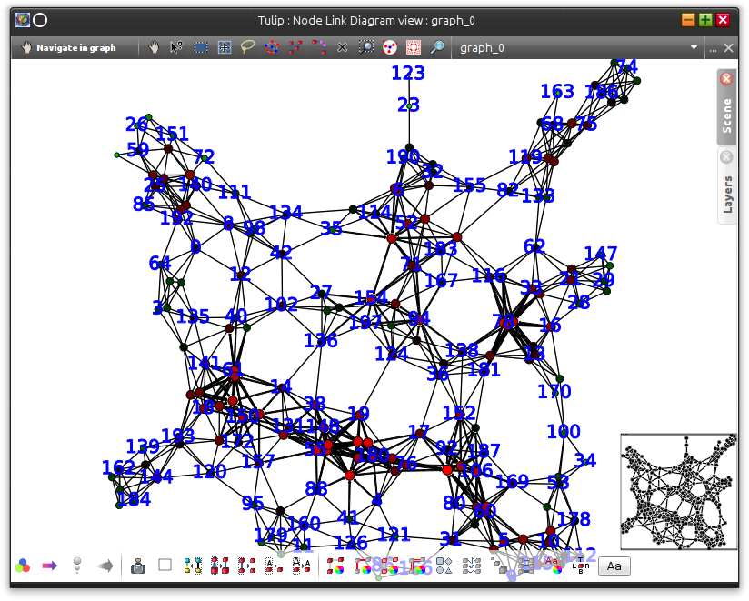
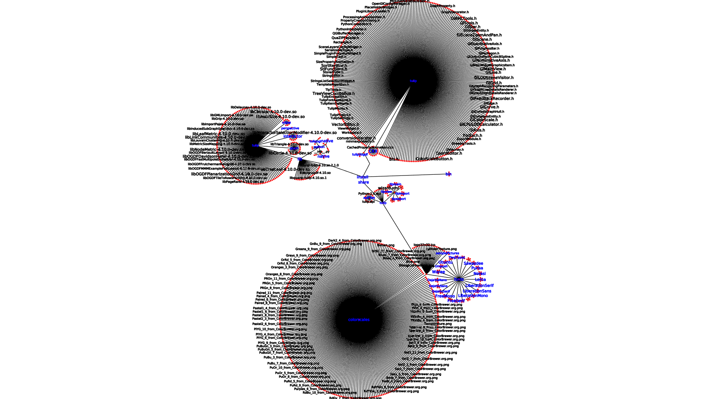

.. py:currentmodule:: tulipgui

Creating and manipulating Tulip visualizations with the :mod:`tulipgui` module
===============================================================================

Starting the 4.4 release of Tulip, a new module called :mod:`tulipgui` is available
allowing to create and manipulate Tulip views (typically Node Link diagrams).
The module can be used inside the Python Script editor integrated in the Tulip software GUI but
also through the classical Python interpreter.

The main features offered by that module are :

    * creation of interactive Tulip visualizations
    * the ability to change the data source on opened visualizations
    * the possibilty to modify the rendering parameters for node link diagram visualizations
    * the ability to save visualization snapshots to image files on disk

Using the module from the main Tulip GUI
----------------------------------------

When the :mod:`tulipgui` module is used through the Python script editor integrated in the Tulip GUI,
it enables to add and manipulate views in the Tulip workspace.

For instance, the following script works on a geographical network. We suppose
that we already have an opened Node Link Diagram view (plus one Python Script view) in Tulip for visualizing the whole network.
The script will extract the induced sub-graph of the european nodes, create a new Node Link Diagram view for visualizing
it and set some rendering parameters::

    from tulip import *
    from tulipgui import *

    def main(graph):

        # extraction and creation of the european sub-graph
        continent =  graph.getStringProperty("continent")
        europeNodes = []
        for n in graph.getNodes():
            if continent[n] == "Europe":
                europeNodes.append(n)
        europeSg = graph.inducedSubGraph(europeNodes)
        europeSg.setName("Europe")

        nlvEurope = tlpgui.createView("Node Link Diagram view", europeSg)

        # set labels scaled to node sizes mode
        renderingParameters = nlvEurope.getRenderingParameters()
        renderingParameters.setLabelScaled(True)
        nlvEurope.setRenderingParameters(renderingParameters)

Using the module with the classical Python interpreter
------------------------------------------------------

The :mod:`tulipgui` module can also be used with the classical Python interpreter and shell.
Tulip interactive visualizations will be displayed in separate windows once they have been created.

Interactive mode
^^^^^^^^^^^^^^^^^

When working through the Python shell, Tulip views can be created interactively.
The opened views will be updated each time the graph or its properties are modified.

For instance, the following session imports a grid graph, creates a Node Link Diagram view of it
and then changes the nodes colors. The Node Link Diagram view will be updated automatically.

    >>> from tulip import *
    >>> from tulipgui import *
    >>> grid = tlp.importGraph("Grid")
    >>> view = tlp.createNodeLinkDiagramView(grid)
    >>> viewColor = graph.getColorProperty("viewColor")
    >>> for n in graph.getNodes():
    ...     viewColor[n] = tlp.Color(0, 255, 0)
    ...

.. warning:: When working on Windows platforms, you have to use the Python command line utility (not the IDLE one)
             if you want to use the :mod:`tulipgui` module interactively. In a same maneer, if you intend to launch python
             through a terminal, you have to used the basic windows console cmd.exe. Other shells like mintty or rxvt
             do not allow to process the GUI events, required for interactive use.

Script execution mode
^^^^^^^^^^^^^^^^^^^^^^

When executing a script from a command line through the classical python interpreter, if
Tulip views had been created during its execution, the script will terminate once all view
windows had been closed.

Below are some samples scripts illustrating the features of the :mod:`tulipgui` module.
The first script imports a grid approximation graph, computes some visual attributes on it
and creates a Node Link Diagram visualization (which will remain displayed at the end of
the script execution). :ref:`Figure 1<fig1a>` introduces a screenshot of the created view.::

    from tulip import *
    from tulipogl import *
    from tulipgui import *

    # Import a grid approximation (with default parameters)
    graph = tlp.importGraph("Grid Approximation")

    # Get references to some view properties
    viewLayout = graph.getLayoutProperty("viewLayout")
    viewSize = graph.getSizeProperty("viewSize")
    viewBorderWidth = graph.getDoubleProperty("viewBorderWidth")
    viewLabelBorderWidth = graph.getDoubleProperty("viewLabelBorderWidth")
    viewColor = graph.getColorProperty("viewColor")
    viewLabelColor = graph.getColorProperty("viewLabelColor")
    viewLabelBorderColor = graph.getColorProperty("viewLabelBorderColor")
    viewBorderColor = graph.getColorProperty("viewBorderColor")
    viewLabel = graph.getStringProperty("viewLabel")
    viewShape = graph.getIntegerProperty("viewShape")

    # Compute an anonymous degree property
    degree = tlp.DoubleProperty(graph)
    degreeParams = tlp.getDefaultPluginParameters("Degree")
    graph.applyDoubleAlgorithm("Degree", degree, degreeParams)

    # Map the node sizes to their degree
    sizeMappingParams = tlp.getDefaultPluginParameters("Size Mapping", graph)
    sizeMappingParams["property"] = degree
    sizeMappingParams["min size"] = 10
    sizeMappingParams["max size"] = 30
    graph.applySizeAlgorithm("Size Mapping", viewSize, sizeMappingParams)

    # Apply an FM^3 layout on it
    fm3pParams = tlp.getDefaultPluginParameters("FM^3 (OGDF)", graph)
    fm3pParams["Unit edge length"] = 100
    graph.applyLayoutAlgorithm("FM^3 (OGDF)", viewLayout, fm3pParams)

    # Create a heat map color scale
    heatMap = tlp.ColorScale([tlp.Color.Green, tlp.Color.Black, tlp.Color.Red])

    # Map the node colors to their degree using the heat map color scale
    # Also set the nodes labels to their id
    for n in graph.getNodes():
        pos = (degree[n] - degree.getNodeMin()) / (degree.getNodeMax() - degree.getNodeMin())
        viewColor[n] = heatMap.getColorAtPos(pos)
        viewLabel[n] = str(n.id)

    # Set border colors values
    viewBorderColor.setAllNodeValue(tlp.Color.Black)
    viewLabelColor.setAllNodeValue(tlp.Color.Blue)
    viewLabelBorderColor.setAllNodeValue(tlp.Color.Blue)

    # Add a border to nodes/edges
    viewBorderWidth.setAllNodeValue(1)
    viewBorderWidth.setAllEdgeValue(1)

    # Sets nodes shapes to circle
    viewShape.setAllNodeValue(tlp.NodeShape.Circle)

    # Create a Node Link Diagram view and set some rendering parameters
    nodeLinkView = tlpgui.createNodeLinkDiagramView(graph)
    renderingParameters = nodeLinkView.getRenderingParameters()
    renderingParameters.setViewArrow(True)
    renderingParameters.setMinSizeOfLabel(10)
    nodeLinkView.setRenderingParameters(renderingParameters)

.. _fig1a:

   Figure 1: Screenshot of the view created by the above script.

The second script aims to generate a snapshot of a file system directory visualization.
It begins by calling the "File System Directory" import plugin, then it sets some
visual attributes on graph elements and finally it creates a node link diagram view
(that will not be displayed) with particular rendering parameters for taking the snapshot.
:ref:`Figure 2<fig2a>` introduces the resulting snaphot.::

    from tulip import *
    from tulipogl import *
    from tulipgui import *

    # Create an empty graph
    graph = tlp.newGraph()

    # Set the parameters for the "File System Directory" Import module
    fsImportParams = tlp.getDefaultPluginParameters("File System Directory", graph)
    fsImportParams["dir::directory"] = "/home/antoine/tulip_install"

    # Import a file system directory content as a tree
    tlp.importGraph("File System Directory", fsImportParams, graph)

    # Get some visual attributes properties
    viewLabel =  graph.getStringProperty("viewLabel")
    viewLabelColor =  graph.getColorProperty("viewLabelColor")
    viewLabelBorderColor =  graph.getColorProperty("viewLabelBorderColor")
    viewLayout =  graph.getLayoutProperty("viewLayout")
    viewBorderWidth = graph.getDoubleProperty("viewBorderWidth")

    # Apply the "Bubble Tree" layout on the imported graph
    bubbleTreeParams = tlp.getDefaultPluginParameters("Bubble Tree", graph)
    graph.applyLayoutAlgorithm("Bubble Tree", viewLayout, bubbleTreeParams)

    # Creates a property that will be used to order the rendering of graph elements
    # as we want to be sure that the directory nodes labels will be visible
    renderingOrderingProp = graph.getDoubleProperty("rendering ordering")

    for n in graph.getNodes():
	# the "File System Directory" import plugin adds a "File name" property containg the file name
	viewLabel[n] = graph["File name"][n]
	# if the node represents a directory, ensure that its label will be visible (as we will activate the "no labels overlaps" mode)
	# also change its label color to blue
	if graph.deg(n) > 1:
	    renderingOrderingProp[n] = 1
	    viewLabelColor[n] = viewLabelBorderColor[n] = tlp.Color(0, 0, 255)
	else:
	    renderingOrderingProp[n] = 0

    viewBorderWidth.setAllEdgeValue(1)

    # Create a Node Link Diagram view without displaying it
    nodeLinkView = tlpgui.createView("Node Link Diagram view", graph, {}, False)

    renderingParams = nodeLinkView.getRenderingParameters()

    # Activate the ordered rendering mode
    renderingParams.setElementOrdered(True)
    renderingParams.setElementOrderingProperty(renderingOrderingProp)

    # Activate the "no labels overlaps" mode
    renderingParams.setLabelsDensity(0)
    renderingParams.setMinSizeOfLabel(7)
    nodeLinkView.setRenderingParameters(renderingParams)

    # Save a snapshot of the view to an image file on disk
    nodeLinkView.saveSnapshot("/home/antoine/tulip_install_view.png", 1920, 1080)

.. _fig2a:

   Figure 2: Snapshot obtained with the above script.
