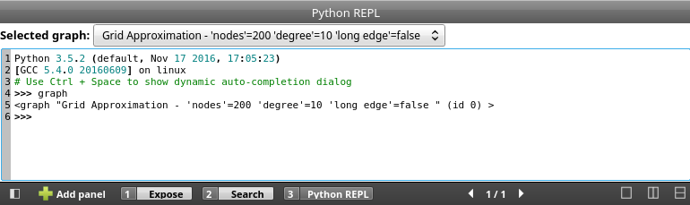
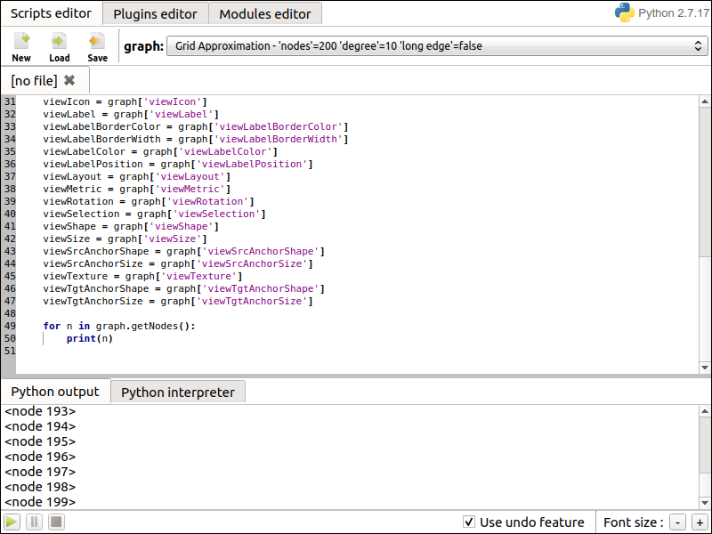
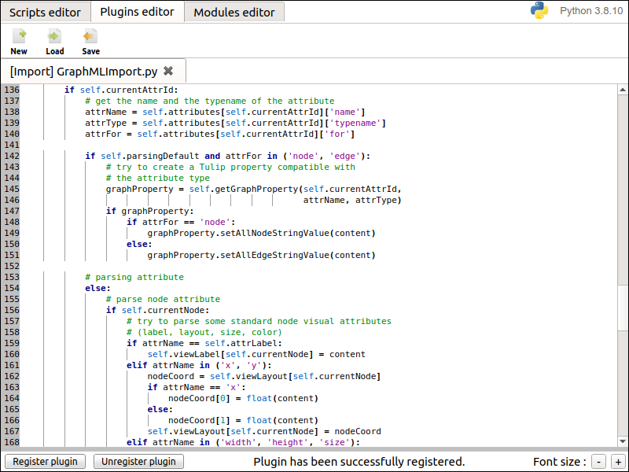
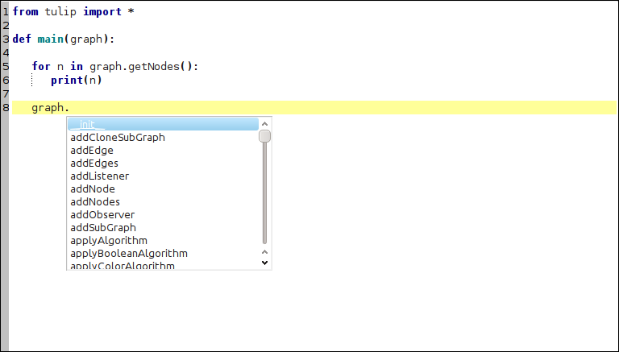
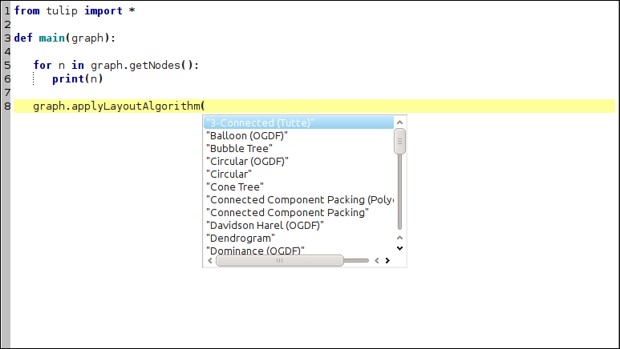
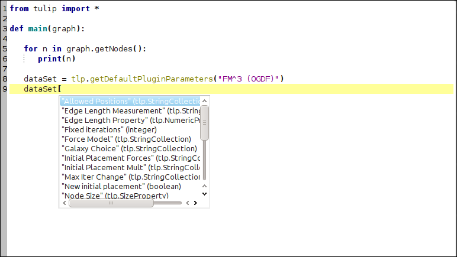
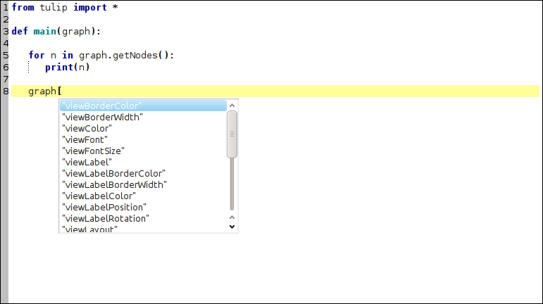
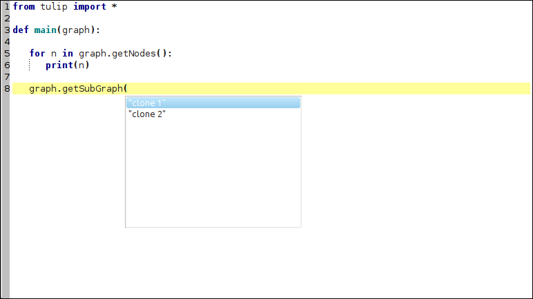

.. py:currentmodule:: tulip

Getting started
===============

.. _usingBindingsInTulipGUI:

Using the bindings from the Tulip Software GUI
-----------------------------------------------

Tulip Python IDE
^^^^^^^^^^^^^^^^^

A lightweight Python IDE can be accessed through the graphical interface of Tulip.
Three components are available :

    * A **Python console**, accessible through the "Python" button at the bottom of the Tulip GUI (see :ref:`Figure 1<fig1>`). It contains a "REPL" tab (read eval print loop) which enables to
      execute Python statements in an interactive manner. A combo box allows to select a graph from those
      currently loaded in the software. The selected graph is then bound to a Python variable named "graph".
      That component also contains an "Output" tab, that displays standard and error output of Python plugins (see :ref:`Writing Tulip plugins in Python <tulippythonplugins>`).

.. warning:: All modifications that have been performed on a graph through the Python REPL cannot be undone.

.. _fig1:

   Figure 1: Screenshot of the "Python console" component in the Tulip GUI.

    * A **Python Script Editor**, integrated as a view plugin named "Python Script view",
      accessible through the "Add panel" button at the bottom left corner of the Tulip GUI (see :ref:`Figure 2<fig2>`).
      It allows to write scripts that can be applied to the
      graphs currently loaded in Tulip. To do so, the "main(graph)" function has to be defined in the script code
      and is used as the script entry point. The graph currently selected in the view is wrapped
      as a :class:`tlp.Graph` object and provided as parameter of the "main" function.
      The currently edited script can be launched through the control panel located
      in the lower part of the view interface. Once started, the script execution can be
      stopped at any time. All modifications performed by a script on a graph can be undone.
      The view also enables to develop Python modules that can be immediately imported
      in the current Python session.

.. _fig2:

   Figure 2: Screenshot of the "Python Script view" in the Tulip GUI.

    * A **Python Plugin Editor**, accessible through the "Develop" button at the left of the Tulip GUI (see :ref:`Figure 3<fig3>`).
      It enables to develop Tulip plugins in pure Python (see :ref:`Writing Tulip plugins in Python <tulippythonplugins>`).
      These plugins are then immediately integrated in the Tulip GUI when requesting their registration (if their source code is valid of course).
      Different kinds of plugins can be develop : General Algorithms, Property Algorithms, Import plugins and Export plugins.
      When executing these plugins, standard and error output will be displayed in the "Output" tab of the Python console component.
      That component also enables to develop Python modules that can be immediately imported in the current Python session.
      If there is a Tulip project associated to the current Tulip session, the source code of the plugins and modules are automatically saved in it.
      When reopening the project, the previously edited plugins will still be available
      in the editor and they will also be automatically loaded.

.. _fig3:

   Figure 3: Screenshot of the "Python Plugin Editor" in the Tulip GUI.

Using the autocompletion to code faster
^^^^^^^^^^^^^^^^^^^^^^^^^^^^^^^^^^^^^^^^

Each Python code editor widget provides an autocompletion feature in order to ease
the development of scripts. To activate it, just hit **Ctrl + Space** and the autocompletion
list will popup. Its contents will depend on the context before the current position of the text cursor.

Python objects autocompletion
""""""""""""""""""""""""""""""

The autocompletion list feature is really useful to get the content of the dictionary
of Python objects. The list is filled by fetching the contents of a database according to the context.
That database contains the API of all standard Python modules but also the tulip ones.
That database is also updated dynamically by performing a static analysis on the source code (in particular,
that analysis tries to associate a typename to each variable in the source code).
The autocompletion will also popup immediatly when hitting a dot character. If the variable before the dot
has an associated typename in the database, only the contents of its dictionary will be inserted in the list.
:ref:`Figure 4<fig4>` shows an
example of the contents of the autocompletion list when requesting it on the "graph" variable (of type :class:`tlp.Graph`)

.. _fig4:

   Figure 4: Using the autocompletion list to get the dictionary contents of a Python object.

Tulip special autocompletion features
""""""""""""""""""""""""""""""""""""""

The autocompletion list is also there to ease the development of Tulip Python scripts. Some special
features have been included to ease the use of the Tulip Python API:

    * **Autocompletion for algorithms** Tulip is bundled with a lot of algorithms (plugins) that can be called through Python.
      To call an algorithm (plugin), one of the following method has to be used : :meth:`tlp.Graph.applyAlgorithm`, :meth:`tlp.Graph.applyBooleanAlgorithm`,
      :meth:`tlp.Graph.applyColorAlgorithm`, :meth:`tlp.Graph.applyDoubleAlgorithm`, :meth:`tlp.Graph.applyIntegerAlgorithm`, :meth:`tlp.Graph.applyLayoutAlgorithm`,
      :meth:`tlp.Graph.applySizeAlgorithm`, :meth:`tlp.Graph.applyStringAlgorithm`, :func:`tlp.importGraph`, :func:`tlp.exportGraph`.
      The first parameter of those method is a string containing the name of the algorithm (plugin)
      to call. When requesting the autocompletion list with the following context : *graph.apply\*Algorithm(*, it will be filled with the names of the corresponding
      algorithms (plugins). :ref:`Figure 5<fig5>` shows an example of the contents of the autocompletion list when requesting it with the following context : *graph.applyLayoutAlgorithm(*.

.. _fig5:

   Figure 5: Using the autocompletion list to get the algorithm names.

    * **Autocompletion for algorithm parameters** Parameters can be passed to Tulip algorithms through a :class:`tlp.DataSet` object. The parameters are
      identified by their names. The autocompletion list can be used to get the names of these parameters. For that feature to work, the following context
      must be present in the source code::

        # Replace by the name of the algorithm you want to call, note that the autocompletion
        # also works for the following context : tlp.getDefaultPluginParameters(
        dataSet = tlp.getDefaultPluginParameters("algorithm name")
        # Hit Ctrl-Space after the bracket to see the magic
        dataSet[

      :ref:`Figure 6<fig6>` shows an example of the autocompletion list contents when requesting the parameters of the layout algorithm : "FM^3 (OGDF)".

.. _fig6:

   Figure 6: Using the autocompletion list to get the algorithm parameters names.

    * **Autocompletion for graph properties** Tulip stores the data associated to graph elements in objects called properties. To get a reference
      on those type of objects, you can either use specific methods (for instance : :meth:`tlp.Graph.getLayoutProperty`, :meth:`tlp.Graph.getSizeProperty`)
      that take the name of the property to retrieve as parameter or the following syntax : *graph["property name"]*. When requesting the autocompletion list
      for the following context : *graph.get*Property(* or *graph[*, the list will be filled with the names of the corresponding and existing properties.
      :ref:`Figure 7<fig7>` show an example of the contents of the autocompletion list for the following context : *graph[*.

.. _fig7:

   Figure 7: Using the autocompletion list to get the graph properties names.

    * **Autocompletion list for sub-graphs** Tulip allows to manipulate a large hierarchy of sub-graphs. References to those sub-graphs can be retrieved
      with their names through the use of the dedicated method :meth:`tlp.Graph.getSubGraph`. When requesting the autocompletion list for the
      following context : *graph.getSubGraph(*, the list will be filled with all the names of the graphs present in the hierarchy. :ref:`Figure 8<fig8>` shows
      an example of that use case.

.. _fig8:

   Figure 8: Using the autocompletion list to get the sub-graphs names.

.. _usingBindingsInShell:

Using the bindings from the Python Interpreter
----------------------------------------------

Setting up the environment
^^^^^^^^^^^^^^^^^^^^^^^^^^
The Tulip Python bindings can also be used through the classical Python Interpreter in an interactive shell. But some setup has to be done
before importing the :mod:`tulip` module. 

First, the path to the :mod:`tulip` module must be provided to Python.
In the following, <tulip_install_dir> represents the root directory of a Tulip installation.
The Tulip Python module is installed in the following directory according to your system :

        * Linux : <tulip_install_dir>/lib/python (if you compiled Tulip yourself, <tulip_install_dir> corresponds to the value of the CMake variable CMAKE_INSTALL_PREFIX)

        * Windows : <tulip_install_dir>/bin/python (if you installed Tulip from a bundle, <tulip_install_dir> should be C:/Program Files (x86)/Tulip/)

        * Mac OS : <tulip_install_dir>/Contents/Frameworks/python (if you installed Tulip from a bundle, <tulip_install_dir> should be /Applications/Tulip-4.X.Y.app/)

This path has to be added to the list of Python module search path. To do so, you can add it in the **PYTHONPATH**
environment variable or add it to the :data:`sys.path` list.	

Second, your system must be able to find the Tulip C++ libraries in order to use the bindings. These libraries are
installed in the following directory according to your system :

        * Linux : <tulip_install_dir>/lib/ (if you compiled Tulip yourself, <tulip_install_dir> corresponds to the value of the CMake variable CMAKE_INSTALL_PREFIX)

        * Windows : <tulip_install_dir>/bin/ (if you installed Tulip from a bundle, <tulip_install_dir> should be C:/Program Files (x86)/Tulip/)

        * Mac OS : <tulip_install_dir>/Contents/Frameworks/ (if you installed Tulip from a bundle, <tulip_install_dir> should be /Applications/Tulip-4.X.Y.app/)

You have to add this path to :
	
	* the **LD_LIBRARY_PATH** environment variable on Linux

	* the **DYLD_LIBRARY_PATH** environment variable on Mac OS

	* the **PATH** environment variable on Windows.

You should now be able to import the :mod:`tulip` module through the Python shell. Issue the following command
at the shell prompt to perform that task::

	>>> from tulip import *

.. note:: 
  If you have installed Tulip from a bundle (Windows or Mac OS), the Tulip bindings were built against Python 2.7
  and you need to use the same Python version to be able to import the :mod:`tulip` module.

.. _loading-plugins:

Loading Tulip plugins
^^^^^^^^^^^^^^^^^^^^^

If you want to use Tulip algorithms implemented as plugins written in C++ or Python (e.g. graph layout algorithms),
you have to load them before being able to call them (see :meth:`tlp.Graph.applyAlgorithm`, :meth:`tlp.Graph.applyLayoutAlgorithm`, ...).

**Since Tulip 3.8, all plugins should be automatically loaded when you import the tulip module.**

If you use a Tulip version prior to the 3.8 release, you have to proceed as described below to load the plugins.

To load all the Tulip plugins written in C++, you have to execute the :func:`tlp.initTulipLib` and :func:`tlp.loadPlugins` functions
the following way if you compiled Tulip yourself::

        >>> tlp.initTulipLib()
        >>> tlp.loadPlugins()

If you installed Tulip from a bundle, you need to specify the path to the Tulip binary as parameter of the :func:`tlp.initTulipLib` because some paths were hardcoded during the compilation::

        >>> tlp.initTulipLib("<path_to_tulip_binary>")
        >>> tlp.loadPlugins()

The path to the Tulip binary is given below according to your system:

        * Linux and Windows : <tulip_install_dir>/bin

        * Mac OS : <tulip_install_dir>/Contents/MacOS
