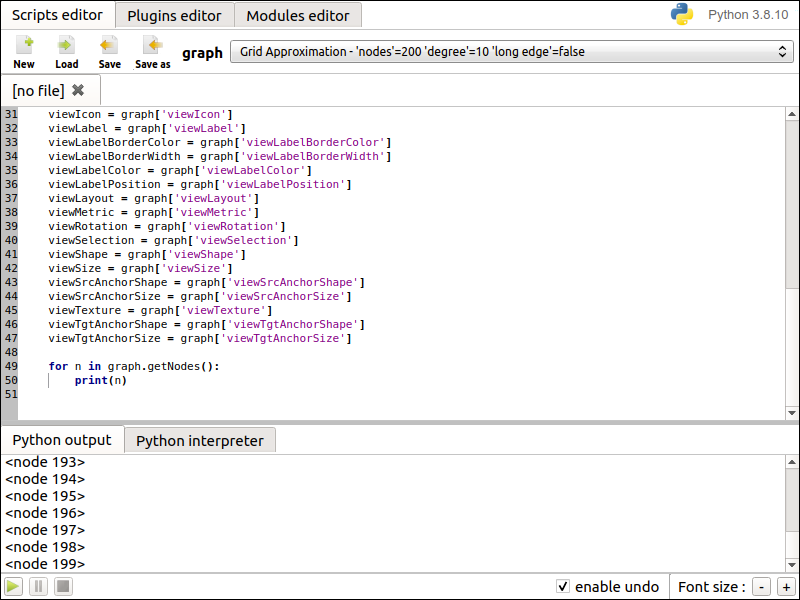

.. py:currentmodule:: tulip

Getting started
===============

.. _usingBindingsInTulipGUI:

Using the bindings from the Tulip GUI
-------------------------------------

Tulip Python bindings were primarily designed to add a scripting feature to the Tulip GUI (also known as the `Tulip Perspective <../../tulip-user/html/gui.html>`_) and thus
interactively manipulate the graphs loaded into it through lines of Python code.
In that purpose, a **Python IDE** (Integrated Development Environment) window is available.

Tulip Python IDE
^^^^^^^^^^^^^^^^^

A lightweight Python IDE can be accessed through the Tulip GUI. Some GUI reorganisation
has been made in Tulip 5.0 and all Python development features are now centralized in a
separated window. It can be displayed by clicking on the |icon_ide| **Python** button located in the left side of the Tulip GUI.

.. _fig1:

  Figure 1: Screenshot of the **Python IDE** window displaying the Python interpreter.

The **Python interpreter** is the most basic way to dynamically interact with graph data. It enables to execute Python statements which are one after the other , read, evaluated then their result is printed. A combo box allows to select a graph from those already loaded in the Tulip GUI. The selected graph is then bound to a global Python variable named "graph".
Since Tulip 5.0, the undo feature on graph state is now handled in that component, meaning every graph modification performed by the executed Python statements can be reverted.

.. |icon_run| image:: ../../library/tulip-gui/resources/icons/22/start.png
    :width: 15

More sophisticated ways to write python code for graphs management purpose are proposed in the upper part of the Python IDE:

- A **Scripts editor** (see :ref:`Figure 2<fig2>`): it allows to write scripts that can be applied to the
  graphs currently loaded in Tulip. To do so, the "main(graph)" function has to be defined in the script code
  and is used as the script entry point. The graph currently selected through the combobox located in the upper
  part of the tab is wrapped as a :class:`tlp.Graph` object and provided as parameter of the "main" function.
  The currently edited script can be launched (|icon_run| button) through the control panel located in the lower part of the tab interface.
  Once started, the script execution can be paused (|icon_pause| button) or stopped (|icon_stop| button); trigerring the update of Tulip visualizations each time.
  All modifications performed by a script on a graph can be cancelled / replayed through the Tulip undo / redo feature.

.. _fig2:

  Figure 2: Screenshot of the **Scripts editor** tab in the Python IDE.

- A **Plugins editor** (see :ref:`Figure 3<fig3>`): it enables to develop Tulip plugins in pure Python
  (see :ref:`Writing Tulip plugins in Python <tulippythonplugins>`).
  These plugins are then immediately integrated in the Tulip GUI when requesting their registration
  (if their source code is valid of course). Different kinds of plugins can be developed : General Algorithms,
  Property Algorithms, Import plugins and Export plugins. When executing these plugins, standard and error output
  will be displayed in the "Message Log" panel of the Tulip GUI.

.. _fig3:

  Figure 3: Screenshot of the **Plugins editor** tab in the Python IDE.

- A **Modules editor** (see :ref:`Figure 4<fig4>`): it enables to develop Python modules that
  can be immediately imported in the current Python session. The purpose is to have a library of utility
  Python modules that can be easily imported in the developed scripts and plugins.

.. _fig4:

   Figure 4: Screenshot of the **Modules editor** tab in the Python IDE.

Backup and restore your Python code with Tulip projects
^^^^^^^^^^^^^^^^^^^^^^^^^^^^^^^^^^^^^^^^^^^^^^^^^^^^^^^

The Tulip software uses a zipped project file format named TLPX to save and restore the state of a Tulip
work session in a portable way. Notably it contains the graphs that was loaded in the software serialized to
files but also the configuration of the views and components that was opened in the software.

When working with the Python IDE, the source code of the scripts, plugins and modules currently edited
are automatically saved to the current Tulip project. Nevertheless, the Tulip project must be explicitely
saved to a .tlpx file in order for the Python files to be included in the resulting archive.
When reopening the project file, the previously edited scripts, plugins and modules will still be available
in the Python IDE even if you open the file on a computer different from the one you write your code.
Python plugins will also be automatically loaded when reopening the project.

Using the autocompletion to code faster
^^^^^^^^^^^^^^^^^^^^^^^^^^^^^^^^^^^^^^^^

Each Python code editor widget provides an autocompletion feature in order to ease
the development of scripts. To activate it, just hit **Ctrl + Space** and the autocompletion
list will popup. Its contents will depend on the context before the current position of the text cursor.

Python objects autocompletion
""""""""""""""""""""""""""""""

The autocompletion list feature is really useful to get the contents of the dictionary
of Python objects. The list is filled by fetching the contents of a database according to the context.
That database contains the API of all standard Python modules but also the tulip ones.
That database is also updated dynamically by performing a static analysis on the source code (in particular,
that analysis tries to associate a typename to each variable in the source code).
The autocompletion will also popup immediately when hitting a dot character. If the variable before the dot
has an associated typename in the database, only the contents of its dictionary will be inserted in the list.
:ref:`Figure 5<fig5>` shows an
example of the contents of the autocompletion list when requesting it on the "graph" variable (of type :class:`tlp.Graph`)

.. _fig5:

   Figure 5: Using the autocompletion list to get the dictionary contents of a Python object.

Tulip specific autocompletion features
""""""""""""""""""""""""""""""""""""""

The autocompletion list facilitates the development of Tulip Python scripts especially with some specific features dedicated to the Tulip Python API:

- **Autocompletion for algorithms**

  Tulip is bundled with a lot of algorithms (plugins) that can be called through Python.
  To call an algorithm (plugin), one of the following method has to be used : :meth:`tlp.Graph.applyAlgorithm`, :meth:`tlp.Graph.applyBooleanAlgorithm`,
  :meth:`tlp.Graph.applyColorAlgorithm`, :meth:`tlp.Graph.applyDoubleAlgorithm`, :meth:`tlp.Graph.applyIntegerAlgorithm`, :meth:`tlp.Graph.applyLayoutAlgorithm`,
  :meth:`tlp.Graph.applySizeAlgorithm`, :meth:`tlp.Graph.applyStringAlgorithm`, :func:`tlp.importGraph`, :func:`tlp.exportGraph`.
  The first parameter of those methods is a string containing the name of the algorithm (plugin)
  to call. When requesting the autocompletion list with the following context : *graph.apply\*Algorithm(*, it will be filled with the names of the available
  algorithms (plugins). :ref:`Figure 6<fig6>` shows an example of the contents of the autocompletion list when requesting it with the following context : *graph.applyLayoutAlgorithm(*.

.. _fig6:

   Figure 6: Using the autocompletion list to get the algorithm names.

- **Autocompletion for algorithm parameters**

  Parameters can be passed to Tulip algorithms through a dictionary. The parameters are
  identified by their names. The autocompletion list can be used to get the names of these parameters.
  :ref:`Figure 7<fig7>` shows an example of the autocompletion list contents when requesting the parameters
  of the layout algorithm : "FM^3 (OGDF)".

.. _fig7:

   Figure 7: Using the autocompletion list to get the algorithm parameters names.

- **Autocompletion for string collection parameters**

  Some algorithms parameters are internally
  based on a :class:`tlp.StringCollection` instance. It allows to select a string from a defined set.
  The direct use of that class is now deprecated but the autocompletion list can be helpful to get the names of the
  available values that can be transmitted to the algorithm.
  :ref:`Figure 8<fig8>` shows an example of the autocompletion list contents when requesting the string collection values
  for the "Allowed Positions" parameter of the layout algorithm : "FM^3 (OGDF)".

.. _fig8:

   Figure 8: Using the autocompletion list to get the algorithm parameters names.

- **Autocompletion for graph properties**

  Tulip stores the data associated to graph elements in objects called properties. To get a reference
  on those type of objects, you can either use specific methods (for instance : :meth:`tlp.Graph.getLayoutProperty`, :meth:`tlp.Graph.getSizeProperty`)
  that take the name of the property to retrieve as parameter or the following syntax : *graph["property name"]*. When requesting the autocompletion list
  for the following context : *graph.get*Property(* or *graph[*, the list will be filled with the names of the corresponding and existing properties.
  :ref:`Figure 9<fig9>` shows an example of the contents of the autocompletion list for the following context : *graph[*.

.. _fig9:

   Figure 9: Using the autocompletion list to get the graph properties names.

- **Autocompletion list for subgraphs**

  Tulip allows to manipulate a large hierarchy of subgraphs. References to those subgraphs can be retrieved
  with their names through the use of the dedicated method :meth:`tlp.Graph.getSubGraph`. When requesting the autocompletion list for the
  following context : *graph.getSubGraph(*, the list will be filled with all the names of the graphs present in the hierarchy. :ref:`Figure 10<fig10>` shows
  an example of that use case.

.. _fig10:

   Figure 10: Using the autocompletion list to get the subgraphs names.

.. _usingBindingsInShell:

Using the bindings from the Python Interpreter
----------------------------------------------

The Tulip Python bindings can also be used through the classical Python Interpreter in an interactive shell.

Since Tulip 4.8 release, the bindings modules are available on the `Python Packaging Index <https://pypi.python.org>`_.

The modules are also located within the Tulip software installation, but some setup has to be done before being able to import them.

Installing the Tulip-Python modules from the Python Packaging Index
^^^^^^^^^^^^^^^^^^^^^^^^^^^^^^^^^^^^^^^^^^^^^^^^^^^^^^^^^^^^^^^^^^^^

Tulip-Python modules can be easily obtained by using the pip tool for Windows, MacOS and Linux users.

.. important::

  Please not that the ``tulipgui`` module is no more distributed on the Python
  Packaging Index since Tulip 5.3.
  Nevertheless, it is still available to be used use from a standard Tulip
  installation (see next section).

To install the :mod:`tulip` module, issue the following command from a terminal prompt:

.. code:: shell

    $ pip install tulip-python

And you're done, you can now import the modules in your Python session.

Setting up the environment from the Tulip software installation
^^^^^^^^^^^^^^^^^^^^^^^^^^^^^^^^^^^^^^^^^^^^^^^^^^^^^^^^^^^^^^^^

In order to be able to import the Tulip-Python modules bundled with the Tulip software installation,
their path must be provided to Python. In the following, <tulip_install_dir> represents the root directory of a Tulip installation.
The Tulip-Python modules are installed in the following directory according to your system :

        * Linux : **<tulip_install_dir>/lib/tulip/python** (if you compiled Tulip yourself,
          <tulip_install_dir> corresponds to the value of the CMake variable CMAKE_INSTALL_PREFIX)

        * Windows : **<tulip_install_dir>/lib/tulip/python** (if you installed Tulip from an installer,
          <tulip_install_dir> should be C:/Program Files (x86)/Tulip-x.y/ for 32 bits Tulip and C:/Program Files/Tulip-x.y/ for 64 bits Tulip)

        * Mac OS : **<tulip_install_dir>/Contents/lib/tulip/python** if you installed Tulip from a bundle (<tulip_install_dir> should then be /Applications/Tulip-x.y.z.app/) or
                   **<tulip_install_dir>/lib/tulip/python** if you compiled and installed Tulip yourself.

This path has to be added to the list of Python module search paths. To do so, you can add it in the **PYTHONPATH**
environment variable prior executing the Python interpreter or add it to the :data:`sys.path` list once you launched the interpreter.

.. warning::

  If you installed Tulip through a bundle (.dmg) on MacOS and want to successfully import the :mod:`tulipgui` module,
  you also need to set the following path **/Applications/Tulip-x.y.z.app/Contents/Frameworks/** as the value of the
  environment variables **DYLD_LIBRARY_PATH** and **DYLD_FRAMEWORK_PATH**.

You should now be able to import the Tulip-Python modules through the classical Python shell. Issue the following commands
at the shell prompt to perform that task::

    >>> from tulip import tlp
    >>> from tulipgui import tlpgui

.. note::
  If you have installed Tulip from a Mac OS bundle, the Tulip-Python modules were built against Python 2.7
  and you need to use the same Python version in order to be able to import them.

Customizing the Python environment
----------------------------------

Since Tulip 4.8, it is possible to customize the Python environment the first time the :mod:`tulip` module
is imported through the use of a startup scripts hook mechanism.

For instance, that feature could be used to :

        * modify the list of Python import paths, in order to load modules not located in standard directories from then

        * load Tulip plugins not located in default plugins folders

        * add new Python functions and classes to the environment that will be available each time the tulip module is imported

When the tulip module is imported from the first time in the current Python session, the contents of the following directories
will be scan for Python files (.py extension) :

        * <tulip_install_dir>/lib/tulip/python/startup

        * <home_dir>/.Tulip-x.y/python/startup

Then, for each Python file found, its contents will be read and executed in the context of the Python main module
(the file will not be imported as a Python module).

