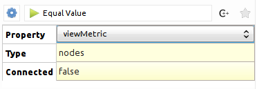
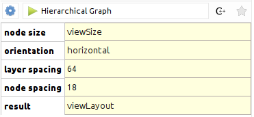

.. py:currentmodule:: tulip

.. warning:: If you are using the bindings through the classical Python interpreter, Tulip plugins must be loaded in order to be
             able to call algorithms (see :ref:`Loading Tulip plugins <loading-plugins>`)).

Applying an algorithm on a graph
================================ 

In Tulip, algorithms are implemented as plugins. There is two main type of algorithms :

	* *General* : algorithms of this type can work on the input graph in a free manner and perform a variety of tasks
	  (modifying the graph structure, creating graph properties, ...).

	* *Property* : algorithms of this type can only compute data to attach on the graph elements and fill an output
	  graph property (e.g. layout algorithm, metric algorithm, ...).

In the remaining of this section, you will learn how to call each type of algorithm from Python 
but also how to transmit parameters to the algorithms. 

.. important:: 
	As algorithms are plugins, they must be loaded before you can call them.  If
	you use the bindings from the Tulip GUI, all installed plugins are already loaded. If you 
	use the bindings from the Python shell, you need to manually load the plugins (see :ref:`Using the bindings from the Python Interpreter <usingBindingsInShell>`).

Calling a general algorithm on a graph
--------------------------------------- 

To call a general algorithm, you must use the :meth:`tlp.Graph.applyAlgorithm` method. 
From the Tulip GUI, you can see all the general algorithms currently loaded by 
looking at the entries from the *Algorithm -> General* menu. Alternatively, from Python you
can get a list of the general algorithms names by calling the :func:`tlp.getAlgorithmPluginsList` function.

As an example, we will call the "Equal value" algorithm from Python. This algorithm
takes an input graph property and partitions the graph elements (nodes or edges) according
to the values of the property. More precisely, all graph elements having the same property value
are grouped in a class. Then for each class, a sub-graph is created.

This algorithm takes 3 parameters as illustrated in the screenshot below:

 
Below is a description of each parameter :

	* *Property* : the input graph property of type :class:`tlp.PropertyInterface` from which to compute the partition
	* *Type* : a :class:`tlp.StringCollection` parameter to choose the type of the elements to partition (two possible values : "nodes" or "edges")
	* *Connected* : a boolean parameter indicating whether the output sub-graphs have to be connected  

The sample code below illustrates how to call this algorithm from Python. We assume that a Tulip graph
is bound to a "graph" variable and this graph contains a double property called "myMetric"::
	
	# get the input property from which to generate the partition
	myMetric = graph.getDoubleProperty("myMetric")
	
	# get a data set filled with default parameters for the algorithm
	dataSet = tlp.getDefaultPluginParameters("Equal Value", graph)

	# set the input property
	dataSet["Property"] = myMetric
	
	# if you want to partition edges instead of nodes
	# dataSet["Type"].setCurrent(1) # use string collection index
	# or alternatively
	# dataSet["Type"].setCurrent("edges") # use string collection value
	
	# if you want connected sub-graphs
	# dataSet["Connected"] = True
	
	# now we call the algorithm
	graph.applyAlgorithm("Equal Value", dataSet)
	
Calling a property algorithm on a graph
--------------------------------------- 

To call a property algorithm on a graph, you must use specific methods from the 
:class:`tlp.Graph` class. There is one method per type of property to compute
like for instance :meth:`tlp.Graph.applyBooleanAlgorithm`, :meth:`tlp.Graph.applyLayoutAlgorithm`, ...

As an illustration, we will call the "Hierarchical Graph" layout algorithm, that can be used to draw a tree.

This algorithm takes 4 parameters as illustrated in the screenshot below:

 
Below is a description of each parameter :

	* *node size* : an input size property of type :class:`tlp.SizeProperty` that contains nodes sizes
	* *orientation* : a :class:`tlp.StringCollection` parameter to choose the layout orientation (two possible values : "horizontal" or "vertical")
	* *layer spacing* : a float parameter to set up the minimum distance between two layers in the drawing
	* *node spacing* : a float parameter to set up the minimum distance between two nodes in the same layer  

The sample code below illustrates how to call this layout algorithm from Python. We assume that a Tulip graph
is bound to a "graph" variable::

	# get a data set filled with default parameters for the algorithm
	dataSet = tlp.getDefaultPluginParameters("Hierarchical Graph", graph)

	# set the orientation to vertical
	dataSet["orientation"].setCurrent("vertical")
	
	# set custom spacing
	dataSet["layer spacing"] = 100.0
	dataSet["node spacing"] = 50.0
	
	# get a reference to the default layout property
	viewLayout = graph.getLayoutProperty("viewLayout")
	
	# call the layout algorithm and store the result in viewLayout
        graph.applyLayoutAlgorithm("Hierarchical Graph", viewLayout, dataSet)

