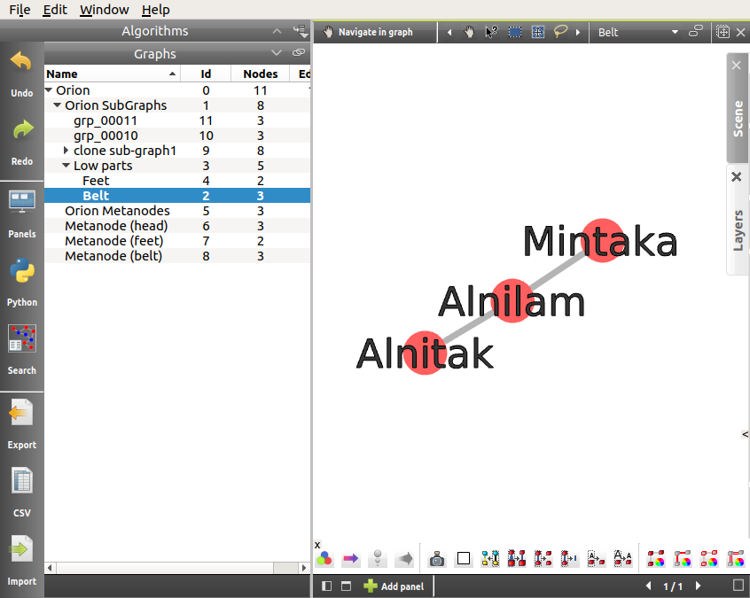
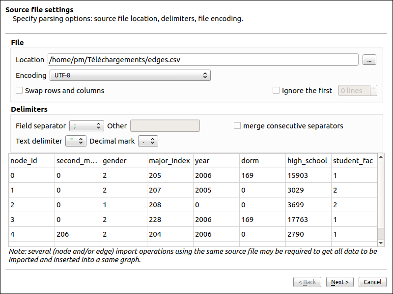
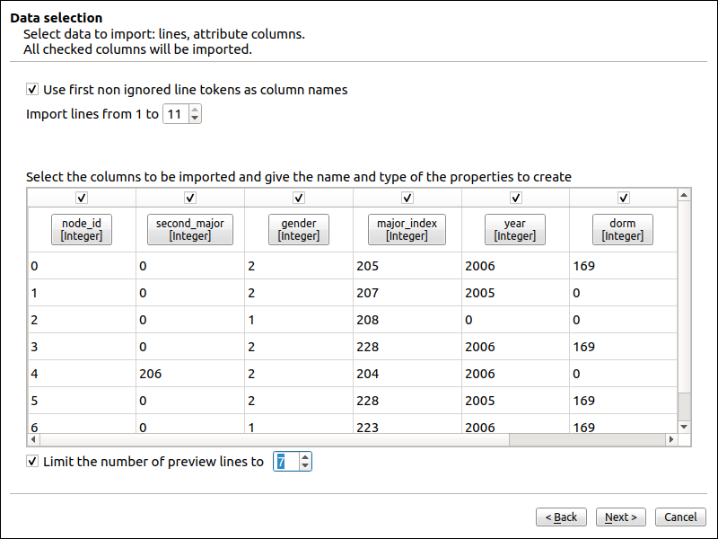

.. _functions:

***************
Functionalities
***************

.. _hierarchy:

Hierarchy
=========

Tulip supports graphs hierarchies. The navigation in the tree of subgraphs can be performed in the graph list view.

.. _hierarchy_definition:

Definitions
-----------

As an example to illustrate our explanations, we will use the following graph (roughly representing the Orion constellation). The corresponding Tulip project can be downloaded with :download:`this link <./_documents/Orion.tlpx>`.

.. _subgraph:

Subgraph
^^^^^^^^

A subgraph is simply a coherent subset of the graph elements: some nodes of the graph, and some edges between them (more informations: `Wikipedia: Subgraphs <http://en.wikipedia.org/wiki/Glossary_of_graph_theory#Subgraphs>`_).

Specifically, the edge of a subgraph must already be present in the graph just above it in the hierarchical scale. A subgraph does not necessarily contains all the edges of the induced subgraph. If an edge belongs to a subgraph, its ends belong to the subgraph too.

For instance, here is a subgraph containing the nodes in the lower half of Orion (but not all edges between them):

Subgraphs can be nested. Here are two possible subgraphs included in Low parts:

The famous Orion's belt ...

.. image:: _images/hierarchy_orion_feet.png
    :width: 600

... And the little less famous Orion's feet.

.. _meta-node:

Meta-node
^^^^^^^^^

To better view the hierarchy, a subgraph can be represented as a single node,	called a meta-node. A meta-node is always associated to exactly one subgraph.

You can enter a node by double-clicking on it

The meta-nodes can also be embedded into other meta-nodes, creating nested meta-graphs.

.. _meta-graph: 

Meta-graph creation
^^^^^^^^^^^^^^^^^^^

When meta-nodes are created, Tulip follows a specific behaviour. With the clustering of nodes, new subgraphs are created in order to improve the visualization. If the action is done from the root level of the hierarchy, a meta-graph, named by default *groups*, will display the whole graph with the appropriate meta-nodes and a subgraph, named in the form *grp_vwxyz*, will only contains the clustered nodes. Otherwise, if the action is realized from a lower level in the hierarchy, only the second subgraph graph will be created at the same level in the hierarchy.

The creation of meta-graph modifies the root graph (here Orion) which represents all nodes (including the meta-nodes and the representation of the subgraph inside it) and all edges (including the meta-edges). So much information overlapping can be displayed unclearly:

Using the subgraph *groups* to observe the data resolve the problem.

.. _hierarchy_creation:

Creating subgraphs or meta-nodes
--------------------------------

You can simply create a subgraph by selecting the nodes and edges you want to isolate in your graph and click on the *Create subgraph from selection* option. It can be found either with a right click on the graph name in the graph list or in the *Edit* menu.

From those menus you will also be able to create empty subgraphs. You can add here new nodes and edges, which will be directly added into the subgraphs above the current one in the hierarchy. The *Clone subgraph* action will duplicate the target graph in a subgraph just beneath it in the hierchical scale.

To create a meta-node, you can proceed in a fashion similar to the one followed to create subgraph from selection. Once you have picked the nodes, click on the option *Group elements* in the menu *Edit*. 

Optionally, the edge selection for the subgraph creation can be realized with the "Induced Sub-graph" algorithm.

.. _hierarchy_deletion:

Removing / ungrouping a subgraph or meta-node
---------------------------------------------

You can delete a subgraph or a meta-node by selecting the appropriate option proposed in the menu opened with a right click on the graph name in the list.

The removal of a subgraph is pretty straight forward. If *Delete* is chosen, only the current subgraph is removed, letting its subgraphs going one step up in the graphs hierarchy; its direct subgraphs become subgraphs of its parent graph. If *Delete all* is chosen, all the subgraphs are removed from the hierarchy.

Deleting a meta-node removes all nodes in this particular meta-node, but not its representation in the other graphs. To properly delete the meta-node, you first need to ungroup it. By doing so, all the edges will resume to their old anchor nodes. This modification propagates through the hierarchy tree, up to the root. The subgraphs created with the meta-node are not deleted, however, the meta-node disappears as it is removed and the ungrouped nodes does not remplace it.

.. _hierarchy-uses:

Modifying subgraphs or meta-nodes
---------------------------------

If you change the position of a node (*viewLayout* property) within a subgraph (with the mouse or through a layout algorithm), the same node will be moved in the root graph, if the *viewLayout* property accessible in the subgraph in the one inherited from the root graph.

If you use a measure algorithm on a subgraph, new local properties are created. Those properties are not applied to the root graph (if properties are not defined on the subgraph, they are inherited).

You can also note that, because of the hierachy, some actions (delete, rename...) done in the root graph or in one of the non-final subgraph will obviously pass on to every subgraph. Identically, the creation of a node in a subgraph will add it in each of the graphs above.

.. _csv:

CSV Import
==========

Tulip proposes an import wizard for CSV files. Comma-separated values files are very common to store statistical data. The internal file structure is rather simple, consisting of records (one per line usually) containing several fields, separated with a special character (such as a comma, a semi-colon, an hash...).

.. _csv_files:

Example files
-------------

In this part, we will present the functionnality with an example. To this end, the two following files have been used :

:download:`nodes.csv <./_documents/nodes.csv>`::

  node_id;second_major;gender;major_index;year;dorm;high_school;student_fac
  0;0;2;205;2006;169;15903;1
  1;0;2;207;2005;0;3029;2
  2;0;1;208;0;0;3699;2
  3;0;2;228;2006;169;17763;1
  4;206;2;204;2006;0;2790;1
  5;0;2;228;2005;169;50029;2
  6;0;1;223;2006;169;3523;1
  7;0;1;208;2007;169;2780;1
  8;0;2;205;2006;170;5477;1
  9;0;1;228;0;0;23675;1	

and :download:`edges.csv <./_documents/edges.csv>`::

  "Source","Target","second_major","gender","major_index"
  0,3,0,2,205
  0,4,0,2,207
  0,5,0,1,208
  0,6,0,2,228
  0,8,206,2,204
  0,9,0,2,228
  1,2,0,1,223
  2,3,0,1,208
  2,4,0,2,205
  2,6,0,1,228
  2,7,200,1,201
  3,6,0,2,199
  3,7,0,2,202
  3,9,0,2,199
  4,8,0,2,209
  4,9,200,1,201
  5,7,206,2,223
  8,9,0,1,223

If you want to follow this part as a tutorial, feel free to use the two texts above to create the appropriate files.

.. _csv_import_nodes:

Import the nodes
----------------

.. |icon_csv| image:: ../../plugins/perspective/GraphPerspective/resources/icons/32/spreadsheet.png

Click on the |icon_csv| **CSV** icon to open the CSV Import Wizard (also available through the menu *Edit →	Import CSV*).

The import data process in Tulip is composed of three dialog panels with configuration options.

Source file settings
^^^^^^^^^^^^^^^^^^^^

The first panel allows the user to configure the source file location, the characters encoding, the field delimiter character and the text delimiter character.

The purpose of each labeled component is explained below:

1. The source file location field: this field indicates the location of the file to parse. To change the source file click on the “...” button and select the file containing the nodes.

2. The file encoding selection menu: this drop down menu provides a list of encoding schemes for the characters in the text file. We use a standard UTF-8 in this example as the files does not contain any special character.

3. The data orientation: this check-box allows the user to invert rows and columns i.e to treat rows as columns and columns as rows in next steps.

4. The separator selector: this field allows the user to define the characters used to separate data value fields within each row. Select a separator in the list or input a custom separator. For the nodes file, the separator is ";". If a duplication of the separators is possible, you can check the "merge consecutive separators" box.

5. The text delimiter selector: this field allows the user to define the characters used as start and end delimiter for data value fields. Select a delimiter in the list or input a custom one and press the [Enter] key to validate your input. Separated value files often additionally define a character used to indicate the start and end of a data element which should be considered as a single text entry. This strategy allows the inclusion of text entries which include the value separator. 

  For example, a file, which is structured as a comma separated value file, could use the double quotation mark to delimit text values and would then be able to include text values such as: 	'Zoe, Mark, Sally'.

6. The preview area : this area displays a preview of the file as it will be interpreted with the current settings.

You can click on "Next" to access to the following panel.

Data selection panel
^^^^^^^^^^^^^^^^^^^^

The second panel allows the user to define the line range, which columns to import and to define their data types.

The purpose of each labeled component is explained below:

1. Use first line tokens as column names : use the elements in the first line as default names for the columns. If checked the first line will be skipped during the import process. In any case, you can alter the name of the fields if they do not suit you.

2. The line range spinbuttons : these two spin buttons allow the user to select the start and end rows for the data to import. The spin boxes can be used either by typing a new value in the text entry area where the numbers are displayed, or by using the mouse button to click on the upwards arrow to increase the number and the downwards arrow to decrease the number. For instance, if the text file contained a large header area with meta information, this header could be excluded from the data imported by increasing the number of the starting, "From", line.

3. The columns configuration area : this area allows the user to configure each column detected in the file. Any single column can be excluded from the data imported by clicking in the checkbox under its name to remove the check mark. User can rename a column by editing the field containing it's original name. You can't input the same name of another column. The data type of a column can be changed using the combo-box under it's name.

4. The preview area : this area displays a preview of the file as it will be interpreted with these settings. If a column isn't selected it will not appear in the preview.

5. The number of preview lines spinbutton : allows the user to increase the number of preview. If unchecked all the file will be displayed.

In our example, all the default choices are ok, so you can click on "Next" to access to the final panel.

			
Import method panel
^^^^^^^^^^^^^^^^^^^

The third panel allows the user to select how to import data in the graph.

The purpose of each labeled component is explained below:

1. The import methods list

2. The configuration area for the selected import method

Currently you can import data on:

* New entities (nodes).
* New relations (edges).
* Existing entities (nodes).
* Existing relations (edges).

New entities (nodes)
""""""""""""""""""""

Create a new entity (node) for each row in the file and import the data of selected columns on created entities (nodes).

New relations (edges)
"""""""""""""""""""""

Consult the following subsection.

Existing entities (nodes)
"""""""""""""""""""""""""

Import the data of selected columns on existing entities (node).

For each row we compare the destination entity id to graph entities ids. If there is a correspondence, the row data are imported on the first matching entity. If there is no entity with such id you can force the creation of a new entity with the “Create missing entities” option.

Existing relations (edges)
""""""""""""""""""""""""""

Import selected columns on existing relations(edges).

For each row we compare the destination relation id to graph relations ids. If there is a correspondence, the row data are imported on the first matching relation.

The node import is very straightforward. Very few changes must be made during the process. Is the end, you will obtain a graph containing only the nodes randomly placed in the node link diagram view.
	

.. _csv_import_edges:

Import the edges
----------------

Once we are done with the nodes import, we can focus on the edges. The steps followed in both of the action are very similar. Start by opening the CSV Import Wizard

Source file settings
^^^^^^^^^^^^^^^^^^^^

Here again, we do not really have to modify any option, just check if all the specifications are ok.

Data selection panel
^^^^^^^^^^^^^^^^^^^^

Same here. You can try to change the import starting position or to view the entire file.

			

Import method panel
^^^^^^^^^^^^^^^^^^^

In the  current application, we want to import the edges on new relations (or edges). 

A relation is specified by a source identifier and a destination identifier. Both identifiers are defined by the values in the source and destination columns. For each row we compare the values in the source and destination columns, to the values in the source and destination properties for all the existing node entities. If the source and destination identifiers correspond to existing node entities a new relation is created between those entities. If there is no entities in the graph with such identifier you can force the creation of missing entities with the “Create missing entities” option.

In our example, instead of the "viewLabel" default property, we specify the previously created "node_id" property as the one against which we will map the "Source" and "Target" fields.

.. _csv_import_final:

Display the graph
-----------------

With all of the steps above completed, you can now observe your newly created graph. Why not try to apply some algorithms on it to change its layout or its color ?

	  		

