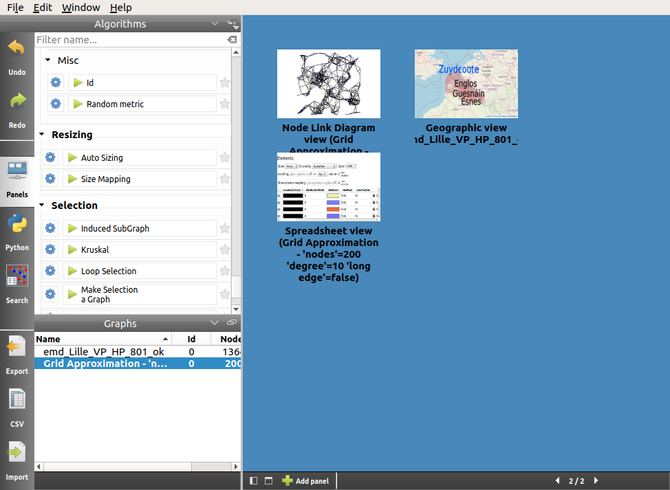

.. _gui:

*********************************************
A Quick Presentation of the Tulip Perspective
*********************************************

Here are the components of Tulip Perspective's main window:

.. image:: _images/i_interface.png
    :width: 900

.. |l_red| image:: _images/legend_red.png
    :width: 32
.. |l_yel| image:: _images/legend_yellow.png
    :width: 32
.. |l_pur| image:: _images/legend_purple.png
    :width: 32
.. |l_blu| image:: _images/legend_blue.png
    :width: 32

|l_red| Menus and toolbar

|l_yel| Algorithms panel

|l_pur| Graphs panel

|l_blu| Workspace view

From this point and even if it is no fully correct, we refer to the Tulip perspective by simply using the term Tulip. Differentiating one (Tulip perspective) from the other (Tulip agent) is quite simple as the perspective window proposes the visualization actions and the Tulip agent window only offers plugin management and choosing the project to open.

.. _menu:

Menus
=====

The Tulip User Interface exploits the standard *File, Edit, Window, Help* menu options.

.. image:: _images/mainmenu.png

The *File* menu contains operations for file management. One can find in it the basic *Create, Open* and *Save Project*, and the *Import* and *New graph* creation tools.

The *Edit* menu gives access to the standard tools *Undo, Redo, Cut, Copy, Paste* and *Delete*. Several other options concerning selection edition, subgraph creation, the management of preferences and color scales can also be found there.

The last two menus, *Window* and *Help*, give a few various options e.g., enabling full screen mode, closing all panels, opening documentation.

.. _toolbar:

Toolbar
=======

.. |icon_undo| image:: ../../plugins/perspective/GraphPerspective/resources/icons/32/undo.png 
.. |icon_redo| image:: ../../plugins/perspective/GraphPerspective/resources/icons/32/redo.png 
.. |icon_workspace| image:: ../../plugins/perspective/GraphPerspective/resources/icons/32/desktop.png

.. |icon_csv| image:: ../../plugins/perspective/GraphPerspective/resources/icons/32/spreadsheet.png
.. |icon_import| image:: ../../library/tulip-gui/resources/icons/64/document-import.png
    :width: 32
.. |icon_plugin| image:: ../../plugins/perspective/GraphPerspective/resources/icons/32/system-software-install.png
.. |icon_search| image:: ../../plugins/perspective/GraphPerspective/resources/icons/48/search.png
    :width: 32

The vertical toolbar, on the left of the main window, contains 8 buttons: 

* |icon_undo| **Undo** and |icon_redo| **Redo**: allows the user to navigate through the operations performed on the graph.

* |icon_workspace| **Panels**: toggle between the display of the overviews of all created panels and the display of the workspace (more information in :ref:`workspace_view`).

When overviews are displayed, you can then double-click on a panel icon to open it, click on the cross in the top-right corner of the icon to delete it, or click again on the **Panels** button to return to the views currently displayed in the workspace.

* |icon_develop| **Python**: displays the Tulip python IDE (find more in :ref:`developer_view`).

* |icon_search| **Search**: displays the Search dialog (find more in :ref:`search_dialog`).

* |icon_export| **Export**: opens the graph exporting wizard (more in :ref:`first_save`).

* |icon_csv| **CSV**: opens the CSV data importing wizard (more information in :ref:`csv`).

* |icon_import| **Import**: opens the graph importing wizard (learn more about it in :ref:`first_create`).

* |icon_plugin| **Plugins**: only available on Mac and Windows platform, opens the plugins center of the Tulip agent (see in :ref:`plugin` for more information).

.. _algo_window:

Algorithms panel
================

.. |icon_algorithm_fav| image:: ../../plugins/perspective/GraphPerspective/resources/icons/16/favorite.png
.. |icon_algorithm_unfav| image:: ../../plugins/perspective/GraphPerspective/resources/icons/16/favorite-empty.png

.. |icon_link| image:: _images/i_link.png
.. |icon_unlink| image:: _images/i_unlink.png

Tulip proposes several ready-to-use algorithms, offering - among others - colorization, labeling and presentation solutions.

.. image:: _images/i_algorithm.png

In the right corner of the title bar of this panel, you find two buttons.

The left button allows to expand/contract the contents of this panel:

* |icon_hide_contents|: When this icon is displayed, clicking on this button hides the content of the panel.

* |icon_show_contents|: When this icon is displayed, clicking on this button shows the content of the panel.

Clicking on the right button displays a menu.

.. image:: _images/menu_result.png

This menu allows to choose the storage policy for the result of property algorithms (such as measures or layout algorithms). When they are applied to a subgraph, this result can be stored:

* either in a local subgraph property (created on the fly if needed),

* or in a property already existing in the ascendant hierarchy (inherited or local).

Here are the description of the contents of the Algorithms panel:

* *Filter*: A search field to find the algorithms whose name or (sub) group match a given pattern.

* |icon_algorithm_fav|: keep the most useful algorithms nearby by putting them in your favorites (drag them in the favorite zone or click on |icon_algorithm_unfav|).

* |icon_algorithm_properties|: most algorithms need parameters, you can display them by clicking on the gear icon.

* |icon_algorithm_launch|: once parameters are set, just click on the algorithm name or drag and drop it on the selected graph.

.. _graph_list:

Graphs panel
============

.. |icon_hide_contents| image:: _images/i_hide_contents.png
.. |icon_show_contents| image:: _images/i_show_contents.png

This panel gives information about the currently opened graphs.

.. image:: _images/i_graphs.png

|

In the right corner of this title bar of this panel, you find two buttons.

The left button allows to expand/contract the contents of this panel:

* |icon_hide_contents|: When this icon is displayed, clicking on the button hides the panel's content.

* |icon_show_contents|: When this icon is displayed, clicking on the button shows the panel's content.

Clicking on right button allows to specify the synchronization policy of the Graphs panel with the workspace active panel:

* |icon_link|: When this icon is displayed, it indicates that the selection of the active graph in the Graphs panel is synchronized with the selection of the graph in the workspace active panel. This means that when selecting a graph to display for this panel, it also becomes the active graph in the Graphs list and then the graph on which algorithms are applied.

* |icon_unlink|: When this icon is displayed, it indicates that the selection of the active graph in the Graphs panel is not synchronized with the selection of the graph in the workspace active panel. 

Users can right-click on the desired graph to open a menu proposing new options such as renaming the graph, deleting it, saving or exporting it (more in :ref:`first_save`).

.. image:: _images/i_graphs_rclick.png

.. _workspace_view:

Workspace view
==============

.. |icon_addpanel| image:: _images/icon_addpanel.png

The workspace is where the visualization takes place. In this space, the user can create different panels to represent data and information.

.. image:: _images/i_workspace.png

To create a new panel at least one graph must exist. Then click on the icon |icon_addpanel| at the bottom left of the workspace or right-click on its name and select *Add panel* (both of them mentioned in :ref:`graph_list`). Otherwise, when no panel is open, you can click on the icon |icon_add| in the middle of the workspace. Each of those steps open the following window :

.. image:: _images/i_graphs_panel.png

About ten panel types are available in Tulip, each of those is presented in this documentation. More information on the workspace can be found in :ref:`the workspace section<workspace>`.

.. _developer_view:

Tulip Python IDE
================

Even with more than a hundred algorithms at your disposition, you may have special needs and/or want to implement your own solutions. If you are willing to implement graph manipulation algorithms, directly heading to program a C/C++ module or plug-in can be rather tricky. Instead, Tulip proposes to use the dynamic programming language `Python <http://www.python.org>`_ to easily and interactively try and implement your solutions. The Tulip Python IDE allows you to create your own scripts, plugins and modules in Python.

.. image:: ../python/tulipPythonScript.png

You may find more information in the `Tulip Python IDE <../../tulip-python/html/gettingstarted.html#tulip-python-ide>`_ section of the Tulip Python documentation.

.. _search_dialog:

Search
======

.. image:: _images/i_workspace_search.png

The tool **Search** can be used in parallel of any panel. It provides a way of selecting graph's elements according to specific criteria. 

First start by selecting the graph and the elements targeted and by choosing the selection mode. The result (respecting the criteria or not) is stored in a boolean property, *viewSelection* by default. Then choose the values to compare and hit the button *Search* to launch the tool.

If the *viewSelection* has been selected as the result property, the selected elements are automatically enhanced in any workspace views.

.. _preferences:

Preferences
===========

Tulip can be configured in several ways. The simplest way is to display the settings dialog through the *Preferences* item of *Edit* menu.

.. image:: _images/i_settings.png

The *Automatic actions* tab, contains a few specific options. You can, for instance, adjust the aspect ratio when updating the layout, indicate the default projection type, automatically adapt the color according the metric being computed, display the time used to run an algorithm or indicate the graph file format to be used when saving a Tulip project.

The *Display settings* tab allows to choose the *Display mode* (Light or Dark) and to select the *Drawing defaults* such as the color, shape and size used for every new nodes and edges. The selection color is used to enhance the selected elements in the 3D views.

You can also change the *Proxy settings* such as: the socket, the host address and the port to use. 
