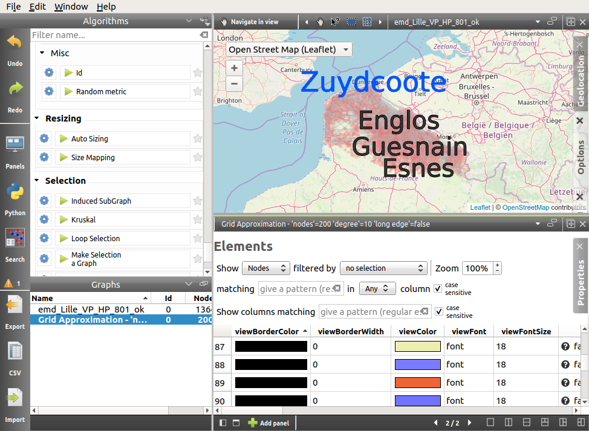

.. _gui:

*********************************************
A Quick Presentation of the Tulip Perspective
*********************************************

Here are the components of Tulip Perspective's main window:

.. image:: _images/i_interface.png
    :width: 600

.. |l_red| image:: _images/legend_red.png
    :width: 32
.. |l_yel| image:: _images/legend_yellow.png
    :width: 32
.. |l_pur| image:: _images/legend_purple.png
    :width: 32
.. |l_blu| image:: _images/legend_blue.png
    :width: 32

|l_red| Menus and toolbar

|l_yel| Algorithms panel

|l_pur| Graphs panel

|l_blu| Workspace view

From this point and even if it is partially incorrect, we will refer to the Tulip perspective by simply using the term Tulip. Differenciating one from the other should not be too complex as the perspective window proposes the visualization actions and the Tulip framework window only offers you to manage your plugins and to choose your project.

.. _menu:

Menus
=====

The Tulip User Interface exploits the standard *File, Edit, Window, Help* menu options.

The *File* submenu contains the operation for file management. One can find in it the basic *Create, Open* and *Save Project*, and the *Import* and *New graph* creation tools.

The *Edit* submenu gives access to the standard tools *Undo, Redo, Cut, Copy, Paste* and *Delete*. Several other options concerning the selection operations or the subgraph creation can also be found here.

The two last submenus, *Window* and *Help*, give a few various options going from enabling the full screen mode to the opening of the help window or of the currnet documentation.

.. _toolbar:

Toolbar
=======

.. |icon_undo| image:: ../../plugins/perspective/GraphPerspective/resources/icons/32/undo.png 
.. |icon_redo| image:: ../../plugins/perspective/GraphPerspective/resources/icons/32/redo.png 
.. |icon_workspace| image:: ../../plugins/perspective/GraphPerspective/resources/icons/32/desktop.png
.. |icon_develop| image:: ../../plugins/perspective/GraphPerspective/resources/icons/32/python.png
.. |icon_csv| image:: ../../plugins/perspective/GraphPerspective/resources/icons/32/spreadsheet.png
.. |icon_import| image:: ../../plugins/perspective/GraphPerspective/resources/icons/32/document-import.png
.. |icon_plugin| image:: ../../plugins/perspective/GraphPerspective/resources/icons/32/system-software-install.png

The vertical toolbar, on the left of the main window, contains 6 buttons: 

* |icon_undo| **Undo** and |icon_redo| **Redo**: allows the user to navigate through the operations performed on the graph.

* |icon_workspace| **Workspace**: displays the workspace view (more information in :ref:`workspace_view`).

* |icon_develop| **Develop**: displays the Tulip plugins editor (find more in :ref:`developer_view`).

.. image:: _images/i_develop.png
    :width: 600

* |icon_csv| **CSV**: open the CSV data importing wizard (more information in :ref:`csv`).

* |icon_import| **Import**: open the graph importing wizard (learn more about it in :ref:`first_create`).

* |icon_plugin| **Plugins**: only available on Mac and Windows OS, open the plugins center (see in :ref:`plugin` for more information).

.. _algo_window:

Algorithms panel
================

.. |icon_algorithm_fav| image:: ../../plugins/perspective/GraphPerspective/resources/icons/16/favorite.png
.. |icon_algorithm_unfav| image:: ../../plugins/perspective/GraphPerspective/resources/icons/16/favorite-empty.png
.. |icon_algorithm_properties| image:: ../../plugins/perspective/GraphPerspective/resources/icons/16/preferences-other.png
.. |icon_algorithm_launch| image:: ../../plugins/perspective/GraphPerspective/resources/icons/16/media-playback-start.png
.. |icon_link| image:: _images/i_link.png
.. |icon_unlink| image:: _images/i_unlink.png

Tulip proposes several ready-to-use algorithms, offering - among others - coloration, labeling and presentation solutions.

.. image:: _images/i_algorithm.png
    :width: 300

In the right corner of the title bar of this panel, you will find two buttons.

The left button allows to expand/contract the contents of this panel:

* |icon_hide_contents|: When this icon is displayed, clicking on this button will hide the contents of the panel.

* |icon_show_contents|: When this icon is displayed, clicking on this button will show the contents of the panel.

Clicking on the right button displays a menu.

.. image:: _images/menu_result.png

This menu allows to choose the storage policy for the result of property algorithms (such as measures or layout algorithms). When they are applied to a subgraph, this result can be stored:

* either in a local subgraph property (created on the fly if needed),

* or in a property already existing in the ascendant hierarchy (inherited or local).

Here are the description of the contents of the Algorithms panel:

* *Filter*: A search field to find the algorithms whose name or (sub) group match a given pattern.

* |icon_algorithm_fav|: keep the most useful algorithms nearby by putting them in your favorites (drag them in the favorite zone or click on |icon_algorithm_unfav|).

* |icon_algorithm_properties|: most algorithms need parameters, you can display them by clicking on the gear icon.

* |icon_algorithm_launch|: once parameters are set, just click on the algorithm name or drag and drop it on the selected graph.

.. _graph_list:

Graphs panel
============

.. |icon_hide_contents| image:: _images/i_hide_contents.png
.. |icon_show_contents| image:: _images/i_show_contents.png

This panel gives information about the currently opened graphs.

|

In the right corner of this title bar of this panel, you will find two buttons.

The left button allows to expand/contract the contents of this panel:

* |icon_hide_contents|: When this icon is displayed, clicking on this button will hide the contents of the panel.

* |icon_show_contents|: When this icon is displayed, clicking on this button will show the contents of the panel.

Clicking on right button allows to specify the synchronization policy of the Graphs panel with the workspace active panel:

* |icon_link|: When this icon is displayed, it indicates that the selection of the active graph in the Graphs panel is synchronized with the selection of the graph in the workspace active panel. This means that when selecting a graph to display for this panel, it also becomes the active graph in the Graphs list and then the graph on which algoritms will applied.

* |icon_unlink|: When this icon is displayed, it indicates that the selection of the active graph in the Graphs panel is not synchronized with the selection of the graph in the workspace active panel. 

Users can right-click on the desired graph to open a menu proposing new options such as renaming the graph, deleting it, saving or exporting it (more in :ref:`first_save`).

.. image:: _images/i_graphs_rclick.png

.. _workspace_view:

Workspace view
==============

.. |icon_addpanel| image:: _images/icon_addpanel.png
.. |icon_add| image:: ../../plugins/perspective/GraphPerspective/resources/icons/16/view-add.png

The workspace is where the visualization takes place. In this space, the user can create different panels to represent data and information.

To create a new panel at least one graph must exist. Then click on the icon |icon_addpanel| at the bottom-right of the graph list or right-click on its name and select *Add panel* (both of them mentioned in :ref:`graph_list`). Otherwise, when no panel is open, you can click on the icon |icon_add| in the middle of the workspace. Each of those steps open the following window :

.. image:: _images/i_graphs_panel.png
    :width: 600

About ten panel types are available in Tulip, each of those is presented in this documentation. More information on the workspace can be found in :ref:`the appropriate section<workspace>`.

.. _developer_view:

Python plugin editor
====================

Even with more than a hundred algorithms at your disposition, you may have special needs and/or want to implement your own solutions. The Python plugin editor allows you to create your own plugins and modules in Python.

.. image:: _images/i_develop.png
    :width: 600

Though the component is not entirely identical to the Python script view, they both are quite similar. Thus, you may find more information in the :ref:`section presenting it <workspace_python>`.

.. _preferences:

Preferences
===========

Tulip can be configured in several ways. The quickest way is to access to the settings window through the *Edit* menu, and the *Preferences* element.

.. image:: _images/i_settings.png
    :width: 600

You can here change the proxy settings (soon available) such as: the socket, the host address and the port to use. 

The drawing defaults, such as the color, shape and size, are used for to every new nodes and edges, however, the selection colour is only used in the node-link diagram based views.

The third part of settings, concerning the automatic actions, contains a few specific options. You can, for instance, adjust the aspect when updating the layout, indicate the default projection type, automatically adapt the colour according the metric being computed or display the time used to run an algorithm.
