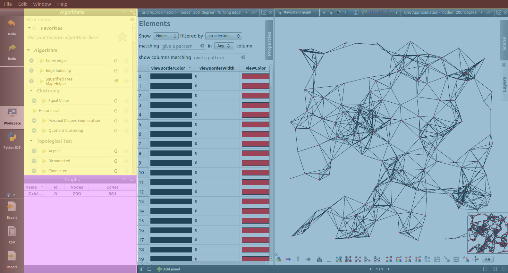

.. _gui:

****************************************************
A Quick Presentation of the Graphical User Interface
****************************************************

We suggest to run Tulip and experiment with the concepts explained while reading this Manual. When starting the software, the welcome window will appear. You can open one of the perspectives of Tulip by clicking on the corresponding green arrow icon or double clicking on their description box. The "Open Project" button also allows you to directly open one of your Tulip file, graph or project.
Here are the components of the main window:

.. |l_red| image:: _images/legend_red.png
    :width: 32
.. |l_yel| image:: _images/legend_yellow.png
    :width: 32
.. |l_pur| image:: _images/legend_purple.png
    :width: 32
.. |l_blu| image:: _images/legend_blue.png
    :width: 32

|l_red| Menus and toolbar

|l_yel| Algorithm panel

|l_pur| Graph list

|l_blu| Workspace view

.. _menu:

Menus
=====

The Tulips's User Interface exploits the standard *File, Edit, Window, Help* menu options.

.. image:: _images/mainmenu.png

The *File* submenu contains the operation for file management. One can find in it the basic *Create, Open* and *Save Project*, and the *Import* and *New graph* creation tools.

The *Edit* submenu gives access to the standard tools *Undo, Redo, Cut, Copy, Paste* and *Delete*. Several other options concerning the selection operations or the subgraph creation can also be found here.

The two last submenus, *Window* and *Help*, give a few various options going from enabling the full screen mode to the opening of the help window.

.. _toolbar:

Toolbar
=======

.. |icon_undo| image:: ../../plugins/perspective/GraphPerspective/resources/icons/32/undo.png 
.. |icon_redo| image:: ../../plugins/perspective/GraphPerspective/resources/icons/32/redo.png 
.. |icon_workspace| image:: ../../plugins/perspective/GraphPerspective/resources/icons/32/desktop.png
.. |icon_develop| image:: ../../plugins/perspective/GraphPerspective/resources/icons/32/python.png
.. |icon_csv| image:: ../../plugins/perspective/GraphPerspective/resources/icons/32/spreadsheet.png
.. |icon_import| image:: ../../plugins/perspective/GraphPerspective/resources/icons/32/document-import.png
.. |icon_plugin| image:: ../../plugins/perspective/GraphPerspective/resources/icons/32/system-software-install.png

The toolbar, placed on the left of the screen, contains 6 buttons: 

* |icon_undo| **Undo** and |icon_redo| **Redo**: Allows the user to navigate through the operations realised on the graph.

* |icon_workspace| **Workspace**: Select the workspace view (more informations in :ref:`workspace_view`).

.. image:: _images/i_workspace.png
    :width: 600

* |icon_develop| **Develop**: Select the developer view (find more in :ref:`developer_view`).

.. image:: _images/i_develop.png
    :width: 600

* |icon_csv| **CSV**: Open the CSV data importation window (more informations in :ref:`csv`).

* |icon_import| **Import**: Open the graph importing wizard (learn more about it in :ref:`first_create`).

* |icon_plugin| **Plugins**: Only available on Mac and Windows OS, open the plugin center (see in :ref:`plugin` for more informations).

.. _algo_window:

Algorithm window
================

.. |icon_algorithm_fav| image:: ../../plugins/perspective/GraphPerspective/resources/icons/16/favorite.png
.. |icon_algorithm_unfav| image:: ../../plugins/perspective/GraphPerspective/resources/icons/16/favorite-empty.png
.. |icon_algorithm_properties| image:: ../../plugins/perspective/GraphPerspective/resources/icons/16/preferences-other.png
.. |icon_algorithm_launch| image:: ../../plugins/perspective/GraphPerspective/resources/icons/16/media-playback-start.png

Tulip proposes several ready-to-use algorithms, offering - among others - coloration, labeling and presentation solutions.

.. image:: _images/i_algorithm.png
    :width: 300

* *Filter*: A search field to find the desired algorithm.

* |icon_algorithm_fav|: Keep the most useful algorithms nearby by putting them in your favorites (drag them in the favorite zone or click on |icon_algorithm_unfav|).

* |icon_algorithm_properties|: Some functions need parameters, you can specify each of them by clicking on the gear icon.

* |icon_algorithm_launch|: Once everything is ready, just click on the algorithm icon or drag and drop it on the selected graph.

.. _graph_list:

Graph list
==========

This window gives informations about the currently opened graphs.

.. image:: _images/i_graphs.png
    :width: 300

Users can right-click on the desired graph to open a menu proposing new options such as renaming the graph, deleting it, saving or exporting it (more in :ref:`first_save`).

.. _workspace_view:

Workspace view
==============

.. |icon_addpanel| image:: _images/icon_addpanel.png
.. |icon_add| image:: ../../plugins/perspective/GraphPerspective/resources/icons/16/view-add.png

The workspace is where the visualization takes place. In this space, the user can create different panels to represent datas and informations.

.. image:: _images/i_workspace.png
    :width: 600

To create a new panel at least one graph must exist. Then click on the icon |icon_addpanel| at the bottom-right of the graph list or right-click on its name and select *Add panel* (both of them mentionned in :ref:`graph_list`). Otherwise, when no panel is open, you can click on the icon |icon_add| in the middle of the workspace. Each of those steps open the following window :

.. image:: _images/i_graphs_panel.png
    :width: 600

About ten panel types are available in Tulip, each of those is presented in this documentation. More informations on the workspace can be found in :ref:`the appropriate section<workspace>`.

.. _developer_view:

Developer view
==============

Even with more than a hundred algorithms at your disposition, you may have special needs and/or want to implement your own solutions. The developer view allows you to create your own plugins and modules in Python.

.. image:: _images/i_develop.png
    :width: 600

Though the component is not entirelly identical to the Python script view, they both are quite similar. Thus, you may find more informations in the :ref:`section presenting it <workspace_python>`.

.. _preferences:

Preferences
===========

Tulip can be configured in several ways. The quickest way is to access to the settings window through the *Edit* menu, and the *Preferences* element.

.. image:: _images/i_settings.png
    :width: 600

You can here change the proxy settings (soon available) such as: the socket, the host address and the port to use. 

The drawing defaults, such as the color, shape and size, are affected to every new nodes and edges, however, the selection colour is only used in the node-link diagram based views.

The third part of settings, concerning the automatic actions, contains a few specific options. You can, for instance, adjust the aspect when updating the layout, indicate the default projection type, automatically adapt the colour according the metric being computed or indicate the time used to run an algorithm.
