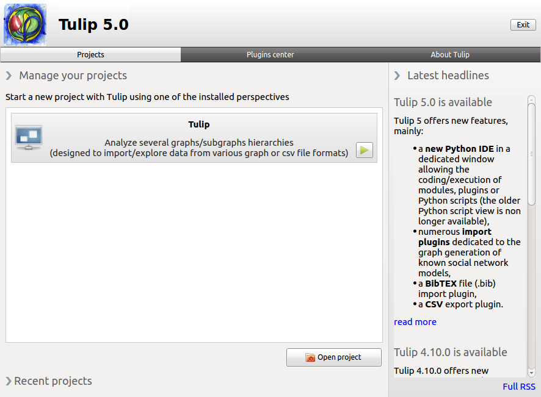

.. userHandbook documentation master file, created by
   sphinx-quickstart on Mon Jul  1 10:58:47 2013.
   You can adapt this file completely to your liking, but it should at least
   contain the root `toctree` directive.

#################################################
Welcome to the Tulip user oriented documentation!
#################################################

We suggest to run Tulip and experiment with the concepts explained while reading this Manual. In itself, the interactive part of Tulip is very limited. The user interface proposes only three distinct tabs. The first one allow to choose among the projects or perspectives of Tulip, the second one is the :ref:`plugins center <plugin>` and the third one present additionnal information about the software and the team behind it.
When starting the software, the **Projects** window will appear. You can then open one of the perspectives of Tulip by clicking on the corresponding green arrow icon or double clicking on their description box. The "Open Project" button also allows you to directly open one of your Tulip file, graph or project. 

The current documentation will present in details the Tulip Perspective. If you are interested to customize the application, you can develop your very own Tulip perspective to implement specific solutions. One example of such developement is Porgy, available through the `Tulip website <http://tulip.labri.fr>`_.

.. highlight:: c

.. _contents:

Contents:
=========

.. toctree::
   :maxdepth: 2

   gui
   tutorial_beginner
   workspace
   algorithm
   functions
   plugins_management

.. Indices and tables
.. ==================

.. * :ref:`genindex`
.. * :ref:`search`

