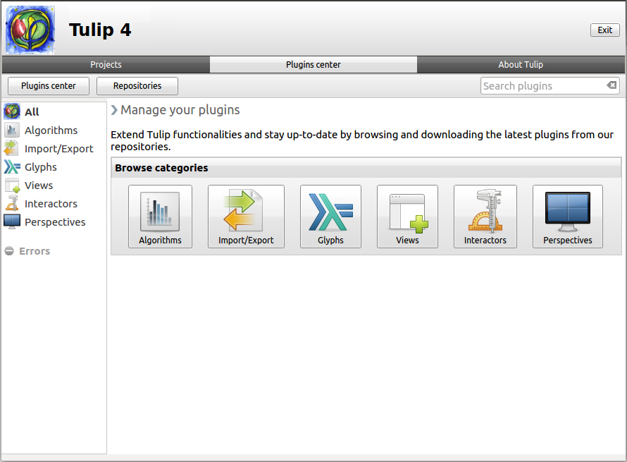
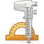
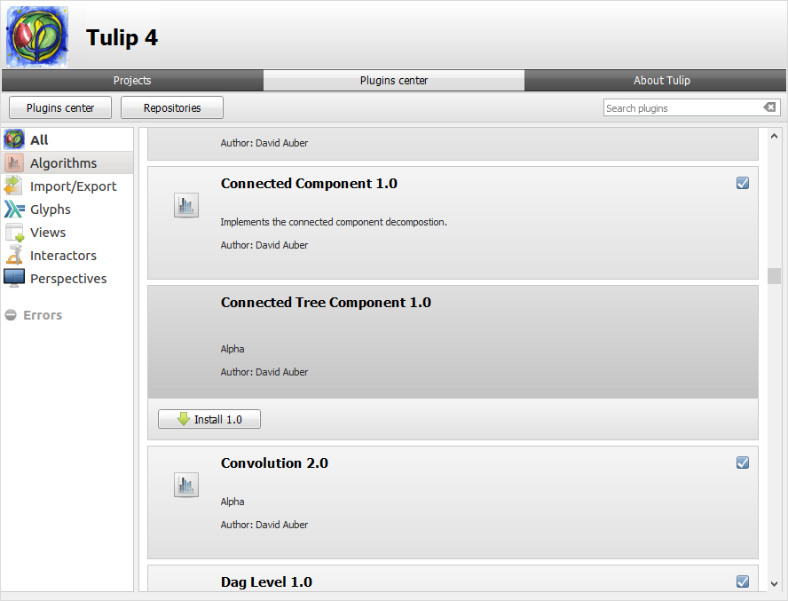

.. _plugin:

********************************************
Plugins Management (Mac OS and Windows only)
********************************************

The plugin management center can be found in the Tulip window, under the tab "Plugins center". 

As you can see, we are here again speaking of the framework and no more of the perspective. The plugins are added directly into Tulip so they can become available in every perspective in the framework. Please, also note that due to library specification and software portability, the Plugin center is not available on Unix-like systems and therefore can only be used on the Apple Mac OS and Microsoft Windows operating systems.

The plugins center panel is divided into three parts.

* The toolbar : located at the top, contains the "Plugins center" and "Repositories" buttons and the plugins search field.

* The side menu : contains the plugin categories and the errors found during the importation of the plugins.

* The main view : display the current content.
			

Navigate through the plugins
============================

Upon clicking on the "Plugins center button", located at the top left of the panel, you will be able to browse the available plugins.
Plugins are sorted by categories :

* |icon_algorithm| **Algorithms**: here are regrouped the plugins to perform a specific test or layout on your values. Despite an impressive number of proposed algorithms, new or more efficient versions of the already existing ones may be implemented depending of research publications.

* |icon_import_export| **Import/Export**: these plugins are used for the importation and exportation technics. They can describe a file formalism or specific rules for randomly generating trees or graphs.

* |icon_glyph| **Glyphs**: the glyphs are the graphic elements representing a node (*viewShape* property) or located at the ends of an edge (*view...Anchorshape* properties). Special edge extremities can give more information about the transition between the two nodes.

* |icon_view| **Views**: the node link diagram and the spreadsheet are not the only available views in Tulip. For instance, the parallel coordinates, pixel oriented and scatter plot 2D views can be used for analyzing the correlations between properties. The view defined how you visualize the information.

* |icon_interactor| **Interactors**: interactors are used to interact with a view or the elements of a view. For example the node link diagram view provides interactors (among others) to deal with nodes/edges selection, addition, removal, or to navigate in the graph.

* |icon_perspective| **Perspectives**: Tulip may have different uses. Perspectives can be developed for a specific domain such as social network analysis or an advanced customization of the provided functionalities for specific tasks such as web sites links analysis.

If you are looking for a specific plugin, the search field will help you to find it.

.. _install_remove:

Installation
============

To install a plugin, in our example the "Connected Tree Component", select it by clicking on its frame. You will see a button labelled *Install* followed by the version number of the plugin.

Once clicked on, a message indicating the need to restart Tulip to apply the changes appears.

After relaunching the software, the plugin, here the algorithm, will be available

.. image:: _images/tulip-plugin_apply.png
    :width: 600

A little checked box in top-right corner of the plugins frame indicates the plugin is ready to be used in the software.

