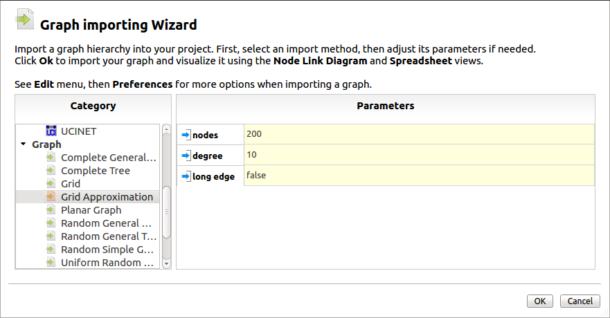
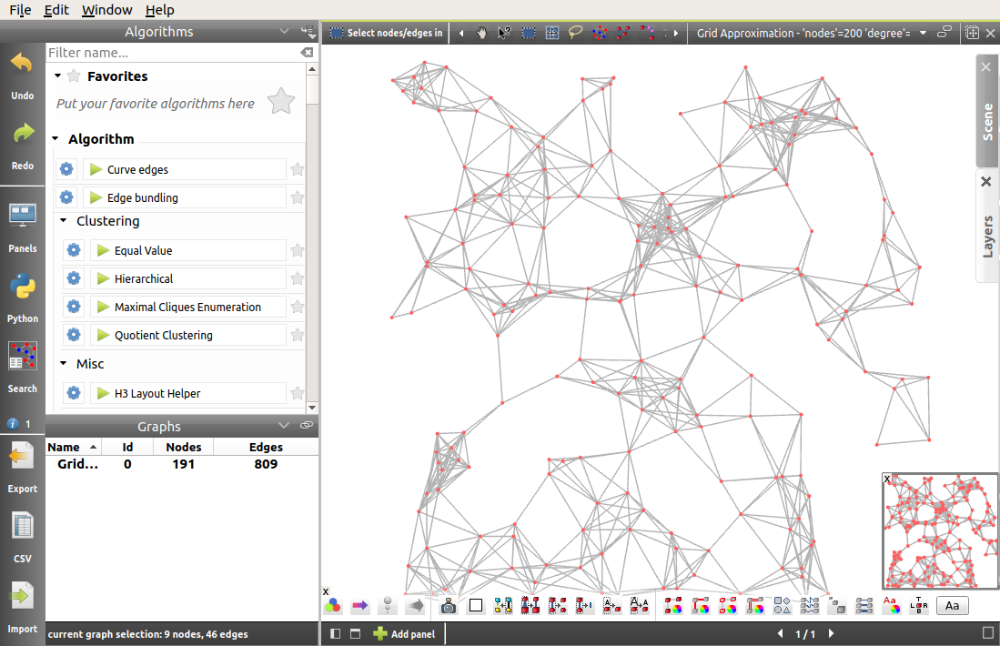
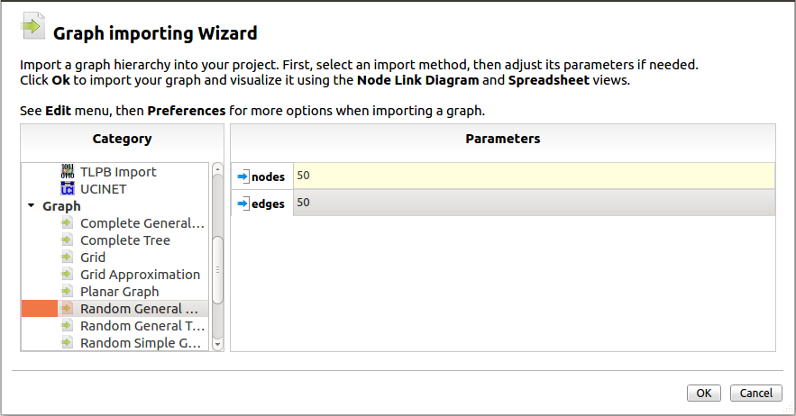
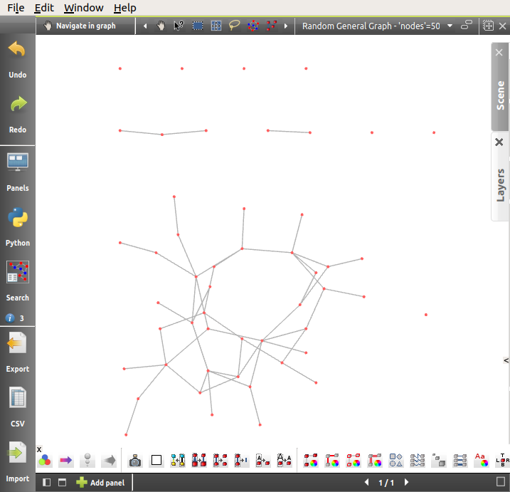
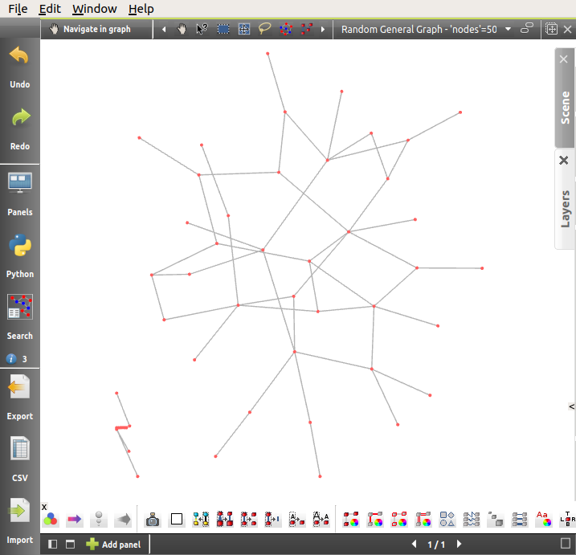

.. _first_steps:

************************
The First Steps in Tulip
************************

The goal of this part is to follow a small tutorial by creating a graph, saving it, and apply on it the most common analysis operations.

.. _first_graph:

Creation
========

There are several ways to create a graph: through a generation algorithm, by manually building it element by element, or by importing CSV data (more on it in :ref:`this page <csv>`).

.. _first_import:

Generate a graph
----------------

* Click on the icon |icon_import| **Import** in the toolbar on the left or in the middle of the workspace if no graph are opened, or select *File → Import*.

* Under the category *Graph*, select a generation method, for instance *Grid Approximation*.

* As you can notice, a few properties can be specified, in the *Grid Approximation* case, the number of *nodes*, the maximum *degree* and whether or not *long edges* should be generated. Those parameters can allow you to generate an example according to your needs. When you have choose your options, click on *Finish*.

A graph with nodes and edges is now displayed. You can manipulate the camera with a few commands :

* You can zoom in and out with the mouse wheel or with *Ctrl+LClick* and a forward or backward movement of the mouse.

* Left-click and drag to move the graph.

* *Shift+LClick* rotates the graph around the X and Y axis, *Ctrl+LClick* and a translation of the mouse to the left or the right rotates around the Z axis.

* To reset the view, just right-click anywhere in the workspace and select *Center view* (*Ctrl+Shift+C*).

**A few precisions towards the OS and Mac users:** Tulip is multi-platform, however, significant changes can be spotted from one OS to another. In addition to the different fonts and window systems, the keyboard shortcuts can also slightly vary. Most of the time in the combinations, the use of the *Ctrl* key is replaced by *Alt*.

.. _first_create:

Build a Graph
-------------

* To create an empty graph, you can invoke the |icon_import| **Import** wizard, by choosing the category *Empty Graph*, or you can click on *File → New graph*.

* Select the *Add nodes/edges* tool (|icon_wst_add_nodes_edges|). Left click on a few different places in the workspace: each click adds a node. Now, you can add a few links: left click on the source node, then on the target node to create it (middle click aborts the current edge creation).

* To delete an element, right click on the element to remove and select the *Delete* item in the contextual menu than displayed. You can also select the *Delete nodes or edges* tool (|icon_wst_delete_nodes_edges|) and click on the element you want to remove.

.. _first_save:

Save your Work
==============

Tulip allows you to save your whole project with its own file format (\*.tlpx). To do so, select *File → Save* or *File → Save as*.

If you are interested to only save the graph, Tulip proposes to save it in its own TLP format, do a right click on the graph's name in the graph list and select *Save to file* in the contextual menu then displayed. You can also export it in the GML format (other plugins can offer more possibilities) by selecting *Export* in the same contextual menu.

.. _first_algo:

Apply an Algorithm
==================

As a visualization tool, Tulip offered several algorithms to adapt your graph layout. You can use them very simply.

* Following the steps mentioned above, let us generate a *Random General Graph* (*[File →] Import → Random General Graph* in the *Graph* category). We will specify here the *nodes* and *edges* settings (*Random General Graph* specific fields displayed in the import wizard) by typing *50* in both of the fields.

* Once the button *Finish* is pressed, you can see a graph similar to this one :
   

Since node positions are choose randomly upon generation, the layout is tangled and not really clear.

* To improve it, we can apply a *Layout algorithm*. In the Algorithm window, select *Layout → Force directed → GEM (Frick)*. A new position for each node will be computed in order to get a better layout:

Some *layout* algorithms can only be applied to graphs belonging to a specific graph class. For instance, the *Mixed Model* algorithm can only be applied to a simple graph. The *Tree layout* algorithms are dedicated to trees but most of them can be applied to graph of any type (using a spanning tree of the graph); so do not hesitate to experiment in order to find the perfect layout for your data.

There are many algorithms for testing, coloring, resizing... more information on them can be find in :ref:`the Algorithm section <algo>`.

.. |icon_import| image:: ../../plugins/perspective/GraphPerspective/resources/icons/32/document-import.png

