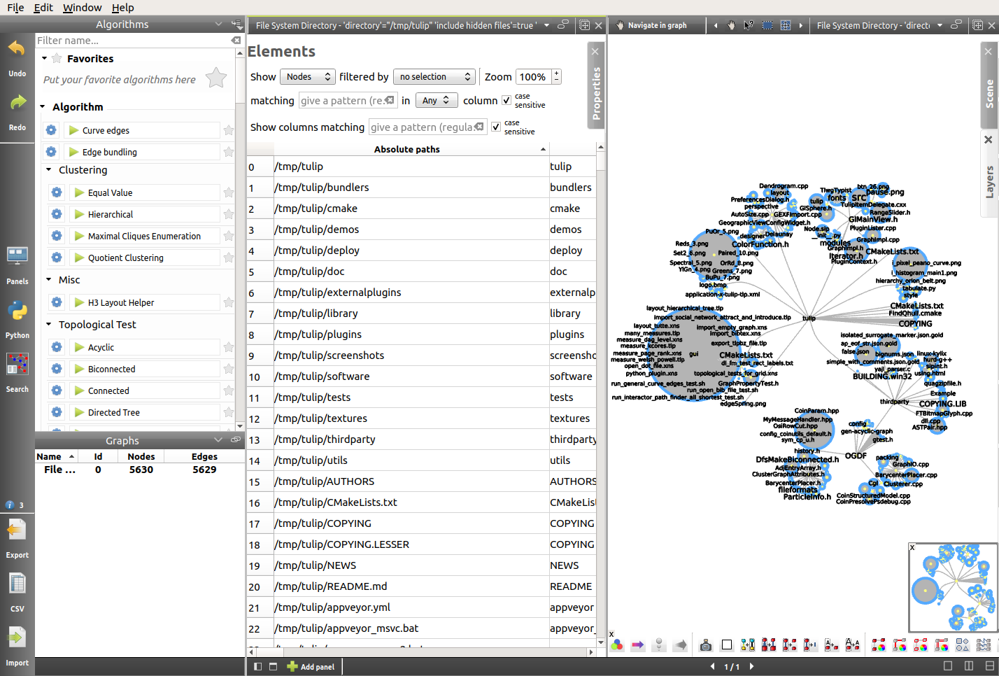
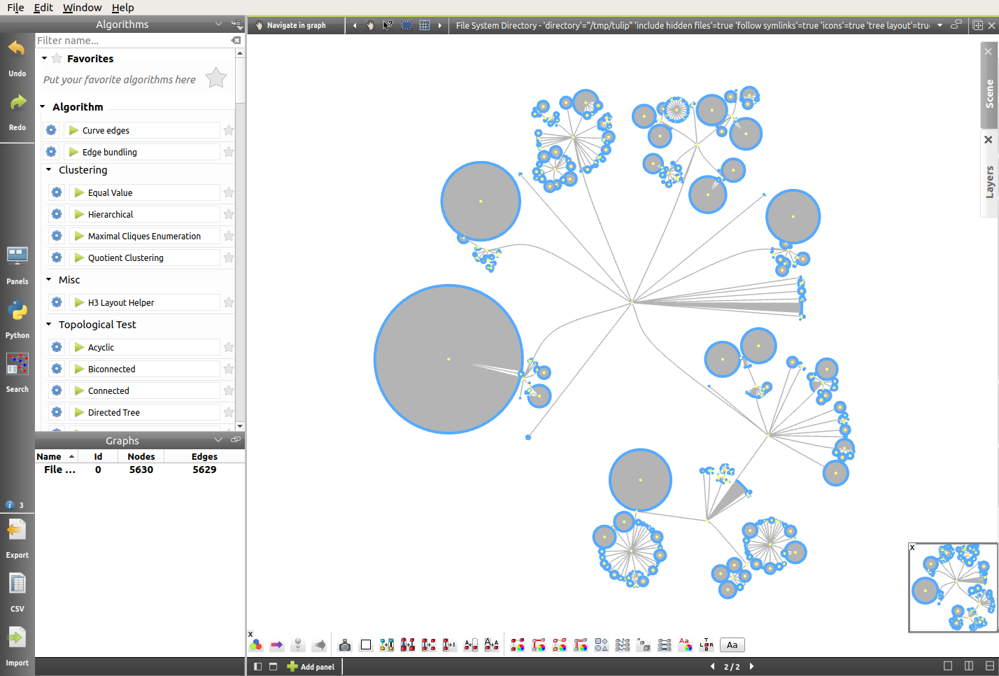
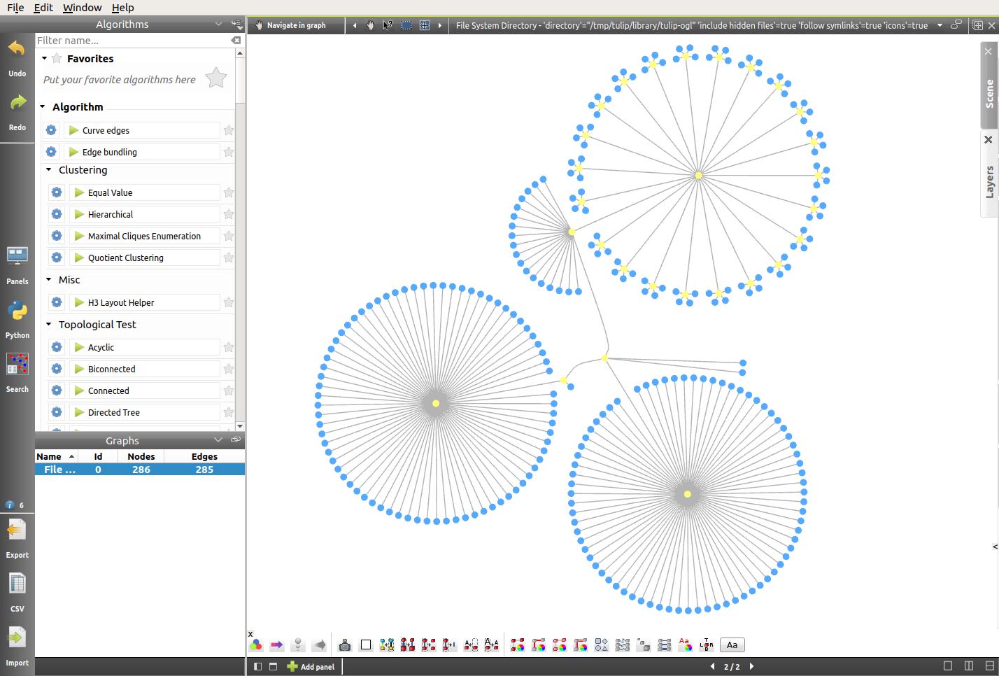
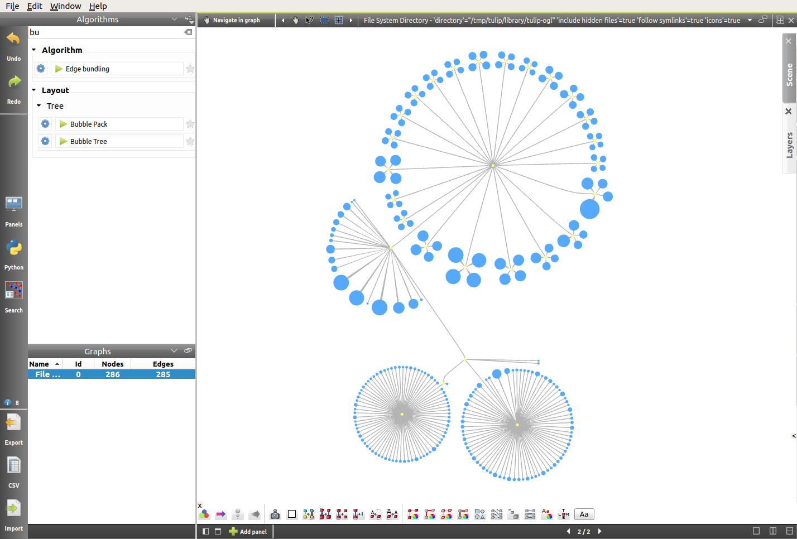
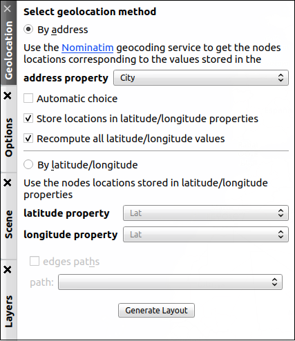
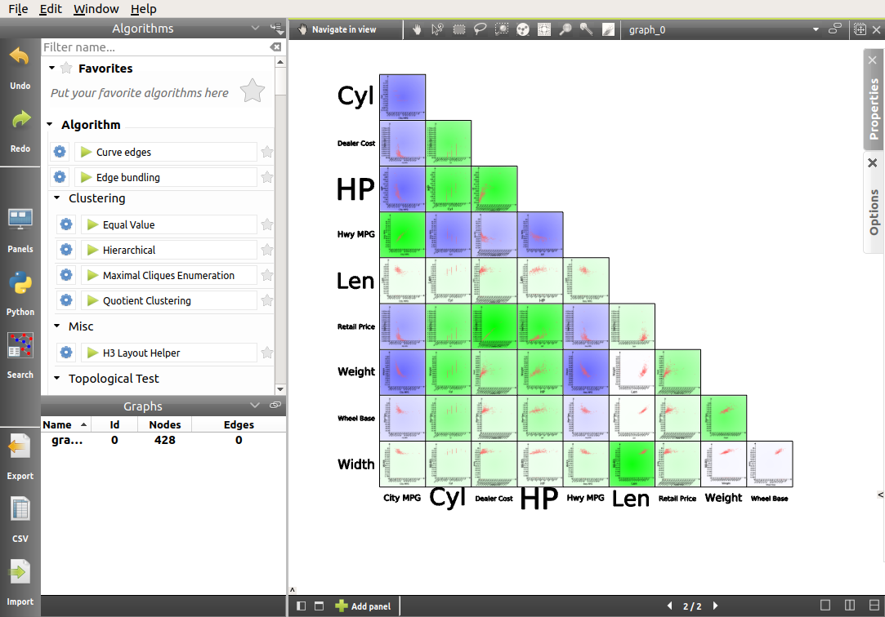
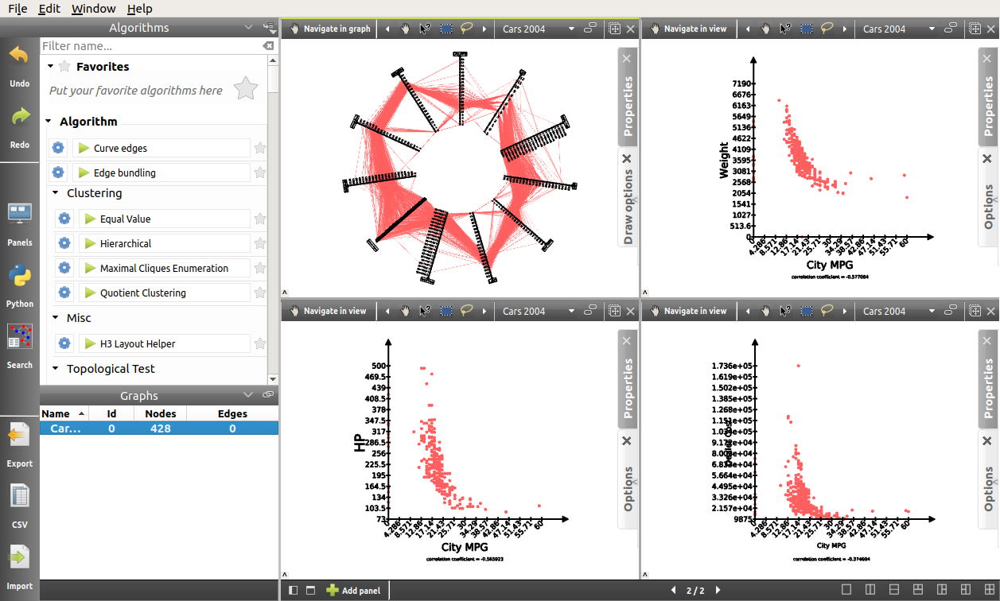
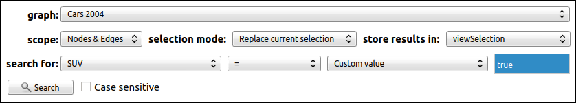
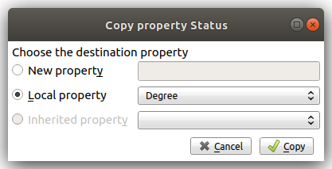

.. _in_practice:

************************************
Tulip in Practice: Four case studies
************************************

These tutorials are intended for users who are already familiarized with the Tulip workspace, as presented in :ref:`gui`, as well as with the basics of Tulip detailed in :ref:`first_steps`.
Here, our purpose will be to highlight some of the possibilities offered by Tulip for data visualization and data analysis, using real-word dataset examples. 

Some of these files can be found on the website `idvbook.com <http://www.idvbook.com/teaching-aid/data-sets/>`__, which is associated with the book:
 
*Interactive data visualization: foundations, techniques, and applications*, by Matthew Ward, Georges Grinstein, and Daniel Keim. [#footnote1]_

.. _tulip_directory:

A Visual Representation of the Tulip Directory
==============================================

.. |icon_panels| image:: _images/icon_panels.png

.. |icon_import| image:: ../../library/tulip-gui/resources/icons/64/document-import.png
   :width: 32

.. |icon_wsm_label_visible_dis| image:: ../../library/tulip-gui/resources/icons/20/labels_enabled.png

.. |icon_wsm_node_shape_set| image:: ../../library/tulip-gui/resources/icons/20/set_node_shape.png

This introductory tutorial will be a good opportunity to apply some of the basic features of Tulip presented in the previous sections. We will see how we can **generate a graph**, apply a **resizing algorithm**, and more.

Generating the graph
--------------------

Before anything else, we will need Tulip to **import** the graph:

* Click on the |icon_import| **Import** icon in the toolbar on the left, or in the center of the workspace if no graph is currently opened, or select *File → Import*.

* Under the category *Misc*, choose *File System Directory*.

.. image:: _images/tutorial01_01b.png
	:width: 770

* Select a directory. Here we will simply select the *tulip* directory and let Tulip generate a tree layout automatically. By default (see `Preferences <gui.html#preferences>`_), Tulip will display the corresponding *Spreadsheet View* on the left, and a *Node Link Diagram view* on the right.

.. note:: The default layout algorithm applied to file system directories is the *Bubble Tree* algorithm, but other layout algorithms are available.

Improving the layout
--------------------

Here the goal will be to apply a few basic algorithms to greatly improve the layout:

* The first thing we are going to do is switching to a one-panel view in order to focus on the *Node Link Diagram view*. In order to do that, we will use the icons situated at the bottom of the view: |icon_panels| 

* Using the arrows at the bottom of the view, we can then switch to the *Node Link Diagram view*.

* After that, *Right click → Center view* in the *Node Link Diagram view* will center the tree. 

* Finally, we will remove the node labels, using the |icon_wsm_label_visible_dis| icon at the bottom of the window and modify the shape of the nodes, using the |icon_wsm_node_shape_set| icon. We will use the *3D - Half-Cylinder* shape.

In this representation, we can notice how the number of files contained in a directory influences its size. The wide and circular directory on the top right corresponds to the "html" folder, which contains numerous files and only one subfolder. However, for the moment the size of the nodes is not relevant, and so it might be interesting to map that size to the size of the files. From now on, we will focus on a small subfolder, for better visibility.

* First, we want the area occupied by the nodes to reflect the size of the files they represent. Naturally, the size of each file is part of the data collected by Tulip when importing the directory. Therefore, we simply have to apply a resizing algorithm on the basis of the file sizes.

Here are the settings (the size of the files will be mapped to the area of the circles, on a scale from 1 to 10):

.. image:: _images/tutorial01_05b.png
	:align: center

The result is the following layout. As we can see, the resizing algorithm has caused some overlap between nodes. 

* In order to solve that problem, we will simply re-apply the *Bubble Tree* layout algorithm (click on *Bubble Tree* in the *Algorithms* top left panel). Here is the result:

From a 2D to a 2.5D Representation
----------------------------------

Now that the area of the nodes is dealt with, we will map the size of the files to the depth of the half-cylinders. We will apply the same resizing algorithm as before, only this time the width and height settings will remain unchanged, whereas the resizing will occur on the depth value. We will also change the scale, making it from 1 to 20. This should help highlight the diversity in file sizes. Here are the settings:

.. image:: _images/tutorial01_08b.png
	:align: center

In order to observe the result of the previously applied algorithm, we will do a X-Y rotation using the current *Navigate in graph* interactor (see `Toolbar <workspace.html#toolbar>`_ for more details). And there we have it, a visual representation of the Tulip directory.

Bonus: A Beautiful 2D Representation
------------------------------------

Here is another way we might want to represent the Tulip directory, using some of the tools seen above, and others. We leave the reproduction of this view as an exercice for the reader curious to explore more of the possibilities offered by Tulip.

|

.. image:: _images/tutorial01_Bonusb.png
	:width: 770

|

Taking Advantage of the Geographic view: A Simple US Temperature Map
====================================================================

.. |icon_add_panel| image:: _images/icon_addpanel.png

The potential offered by the *Geographic view* is indeed great for data visualization. In this short tutorial, we will go through the process of **importing a CSV file**, **generating a geographic view** on the basis of this data, and we will apply some basic algorithms in order to make our visualization as relevant as possible.

Importing the data
------------------

The data used for this visualization was downloaded from the `idvbook.com <http://www.idvbook.com/teaching-aid/data-sets/the-city-temperature-data-set/>`__ website. A *CSV* file can easily be generated from the XLS table found in the archive.

The point here is to make sense of the following raw data, using some of the Tulip basic features:

.. image:: _images/tutorial02_01b.png

* The first step will be to import the *CSV* file into Tulip. As the reader should be comfortable with that process by now, we will simply include a link to the relevant section: :ref:`csv`. The default import settings should work nicely, and of course these are *new entities (nodes)*.

* Here again, Tulip displays a two-panel view with the *Spreadsheet view* on the left, and a *Node Link Diagram view* on the right. Therefore, we might want to start by switching to a one-panel view. Just like we did previously, we will use the icons situated at the bottom of the view: |icon_panels|

Generating a *Geographic view*
------------------------------

* Now that our workspace is set up, it is time to generate the *Geographic view*. The simplest way is to double click on the graph name in the *Graphs* panel on the left, or else we can also click on the |icon_add_panel| icon. Select *Geographic view*, click on *OK*, and the RoadMap view should appear. Also, the following warning message should pop up:

.. image:: _images/tutorial02_02b.png
	:align: center

.. note:: Because of the nature of the visualization we are aiming for, we suggest switching to the Hybrid view.

* In order to place the nodes, click on the *Geolocation* tab on the right-hand side of the view. Despite the fact that the data includes the latitude and longitude of US cities, the longitude values are not directly usable because they must be negative but they are not, and for that reason, we will use the city names instead. Fortunately, they will be sufficient for Google Maps to place the nodes. The *geolocation method* will therefore be **By address** and the string property will be **City**:

* We can see the process of geolocation taking place, thanks to this progress bar:

.. image:: _images/tutorial02_04b.png
	:align: center

* Here is what the view should look like once the geolocation is finished:

.. image:: _images/tutorial02_05b.png
	:width: 770

.. note:: If the placement of the nodes does not seem right, try dragging the view a little bit in order to refresh their position.

Improving the layout
--------------------

Now that the nodes are correctly placed, we will apply a few algorithms to create the most relevant layout possible:

1. First, we will modify the shape. Since the usual toolbar is not present in the *Geographic view*, we can switch to the *Spreadsheet view* to proceed to these changes. To modify the default value for all nodes at once, *Right click* in the *viewColor* column (the node does not matter) → *Set value(s) of* → *All nodes of the current graph*. Here we will use the *2D - Rounded box* shape.

.. image:: _images/tutorial02_06b.png

2. We will go through the same process (in clicking in a view property column) to increase the size of the nodes (making the *viewSize* values W:5, H:5, D:1), as well as the default color of the nodes (*viewColor*), in order to achieve this kind of layout:

.. image:: _images/tutorial02_07b.png
	:width: 770

3. The next step is to create labels for every node. By default, the *viewLabel* property is empty for every node, but we can easily assign the city names to the labels, either from the *Spreadsheet view*, with the combination *Right click* on a city name → *To label(s) of* → *All nodes of the current graph*; or by applying the *Labeling* algorithm *To labels*, with the following settings:

.. image:: _images/tutorial02_08b.png
	:align: center

4. The final step is to apply a *Coloring* algorithm. As we are dealing with temperature in this case, the choice of a color gradient will be paramount in creating a relevant visualization. First, open the *Color Mapping* algorithm settings, in the *Coloring* section. Of course, the input will be **JanTemp**, and the target will be the nodes. In order to configure the color scale, we will click once on the gradient, go in the *Predefined color scale* tab, and select the *RdYlBu_9.png* color scale.

.. image:: _images/tutorial02_09b.png
	:align: center

By default, the maximum value corresponds to blue, and the minimum to red. In order to invert the scale, click one more time on the gradient, and in the first tab, click on the double arrow.

.. image:: _images/tutorial02_10b.png
	:align: center

|

Here is the final layout. As we can see, it is not perfect, and there are some issues with overlap. However, for the purpose of this tutorial, the result is already quite satisfactory.

.. image:: _images/tutorial02_11b.png
	:width: 770

|

Analysis of a Multivariate Dataset
==================================

.. |icon_wsm_node_size_set| image:: ../../library/tulip-gui/resources/icons/20/set_node_size.png

.. |icon_wsm_node_color_set| image:: ../../library/tulip-gui/resources/icons/20/set_node_color.png

.. |icon_search| image:: ../../plugins/perspective/GraphPerspective/resources/icons/48/search.png
    :width: 32
					       
In this third tutorial, we will highlight some of the possibilities offered by Tulip for the analysis of multivariate datasets. The dataset may already be familiar to the reader, as it was featured in the :ref:`workspace` section. The file may be downloaded :download:`here <./_documents/04cars_data.csv>`, and is available on the website `idvbook.com <http://www.idvbook.com/teaching-aid/data-sets/2004-cars-and-trucks-data/>`_.

Note that originally, data was missing for some cars, and so in order to *clean* the file and avoid having to deal with problems when importing the file into Tulip, we chose the strategy of simply discarding those vehicles. The resulting *cleaned* file consists of the vehicles for which all the information was available.

In order to achieve that, we will produce a similar analysis to the one in the book *Interactive data visualization* (see pp. 35-40). [#footnote1]_ 

In this case, we will ask ourselves a somewhat naive question when dealing with cars: Does an increased dealer/retail price mean a more efficient vehicle, meaning a higher MPG?

Generating a *Scatter Plot 2D view*
-----------------------------------

* The first step is of course to import the data in Tulip. Once the *Spreadsheet view* and *Node Link Diagram view* have been generated, we will close the latter, as it is not relevant to this analysis.

.. note:: By default, when the *Spreadsheet view* is generated, the columns are re-arranged in alphabetical order. We might want to re-organize them for better visibility. In order to do that, simply drag the column title to the desired slot.

* Next, we will generate a *Scatter Plot 2D view*, for the following imported properties. The idea of course, is to include as many properties that may be relevant as possible, in order to produce a more accurate analysis. We can also pair related properties together in order to obtain a nicer layout:

.. image:: _images/tutorial03_02b.png
	:align: center

After closing the *Properties* tab, the following view is generated:

Evidently, there is a lot to explore here. However, thanks to the mapping of the correlation coefficient to the background color of every scatter plot, some obvious patterns appear. The answer to our question seems to be that there is in fact a negative correlation between the price of a vehicle and its efficiency. But it does not appear to be the best predictor. Indeed, the negative correlation between **horse power** of the vehicle and **MPG** is stronger, and that between **weight** and **MPG** is the strongest.

Analyzing the data using subgraphs
----------------------------------

In order to confirm this hypothesis, we will generate other *Scatter Plot 2D views* with fewer properties, and use a multi-panel view. In addition to that, we will also generate a *Parallel Coordinates view*, which will enable us, not only to visualize the data differently, but also to go deeper in our analysis:

By default, the size of the nodes is rather small. Also, at the moment their color does not represent anything. Therefore, we will use the *Scatter plot 2D view* toolbar button [ |icon_wsm_node_size_set| ] of the quick access bar to manually resize the nodes. We will also map the color of the nodes to the type of vehicle, using the *Search* mode. To access the *Search* mode, either press *Ctrl+F* or click on |icon_search| **Search** button in the left side panel. The *Search* dialog enables the user to toggle node and/or edge selection based on a filter system. In order to select all vehicles in the **SUV** category, we proceed as follows:

After clicking on the *Search* button, the 59 nodes for which the **SUV** property was "true" are selected. After that, we will use the *Scatter plot 2D view* toolbar button [ |icon_wsm_node_color_set| ] of the quick access bar and choose a color. If we go back to the multi-panel view, here is what it might look like after all vehicles types (Minivan, SUV, Small/Sporty..., Sports Car, Wagon) have been assigned a color. We also chose to modify the *Lines type* in the *View setup* (*Right click* anywhere in the view except on graph elements to access the *View setup*):

.. image:: _images/tutorial03_06b.png
	:width: 770

.. note:: It is important to cancel the selection after the coloring operation is finished, since selected nodes are also assigned a dark blue color by default. Click on *Edit* → *Cancel selection*, or press *Ctrl+Shift+A* to cancel selection.

Here, we can recognize the color of a particular class of vehicle based on the scatter plots. In this case, the sports cars are of course in red (see **HP**), the SUVs are in dark blue (see **Weight**), etc. However, when we focus on the main group, that is apart from the extremes, it is hard to differentiate between types of vehicles.

What this tells us is that there is a lot of overlap, and that apart from the extremes, it is not easy to distinguish the types of vehicles based on the chosen properties. We could try generating a similar view for each class of vehicle.

In order to do that, we will go through a similar process to the one we used to color the nodes. We will first toggle the selection for all vehicles of a particular class, and then generate a corresponding subgraph. Once the selection is made, *Right click* on the name of the graph in the graphs panel, and click on *Create subgraph from selection*.

.. image:: _images/tutorial03_07b.png

Here is what the view looks like when focussing on the **SUV** subgraph:

.. image:: _images/tutorial03_08b.png
	:width: 770

|

Here is a table containing all the correlation coefficients for each class of vehicle:

+------------------+--------------------+-----------+-------+----------------------+------------+-------+
|     Properties   |    All vehicles    |  Minivan  |  SUV  |   Small/Sporty...    | Sports Car | Wagon |
+==================+====================+===========+=======+======================+============+=======+
|   HP/City MPG    |       -0.67        |  +0.03    | -0.80 |       -0.69          |   -0.84    | -0.84 |
+------------------+--------------------+-----------+-------+----------------------+------------+-------+
|  Cost/City MPG   |       -0.48        |  -0.07    | -0.76 |       -0.52          |   -0.65    | -0.76 |
+------------------+--------------------+-----------+-------+----------------------+------------+-------+
| Weight/City MPG  |       -0.73        |  -0.73    | -0.88 |       -0.75          |   -0.82    | -0.89 |
+------------------+--------------------+-----------+-------+----------------------+------------+-------+

|

This analysis tells us that not only is **weight** a better predictor of **MPG** (*City* MPG and *Highway* MPG are very highly correlated) than **price** or **horse power**, but also that when it comes to **minivans** in particular, **horse power** and **cost** are completely unrelated to **MPG**. We could not have guessed this last point by looking at all vehicles. To go further, we might think of analyzing particular brands, etc.

Analyzing the data using highlights
-----------------------------------

.. |icon_par_axis_sliders| image:: ../../plugins/view/ParallelCoordinatesView/resources/i_axis_sliders.png
    :width: 20
.. |icon_par_highlight_elements| image:: ../../plugins/view/ParallelCoordinatesView/resources/i_element_highlighter.png
    :width: 20

Another strategy that we can rely on when analyzing a multivariate dataset, instead of creating subgraphs for every category we want to look at, is the highlighting tool featured in Tulip. To access this tool, we will focus on our *Parallel Coordinates view*, and click on the |icon_par_axis_sliders| icon.

Here, we will see how applying filters to one or several properties simultaneously may affect the views.

One thing we might want to know is how the other properties may affect our previous analysis. In order to find out, we will play around with the *Axis sliders* in the *Parallel Coordinates view* and observe how the scatter plots react to the filters we apply. For more details on how to use the *Axis slider*, open its configuration panel by clicking on *Axis slider* at the top left of the view.

Here is what the four-panel view may look like when highlighting the largest vehicles, that is applying a filter based on **Len**, **Width**, and **Wheel base** only:

.. image:: _images/tutorial03_09b.png
	:width: 770

.. note:: The way the highlighting works in Tulip is by reducing the *alpha* value of non-highlighted nodes. This *alpha* value can be modified in the *Draw options* tab in the *Parallel Coordinates view*. Here the alpha value of non-highlighted nodes is set at 50.

The great advantage of highlighting a particular subset of our dataset is that we get to visualize how it relates to the rest of the vehicles, whereas this was lost when we created subgraphs.

|

.. image:: _images/tutorial03_10b.png
	:width: 770

|

Using Tulip for Network Analysis
================================

Network analysis is an important aspect of data visualization. In this last tutorial, we will see how we can use Tulip to analyze both a small or a larger network, using the same dataset. We will also have the opportunity to use some features we saw in previous tutorials, such as the *Geographic view*, as well as new features, such as the **Python IDE**.

World Chess Champions (1948-1990)
---------------------------------

The dataset
^^^^^^^^^^^

The original dataset consists of two *CSV* files. The first one corresponds to the **nodes**, and the second one to the **edges** of our graph. These files were created by the author specifically for this tutorial. They can be downloaded here: 

* Players: :download:`chess.candidates.1948.1990.csv <./_documents/chess.candidates.1948.1990.csv>`
* Games: :download:`wcc.games.1948.1990.csv <./_documents/wcc.games.1948.1990.csv>`

The first file contains five columns, respectively **Name**, **Birth Place**, **Peak Rating**, **Number of Participations**, and **Status**. This last column may contain one of three integers (0 = Did not reach the finals; 1 = Reached the finals but lost; 2 = Former World Champion).

.. image:: _images/tutorial04_01b.png

The second file contains two columns, each corresponding to one player. Every line represents a game played between two players.

.. image:: _images/tutorial04_02b.png

In order to import the data, follow the instructions as explained in :ref:`csv`. Make sure to choose ``,`` as field separator for the games file.

The goal
^^^^^^^^

The idea behind this first example was to combine a network analysis and the geolocation feature in Tulip, in order to create a multi-dimensional representation of World Chess Champions between 1948 and 1990. Several things should stand out:

	1. In that period, all but one World Champion were European. The geographic representation will allow us to highlight this.
	2. Some players have played many more games than others. The best way to convey this would probably be to map the number of games played to the size of the nodes.
	3. World Chess Championships have been the scene of some great rivalries over the years, and especially the famous Karpov-Kasparov matches.

Now that we have an idea of the different aspects we want to highlight, it is time to apply the appropriate algorithms.

The implementation
^^^^^^^^^^^^^^^^^^

The first thing we want to take care of is the geolocation of every player. This should be the resulting view:

.. image:: _images/tutorial04_03b.png
	:width: 770

As we can see, the network is quite chaotic and there is a lot of overlap, since the concentration of European players is so high. Because we are more interested in actual World Champions here, we will start by creating a subgraph containing only those players (their **Status** value is "2").

One easy way to do that is to select the nodes we want to keep in our subgraph, apply the *Selection* → *Induced Subgraph* algorithm in order to add the edges between those nodes to the selection, and then create a subgraph from selection.

This is the World Champions subgraph:

.. image:: _images/tutorial04_04b.png
	:width: 770

Now that the layout is cleaner, we simply need to apply a few algorithms in order to improve it, keeping our goal in mind.

* As every edge represents one game, we will start by mapping the number of games played between these players to the size of the nodes. We will need to store the degree of the nodes in the **viewMetric** column, and then apply a *Resizing* algorithm on the basis of that metric. In the algorithms panel, under *Measure* → *Graph*, click *Degree*. One look at the *Spreadsheet view* confirms that the **viewMetric** value now corresponds to the degree of each node. We can then apply the *Size mapping* algorithm with the following settings:

.. image:: _images/tutorial04_05b.png
	:align: center

.. note:: This pattern will reoccur very often when analyzing a network. First, we apply a particular *Measure* algorithm in order to extract information from the graph, and then store its result in the **viewMetric** column so that we can apply a second algorithm, whether it be a *Resizing*, *Color mapping* algorithm, etc.

* In order to identify communities within this very small network of 8 World Champions, we will use the *Louvain* algorithm in the *Measure* → *Clustering* section. Now if we have a look at the *Spreadsheet view*, we can see that the **viewMetric** column contains one of three integers. That tells us that our algorithm identified three communities. Note that this information is also stored in the *Louvain* algorithm output parameter **#communities**.

.. image:: _images/tutorial04_06b.png
	:align: center

* Now we will apply the *Color Mapping* algorithm, choosing three distinct colors so that the commuities are easily identified in the *Geographic view*. This might be the result:

.. image:: _images/tutorial04_07b.png
	:width: 770

* The final step will consist in manually tweaking the layout in order to make the data more accessible. That is, we will resize the labels, map their color to that of the corresponding nodes, and finally take care of the overlap between the labels. We will have to switch back to the *Spreadsheet view* in order to implement some of these changes. Here is one example of the type of view we might reach:

.. image:: _images/tutorial04_08b.png
	:width: 770

This is our final view. If we go back to our original goal, here is what we have achieved:

	1. The American exception that is Bobby Fischer really stands out from the European World Champions, thanks to the geolocation of the players by place of birth.
	2. The players having the most games are represented by larger circles. The player with the least amount of games is the American World Champion Bobby Fischer. On the other hand, Mikhail Botvinnik, Anatoly Karpov and Garry Kasparov have all three played a lot of games in these events.
	3. Lastly, thanks to the *Louvain* algorithm, we identified communities within the players, that highlight amongst other things the Karpov-Kasparov rivalry. In fact, we could go a little further in our interpretation of the communities, by saying that they tend to correspond to generations of players. In this particular case, the yellow players were more active in the late 1940s and 1950s, while the green players correspond to the 1960s and 1970s World Champions, and the blue players to the late 1970s and 1980s World Champions. That explains why they mainly played together and why they would form communities.

World Chess Candidates (1948-1990)
----------------------------------

The dataset
^^^^^^^^^^^

We will be using the same dataset as in the previous example.

Making sense of a large network
^^^^^^^^^^^^^^^^^^^^^^^^^^^^^^^

This time we will work mostly on the *Node Link Diagram view*, which will allow us much more freedom than in the *Geographic view*. This is what the network looks like initially:

.. image:: _images/tutorial04_09b.png
	:width: 770

One way of making sense of this network is of course to identify communities within it, and then to work on applying a relevant layout algorithm. When we combine those, this is the type of *Node Link Diagram view* that we might reach. Note that in this case, the degree of the nodes was mapped to their size, the community to which they belong was mapped to their colors, and the *Kamada Kawai (OGDF)* algorithm was applied to improve the layout. In addition to that, the **viewFontSize** was also mapped to the degree of the nodes, using the Python IDE (see next section).

.. image:: _images/tutorial04_10b.png
	:width: 770

*For readers interested in the game of Chess, something that really stands out in this view as opposed to our first* Geographic view *(limited to World Champions) is the prominence of non-World Champion Viktor Korchnoï. And indeed, he participated in many Candidates Tournaments and even played in finals against the legendary Anatoly Karpov. This graph highlights the fact that Viktor Korchnoi was indeed one of the best Chess players never to have become World Champion.*

Analyzing the network properties numerically
^^^^^^^^^^^^^^^^^^^^^^^^^^^^^^^^^^^^^^^^^^^^

Working on the layout is rarely sufficient when analyzing a network, and so in this last section we will see how we might store different metrics related to the graph in order, for example, to study the correlation between those metrics. We will need to switch to the *Spreadsheet view* in order to do that. Say we want to see how the degree of the nodes correlates to their betweenness centrality, or to some other metric. This is the process we are going to follow:

	1. Apply a *Measure* algorithm.
	2. In the *Spreadsheet view*, create a new graph property and copy the **viewMetric** value in this new property.
	3. Repeat until we have all the properties we need.

Once this is done, we may analyze these new properties using some of the methods we have seen in previous sections. 

There are several ways to create a new graph property in the *Spreadsheet view*, and one of them is simply to *Right click* on any property name, and click on *Add new property*. We then specify a *Property type* and a *Property name* and click on *Create*.

Next, we can copy the content of the **viewMetric** property into this newly-created and empty column, with a *Right click* on the sources property → *Copy*, and a similar window will pop up:

We can repeat this process in order to have access simultaneously to a variety of metrics related to our graph. We might then want to analyze those metrics in relation to each other, for example in a *Scatter Plot 2D view*:

.. image:: _images/tutorial04_13b.png
	:width: 770

Here we can see that while there is a certain degree of correlation between the **Number of Participations**, **Degree** (that is the number of games played), **Peak Rating** and **Betweenness Centrality**, each of these metric highlight a different aspect of our original dataset. A deeper analysis would be required in order to shed the light on the subtleties of this dataset, but our goal here was simply to show the reader how to produce such analyses in Tulip.

Using the Python IDE to implement a specific algorithm
^^^^^^^^^^^^^^^^^^^^^^^^^^^^^^^^^^^^^^^^^^^^^^^^^^^^^^
.. |icon_ide| image:: ../python/tulipPythonIDEButton.png
    :width: 24

In this section, we will go through how we can apply an algorithm such as the one we used to map the **degree** of the nodes to their **viewFontSize** property. This will be the opportunity to introduce the reader to the **Python IDE**, a central feature of the Tulip framework.

The reason why we use the **Python IDE** in this particular case is because there is a limit to what the pre-existing algorithms allow us to do. On the other hand, using some simple Python code, we can apply any original algorithm a particular situation might require.

.. note:: For more information on how to use the Python IDE or Python REPL, please consult the `Tulip Python Documentation <http://tulip.labri.fr/Documentation/current/tulip-python/html/index.html>`_.

The first step is to open the *Python IDE* window in clicking on the |icon_ide| **Python** button located in the left side of the Tulip GUI.

In this case, we will only use the **Scripts editor** tab to implement our simple algorithm. By default, when we open a new script, the code consists of a **For** loop that iterates through all the nodes of the current graph and prints their **ID**. Because we thought that it would be relevant to see the chess players' names directly in the view, we had to make their **viewFontSize** property proportionate to their **degree**. 

Some experimentation was required in order to find a good factor, and in the end we went with 8. This is the code that we used in order to implement this algorithm:

.. code-block:: python

	  for n in graph.getNodes():
    		viewFontSize[n] = 8*degree[n]

We then need to *Run* the script, and we are done. A look at the *Node Link Diagram view* will confirm that we have indeed modified the **viewFontSize** property for every node.

Conclusion
----------

In this last example, we have once again gone through the process of generating a graph, applying various algorithms, and we have seen how one might use the different tools available in Tulip in order to produce a relevant analysis. We have also had the opportunity to mention the **Python IDE** and to make use of this tool.

Hopefully after following these tutorials, the user should have the necessary tools to get started in Tulip and to produce data visualizations and analyses based on a variety of datasets, ranging from multivariate datasets to networks as in this last tutorial.

|

.. rubric:: Bibliography

.. [#footnote1] Ward, M., Grinstein, G. and Keim, D. (2010). Interactive data visualization. Natick, Mass: A K Peters.

