.. _workspace:

***********************
The Workspace in Detail
***********************

As it has been seen in :ref:`gui`, the workspace is where all the visualization views, or panels, take place. 

.. _workspace_panel:

Manage the panels
=================

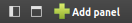
.. |icon_panel_arrow| image:: _images/icon_panel_arrow.png
.. |icon_panels| image:: _images/icon_panels.png
.. |icon_close_panel| image:: _images/icon_close_panel.png
.. |icon_move_panel| image:: _images/icon_move_panel.png
.. |icon_list_graph| image:: _images/icon_list_graph.png
.. |icon_link| image:: _images/i_link.png
.. |icon_unlink| image:: _images/i_unlink.png

When working with Tulip, you have several panels to see all the information you need. In order to easily compare or sort your results, you can find at the bottom of the workspace a toolbar containing three groups of buttons:

* |icon_show_hide_bars_add_panel|: You can show/hide the side bar in clicking on the first icon, show/hide the menu bar in clicking on the second icon, or open a new panel for the current graph in clicking on the *Add panel* button.

* |icon_panel_arrow|: You can simply change the currently displayed panels by clicking on the arrows.

* |icon_panels|: These icons appear depending of the number of opened panels. Clicking on one of those changes the tiling of the workspace according to the icon.

.. image:: _images/i_workspace_6panels.png
    :width: 600

Here is an example of the 6-panels tiling

|

In the title bar of a workspace panel, you have different buttons:

* |icon_list_graph|: Clicking on this button displays a list of opened graphs. The name of the current one is displayed using a bold font. Choosing an other graph modifies the current panel and update the visualized information.

* |icon_unlink|: When this icon is displayed, it indicates that the selection of the current graph in this workspace panel, is not synchronized with the selection of the active graph in the Graphs panel. Clicking on the button displaying this icon enables the synchronization.

* |icon_link|: When this icon is displayed, it indicates that the selection of the current graph in this workspace panel, is synchronized with the selection of the active graph in the Graphs panel. This means that when selecting a graph in the Graphs panel, it becomes automatically the current one in this workspace panel if it is the active panel. Clicking on the button displaying this icon disables the synchronization.

* |icon_move_panel|: When using the tiled display, you can press on this icon to move a panel and exchange its place with the one of another displayed panel. 

* |icon_close_panel|: Clicking on this icon deletes the current panel.

The title bar of the currently active workspace panel is highlited with a top green line.

The creation of panels have already been presented in the previous section. Consult :ref:`workspace_view` for more information.

.. _workspace_diagram:

The Node Link Diagram
=====================

.. image:: _images/i_workspace-node_link_diagram.png
    :width: 600

.. |l_red| image:: _images/legend_red.png
    :width: 32
.. |l_yel| image:: _images/legend_yellow.png
    :width: 32
.. |l_pur| image:: _images/legend_purple.png
    :width: 32
.. |l_blu| image:: _images/legend_blue.png
    :width: 32

This panel gives you the main visualization view of Tulip, displaying graphs and offering you navigation tools to observe your data under different angle.

The view contains three distinctive elements colored differently in the following screen capture:

.. image:: _images/i_workspace-node_link_diagram-main_window.png
    :width: 400

|l_blu| the main window;

|l_red| the toolbar; 

|l_yel| the scene and layer subpanels.

.. _workspace_diagram_main:

Main window
-----------

.. |icon_wsm_map_node_color| image:: ../../library/tulip-gui/resources/icons/20/node_color_interpolation.png
    :width: 20
.. |icon_wsm_map_edge_color| image:: ../../library/tulip-gui/resources/icons/20/edge_color_interpolation.png
    :width: 20
.. |icon_wsm_map_node_size| image:: ../../library/tulip-gui/resources/icons/20/node_size_interpolation.png
    :width: 20
.. |icon_wsm_map_edge_size| image:: ../../library/tulip-gui/resources/icons/20/edge_size_interpolation.png
    :width: 20
.. |icon_wsm_screenshot| image:: ../../library/tulip-gui/resources/icons/20/camera-photo.png
    :width: 20
.. |icon_wsm_back_color| image:: _images/icon_wsm_back_color.png
    :width: 20
.. |icon_wsm_edge_color_interpol_dis| image:: ../../library/tulip-gui/resources/icons/20/color_interpolation_disabled.png
    :width: 20
.. |icon_wsm_edge_color_interpol_en| image:: ../../library/tulip-gui/resources/icons/20/color_interpolation_enabled.png
    :width: 20
.. |icon_wsm_edge_size_interpol_dis| image:: ../../library/tulip-gui/resources/icons/20/size_interpolation_disabled.png
    :width: 20
.. |icon_wsm_edge_size_interpol_en| image:: ../../library/tulip-gui/resources/icons/20/size_interpolation_enabled.png
    :width: 20
.. |icon_wsm_edge_visible_dis| image:: ../../library/tulip-gui/resources/icons/20/edges_disabled.png
    :width: 20
.. |icon_wsm_edge_visible_en| image:: ../../library/tulip-gui/resources/icons/20/edges_enabled.png
    :width: 20
.. |icon_wsm_label_visible_dis| image:: ../../library/tulip-gui/resources/icons/20/labels_disabled.png
    :width: 20
.. |icon_wsm_label_visible_en| image:: ../../library/tulip-gui/resources/icons/20/labels_enabled.png
    :width: 20
.. |icon_wsm_label_size_fit_dis| image:: ../../library/tulip-gui/resources/icons/20/labels_scaled_disabled.png
    :width: 20
.. |icon_wsm_label_size_fit_en| image:: ../../library/tulip-gui/resources/icons/20/labels_scaled_enabled.png
    :width: 20
.. |icon_wsm_node_color_set| image:: ../../library/tulip-gui/resources/icons/20/set_node_color.png
    :width: 20
.. |icon_wsm_edge_color_set| image:: ../../library/tulip-gui/resources/icons/20/set_edge_color.png
    :width: 20
.. |icon_wsm_node_border_color_set| image:: ../../library/tulip-gui/resources/icons/20/set_node_border_color.png
    :width: 20
.. |icon_wsm_edge_border_color_set| image:: ../../library/tulip-gui/resources/icons/20/set_edge_border_color.png
    :width: 20
.. |icon_wsm_node_shape_set| image:: ../../library/tulip-gui/resources/icons/20/set_node_shape.png
    :width: 20
.. |icon_wsm_edge_shape_set| image:: ../../library/tulip-gui/resources/icons/20/set_edge_shape.png
    :width: 20
.. |icon_wsm_node_size_set| image:: ../../library/tulip-gui/resources/icons/20/set_node_size.png
    :width: 20
.. |icon_wsm_edge_size_set| image:: ../../library/tulip-gui/resources/icons/20/set_edge_size.png
    :width: 20
.. |icon_wsm_label_color_set| image:: ../../library/tulip-gui/resources/icons/20/set_label_color.png
    :width: 20
.. |icon_wsm_label_position_set| image:: ../../library/tulip-gui/resources/icons/20/set_label_position.png
    :width: 20
.. |icon_wsm_label_font_set| image:: _images/icon_wsm_label_font_set.png
    :width: 40

.. |i_workspace_rclick_edge| image:: _images/i_workspace_rclick_edge.png
.. |i_workspace_rclick_node| image:: _images/i_workspace_rclick_node.png

This part of the panel shows the graph. From here, the user can exploit two elements to interact with it.

* The first one is the quick access bar located at the bottom of the view:

  .. image:: _images/icon_wsm_toolbar.png
    :width: 600

  The button actions are explained when hovered over with the mouse cursor.

  * |icon_wsm_map_node_color|: Show/hide a node color mapping metric filter.

  * |icon_wsm_map_edge_color|: Show/hide an edge color mapping metric filter.

  * |icon_wsm_map_node_size|: Show/hide a node size mapping metric filter.

  * |icon_wsm_map_edge_size|: Show/hide an edge size mapping metric filter.

  * |icon_wsm_screenshot|: Take a screenshot of the current scene view.

  * |icon_wsm_back_color|: Change the scene background color.

  * |icon_wsm_edge_color_interpol_dis| or |icon_wsm_edge_color_interpol_en|: Activate/deactivate the edge color interpolation.

  * |icon_wsm_edge_size_interpol_dis| or |icon_wsm_edge_size_interpol_en|: Activate/deactivate the edge size interpolation.

  * |icon_wsm_edge_visible_dis| or |icon_wsm_edge_visible_en|: Make the edges visible/invisible

  * |icon_wsm_label_visible_dis| or |icon_wsm_label_visible_en|: Display/Hide the labels.

  * |icon_wsm_label_size_fit_dis| or |icon_wsm_label_size_fit_en|: Make the label size fits or not to the node size.

  * |icon_wsm_node_color_set|: Set the color of the selected nodes, if any, of all the nodes, if none.

  * |icon_wsm_edge_color_set|: Set the color of the selected edges, if any, of all the edges, if none.

  * |icon_wsm_node_border_color_set|: Set the border color of the selected nodes, if any, of all the nodes, if none.

  * |icon_wsm_edge_border_color_set|: Set the border color of the selected edges, if any, of all the edges, if none.

  * |icon_wsm_node_shape_set|: Set the shape of the selected nodes, if any, of all the nodes, if none.

  * |icon_wsm_edge_shape_set|: Set the shape of the selected edges, if any, of all the edges, if none.

  * |icon_wsm_node_size_set|: Set the size of the selected nodes, if any, of all the nodes, if none.

  * |icon_wsm_edge_size_set|: Set the size of the selected edges, if any, of all the edges, if none.

  * |icon_wsm_label_color_set|: Set the label color of the selected elements, if any, of all the elements, if none.

  * |icon_wsm_label_position_set|: Set the label position of the selected nodes, if any, of all the nodes, if none.

  * |icon_wsm_label_font_set|: Change the default label font.

  When clicked on, some of these icons adapt themselves to the current situation, by either alterning between two versions for the toggle buttons, or by indicating the color or the chosen font.

* The second element is the contextual menu displayed on a right click.

  .. image:: _images/i_workspace_rclick.png

By default, the options are divided in two parts: *View* et *Augmented display*.
	    
**View**
  * *Force redraw*: update the graph displayed.

  * *Center view*: reset the camera position.

  * *Use orthogonal projection*: switch to orthogonal projection to true perspective.

  * *Anti-aliasing*: enable/disable the anti-aliasing (smooth stairstep-like lines).

  * *Take snapshot*: take a screenshot.

  * *Use orthogonal projection*: allow to switch between the orthogonal or classic perspective projection.

**Augmented display**
  * *Show overview*: display/hide the overview in the bottom right corner of the window.

  * *Show quick access bar*: display/hide the quick access bar.

  * *Tooltips*: enable/disable the display of essential information about the node/edge under the mouse pointer.

  * *Url property*: display a sub menu allowing to choose a property giving the url of the web page associated with a graph element. When moving the mouse pointer over a node or edge, the url of the associated web page is displayed; this web page can then be shown in your default web browser in typing on the space bar.

  * *Use Z ordering*: adapt the display priority according to the Z position.

  * *Grid display parameters*: open the grid setup wizard.

When right clicking on an edge or a node, a different menu appears, displaying the object name and offering to select the node/edge (*Select*), to add/remove it or its neighboring nodes or adjacent edges to/from the current selection (*Toggle selection*), to delete it (*Delete*) or to update (*Edit*) one of the main draw properties (color, label, shape or size)

  |i_workspace_rclick_edge|    |i_workspace_rclick_node|

.. _workspace_diagram_toolbar:

Toolbar
-------

.. |icon_wst_navigate_graph| image:: ../../library/tulip-gui/resources/icons/i_navigation.png
    :width: 20
.. |icon_wst_get_edit_info| image:: ../../library/tulip-gui/resources/icons/i_select.png
    :width: 20
.. |icon_wst_select_rect| image:: ../../library/tulip-gui/resources/icons/i_selection.png
    :width: 20
.. |icon_wst_move_reshape| image:: ../../library/tulip-gui/resources/icons/i_move.png
    :width: 20
.. |icon_wst_select_free| image:: ../../plugins/interactor/MouseLassoNodesSelector/i_lasso.png
    :width: 20
.. |icon_wst_select_short_path| image:: ../../plugins/interactor/PathFinder/designer/pathfinder.png
    :width: 20
.. |icon_wst_add_nodes_edges| image:: ../../library/tulip-gui/resources/icons/i_addedge.png
    :width: 20
.. |icon_wst_edit_edge_bends| image:: ../../library/tulip-gui/resources/icons/i_bends.png
    :width: 20
.. |icon_wst_delete_nodes_edges| image:: ../../library/tulip-gui/resources/icons/i_del.png
    :width: 20
.. |icon_wst_zoom_rect| image:: ../../library/tulip-gui/resources/icons/i_zoom.png
    :width: 20
.. |icon_wst_highlight_neighbor| image:: ../../plugins/interactor/NeighborhoodHighlighter/i_neighborhood_highlighter.png
    :width: 20
.. |icon_wst_fisheye| image:: ../../plugins/interactor/FishEye/i_fisheye.png
    :width: 20
.. |icon_wst_magnify_glass| image:: ../../plugins/interactor/MouseMagnifyingGlass/i_magnifying_glass.png
    :width: 20

This element of the node link diagram panel is located at the top of the window and is divide in three parts.

The first one, when clicked on, opens the configuration panel, giving explanations about the currently selected tool and proposing the advanced options.

Before clicking:

.. image:: _images/i_workspace_toolbar_configuration.png

After clicking:
	   
.. image:: _images/i_workspace_toolbar_configuration_clicked.png

The second part contains the tools icons:

.. image:: _images/icon_wst_toolbar.png

The use of the tools is not be explained in detail here. More information about their use can be found by selecting the tool and clicking on the configuration panel button.

* |icon_wst_navigate_graph|: navigate in graph.

* |icon_wst_get_edit_info|: get/edit node or edge information.

* |icon_wst_select_rect|: select nodes/edges in a rectangle.

* |icon_wst_move_reshape|: move/reshape rectangle selection.

* |icon_wst_select_free|: select nodes in a freehand drawn region.

* |icon_wst_select_short_path|: select path(s) between two nodes.

* |icon_wst_add_nodes_edges|: add nodes/edges.

* |icon_wst_edit_edge_bends|: edit edges bends.

* |icon_wst_delete_nodes_edges|: delete nodes or edges.

* |icon_wst_zoom_rect|: zoom on rectangle.

* |icon_wst_highlight_neighbor|: highlight node neighborhood.

* |icon_wst_fisheye|: use the cursor "Fisheye".

* |icon_wst_magnify_glass|: use the cursor "Magnifying glass".

The final element is a combo box, allowing the user to choose which graph to visualize.

.. image:: _images/i_workspace_toolbar_list.png
    :width: 300

.. image:: _images/i_workspace_toolbar_list_clicked.png
    :width: 300

.. _workspace_diagram_scene:

Scene
-----

The scene rendering settings can be opened by clicking on the **Scene** tab, in the top right corner of the node link diagram panel. The following tab then appears :

.. image:: _images/i_workspace_scene.png

* **Colors**: customize the selection and background colors.

* **Edges**: manage the edge display by enabling the 3D edges, showing the arrows, enabling the color or the size interpolations.

* **Elements ordering**: manage the display of the graph nodes/edges and their labels by ordering them according to a given metric. 

* **Labels**: manage the labels display by adapting their size so they can fit into their respective nodes, choosing the number of labels simultaneously displayed and setting the size limits of the used font. 

* **Graph changing**: specify if the scene point of view must change when switching the graph to display.

* **Projection**: select the orthogonal or classic perspective projection.

Note that some of the settings mentioned above can be modified through the quick access bar or with the right click menu in the main window.

The tab can be closed by clicking on the cross near the tab's name.
	

.. _workspace_diagram_layers:

Layers
------

The layers settings can be accessed by clicking on the **Layers** tab. The following tab is then displayed:

.. image:: _images/i_workspace_layers.png

The **Visible** column allows you to select the elements you want to display. The **Stencil** column gives you another level of visibility by setting the objects in the front of the display. If the **Visible** check box on the *Hulls* row is checked, the convex hulls of the current graph and its descendant subgraphs are computed and can then be shown/hidden using their corresponding **Visible** check boxes.

.. _workspace_diagram_faq:

FAQ
---

The Node-Link Diagram being one of the mostly used view, it is also the one we are asked the more about. We list here some of the more frequently asked questions in order to allow you to maybe find a direct answer to your problem.

**Labels**

* *Why are some of the labels not displayed ?*

  Because we want to allow people working with large graphs to use Tulip too, displaying each and every label is a poor choice.
  The rendering becomes demanding and the visibility is not really at its best. 
  By default, the density of labels displayed is set in order to forbid any overlap. 
  This option can be customized in the Scene Rendering Settings (see :ref:`workspace_diagram_scene`).

* *The size of the labels is not adapted. Even when I try to augment it for each node, nothing happens; what should I do?*

  By default, the label size is set to a certain interval. The size appreciation in Tulip can be deceptive so we have decided to implement a dynamic font size, scaling the font according to your view. However, some people may need more control upon the label size. The Scene Rendering Settings (see :ref:`workspace_diagram_scene`) options can manage font size interval or use a fixed value. Checking the *Fit labels size to nodes size* option also adapts the labels to the corresponding nodes according to their size.

* *I have set a few label for some edges but I can not see them. The label density is set to* Show all *and I am sure the labels are not hidden. How can I fix this?*

  By default, the visibility of some elements is restricted to keep the graph clean. The edges labels and the meta-node content labels are not visible. To change this option, open the layer settings (see :ref:`workspace_diagram_layers`) and set to visible the wanted elements.

**Edges**

* *I am sure my graph is oriented, but I do not see any arrow displayed, did I forget something?*

  By default, the arrows are not displayed in Tulip. You can address this issue by checking the option *Show arrows* in the scene rendering settings (see :ref:`workspace_diagram_scene`). If your graph is quite large, they may also be too small, in that case, you should try to enlarge them using the |icon_wst_get_edit_info| interactor.

* *I have change the source/target anchor shape/size but I still do not see them, what is the problem?*

  Do not forget to check the *Show arrows* option as explained above to indicate to Tulip you want them to be displayed.

* *When I change the size of my edges, the layout stays identical, how should I proceed to modify that?*

  Just like the color and the arrows issues, the program does not use the size value given for each edge if the size interpolation is enabled. To resolve your issue, click on the size interpolation icon (|icon_wsm_edge_size_interpol_en|) in the quick access menu (see :ref:`workspace_diagram_main`) or check/uncheck the *Enable size interpolation* option in the Scene Rendering Settings (see :ref:`workspace_diagram_scene`).

**Color/Transparency**

* *I can not see the edges/nodes. Changing their color is not helping, what happened?*

  Before changing every parameter in your graph, check if the edges/nodes are *visible*. This option can be verified by checking the *Nodes* and *Edges* box in the column *Visible* in the *Layer* panel. For the edges, clicking on |icon_wsm_edge_visible_dis| in the quick access bar realizes the same action.

  If you have change the nodes or edges color manually, maybe you also have modified the alpha component, changing the color to be transparent. Selecting the edges or nodes and setting the alpha value to 255 in the color picker should solve the issue. Use the icons |icon_wsm_node_color_set| and |icon_wsm_edge_color_set| to do so.

* *I have changed the edge color but nothing happens, what is the problem?*

  Tulip provides an option to colorize the edges using an interpolation. When this option is selected, the edge color is set to match its in and out nodes colors. You can activate/deactivate this option by clicking on |icon_wsm_edge_color_interpol_en| in the quick access bar (see :ref:`workspace_diagram_main`) or by checking/unchecking the option in the Scene Rendering Settings (see :ref:`workspace_diagram_scene`).

* *I do not like the selection color or the default node color, any suggestion ?*

  The selection and default color can be customized in the *Preferences* window. To open it, go through the *Edit* menu and the *Preferences* element. More information in :ref:`preferences`.
  

.. _workspace_spreadsheet:

Spreadsheet view
================

This panel displays the properties of the nodes and edges of the graph.

.. image:: _images/i_workspace-spreadsheet.png
    :width: 600

.. _workspace_spreadsheet_main:

Main window
-----------

Properties are an important concept in Tulip, they are used to store information about each node and edge. By convention, the properties used by the rendering engine begin with the “view” prefix but it is possible to define an unlimited number of additional properties to your convenience. 

Here is the list of all the rendering properties (e: used with edges, n: used with nodes):

* *viewBorderColor*: border color (e/n).

* *viewBorderWidth*: border width (e/n).

* *viewColor*: color (e/n).

* *viewFont*: font used to render the label (e/n).

* *viewFontSize*: font size of the label (e/n).

* *viewLabel*: label (e/n).

* *viewLabelColor*: label color (e/n).

* *viewLabelPosition*: label position (center, top, bottom, left, right) (e/n).

* *viewLayout*: position (x,y,z) of a node, or vector of the bends positions of an edge (e/n).

* *viewMetric*: property used by the algorithms (e/n).

* *viewRotation*: rotation (n)

* *viewSelection*: true if the element is selected, false if not (e/n).

* *viewShape*: shape of a node (circle, square, cube, sphere...) or an edge (Bezier curve, polyline...) (e/n). 

* *viewSize*: size of a node (height, width, depth) and for an edge, the width at source, width at end, and arrow size. The edge size interpolation must be disabled for this property to be consider (e/n).

* *viewSrcAnchorShape*: shape of the source anchor of the edge. For this setting to take effect, the option *Show arrow* must be enabled (e).

* *viewSrcAnchorSize*: size (along the x, y, z axis) of the source anchor (e).

* *viewTexture*: texture, an image file, to replace the color (e/n).

* *viewTgtAnchorShape*: size (along the x, y, z axis) of the target anchor (e).

* *viewTgtAnchorSize*: size (along the x, y, z axis) of the target anchor (e).

The spreadsheet view allows you to select the elements you want to watch by choosing *Nodes* or *Edges* in the *Show* combo box. A filter is available to pick elements depending of their selection in the *node link diagram*, or to match a given pattern in a specific column. The set of displayed columns can be restricted to those whose the name matches a given pattern.

The value stored in the table can be modified by several ways. A double click on one of the cells offers to enter the value for one property and one element (edge or node). A right click in one of the cells opens the following menu :

.. image:: _images/i_workspace_rclick_elements.png

Two types of action can be done, the ones concerning the property values and the ones concerning the selection of the element. The property values can be set for all nodes or edges (having the property or belonging to the current graph), the ones selected (where *viewSelection = true*) or the ones  corresponding to the highlighted rows (current element and the ones clicked on while maintaining *Ctrl* pushed). The values of the current property (corresponding to the current cell column) can also be copied into *viewLabel* in order to display them in the graph.

A right click in the column header opens the following menu:

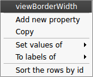

The first set of actions in that menu allows to add a new property or to manage the current property; the *Copy* action allows to copy the property values into an already existing property or a new one, the *Delete* and *Rename* actions cannot be applied to "view" prefixed properties. As for the previous contextual menu, the second set allows to manage the property values.

.. _workspace_spreadsheet_properties:

Properties
----------

In the top right of the panel, you can find the tab *Properties*.

.. image:: _images/i_workspace_properties.png

Here you can manage the properties. The eye-shaped check boxes make visible/not visible the properties in the table in the main window. The [+ Add new] button allows to create new properties.
	   
A right click opens a contextual menu :

.. image:: _images/i_workspace_rclick_properties.png

The first menu actions allows to create new properties (same as [+ Add new] button) and to *Copy*, *Delete* or *Rename* existing ones. As for the previous menus, the second set of actions allows to manage the property values.

.. _workspace_adjacency:

Adjacency matrix view
=====================

This view gives you a general glimpse of the adjacency matrix of your graph.

.. image:: _images/i_adjacency_matrix.png
    :width: 400

.. _workspace_adjacency_settings:

Settings
----------

By clicking on the tab in the top right corner, you can open the display settings panel.

.. image:: _images/i_adjacency_settings.png

Several parameters such as the background color, the node ordering, the grid or edges visibility can be customized.

.. _workspace_geographic:

Geographic view
===============

.. image:: _images/i_geographic_main.png
    :width: 600

.. _workspace_geographic_mods:

Map modes
---------

The geographic view provides different map modes. You can switch between them by clicking on the button in the top left corner. Test them in order to customize the visualization background to your needs.

* OpenStreeMap:

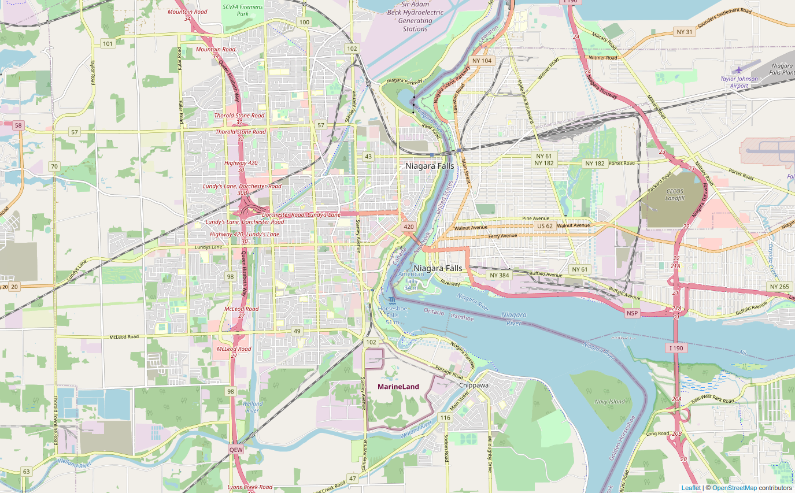

* OpenTopoMap :

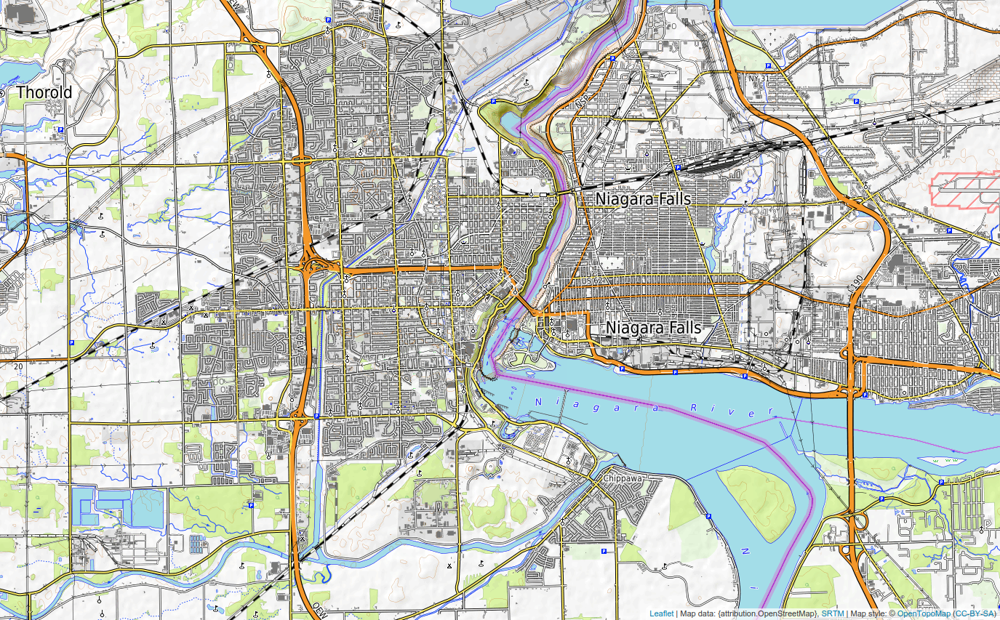

* Esri World Street Map:

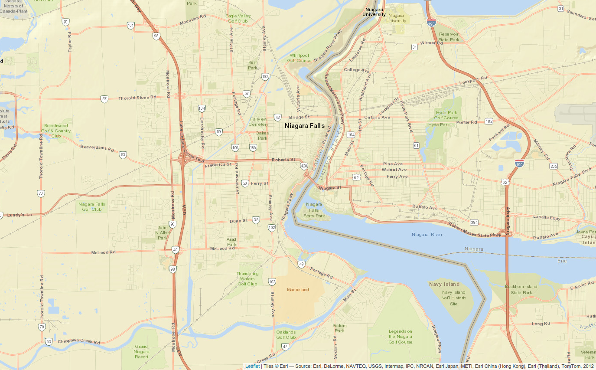

* Esri Topographic Map:

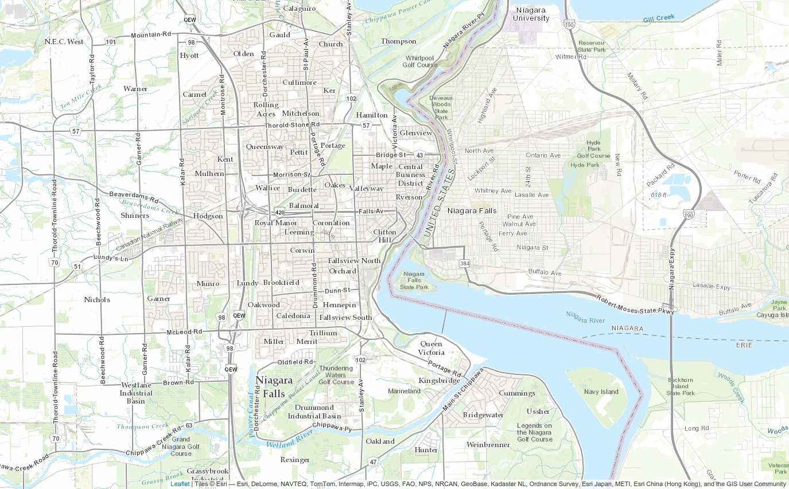

* Esri National Geographic Map:

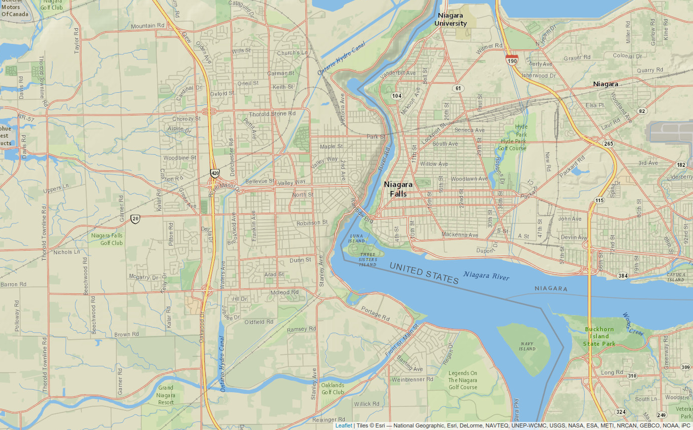

* Esri World Imagery:

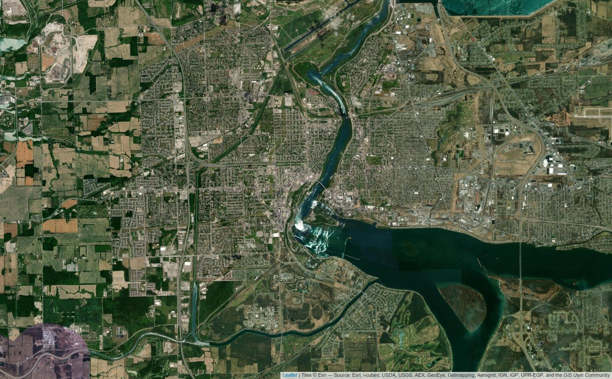

* Esri Light Gray Canvas:

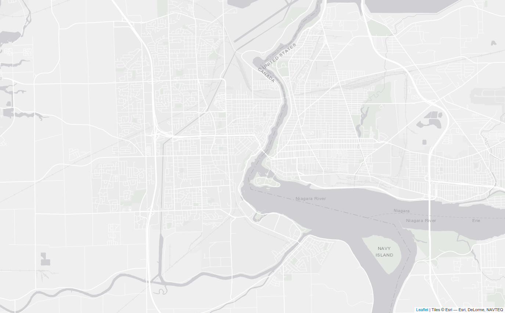

* Esri Dark Gray Canvas:

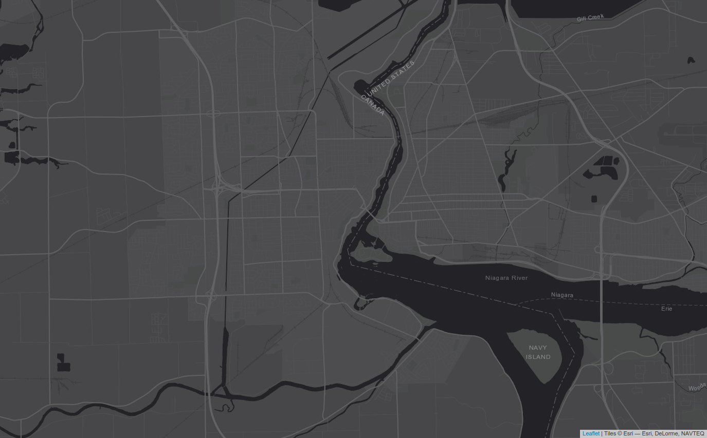

* CartoDB Map:

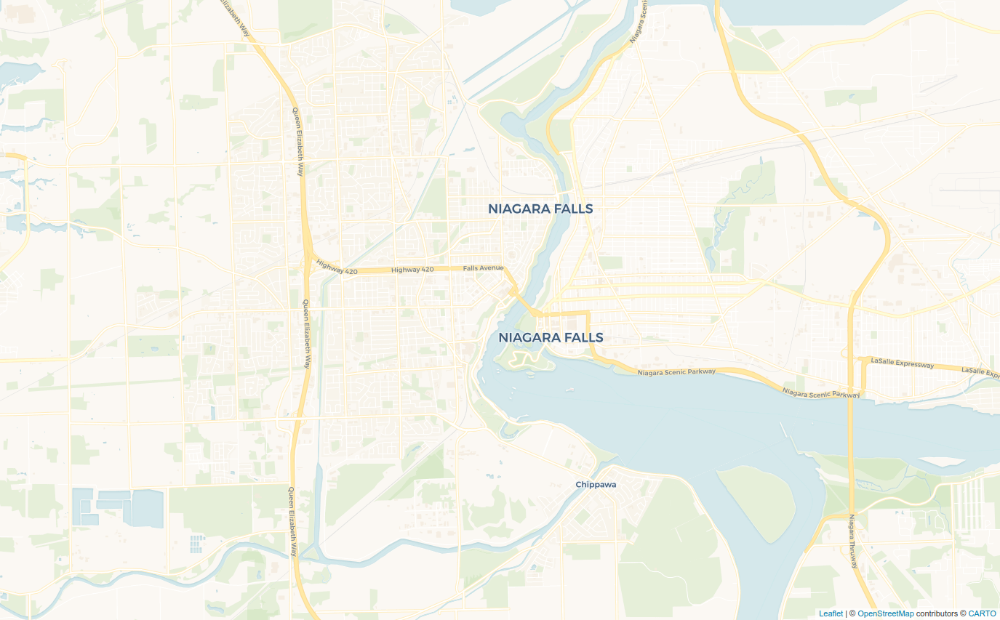

* CartoDB Light Map:

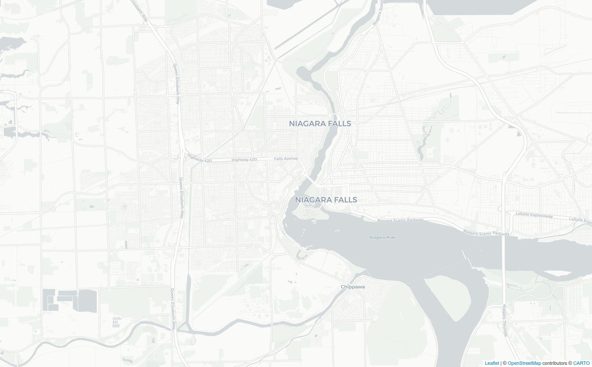

* CartoDB Dark Map:

.. image:: _images/geoview_cartodb_dark_map.png
    :width: 400

* Wikimedia Map:

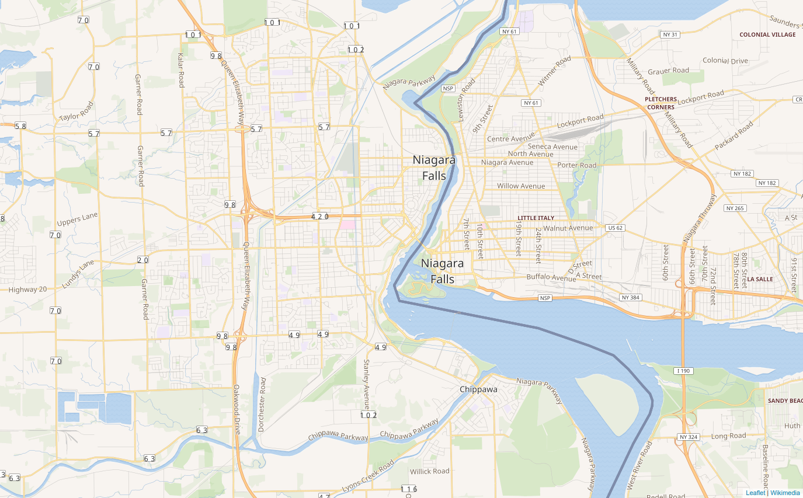

* Leaflet Custom Tile Layer:

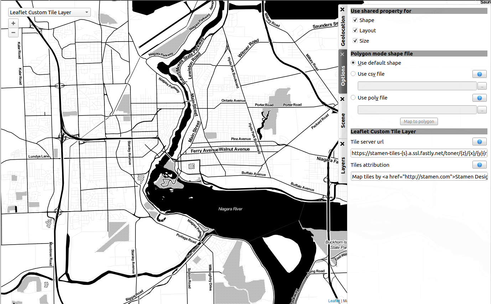

* Polygon:

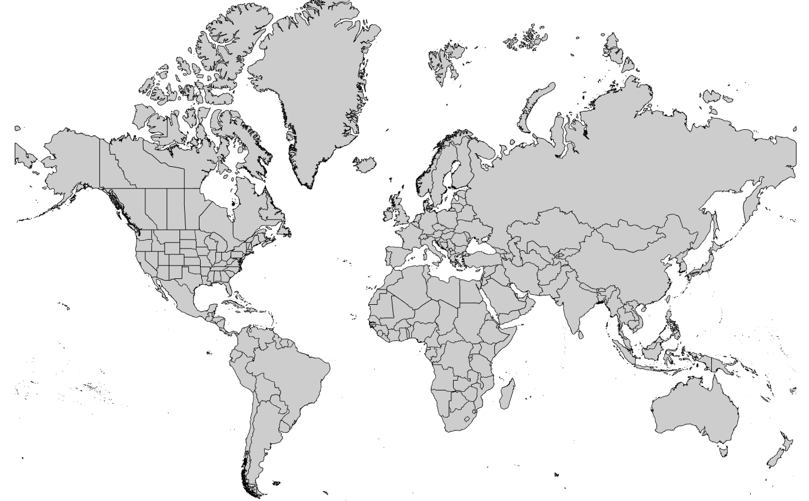

* Globe:

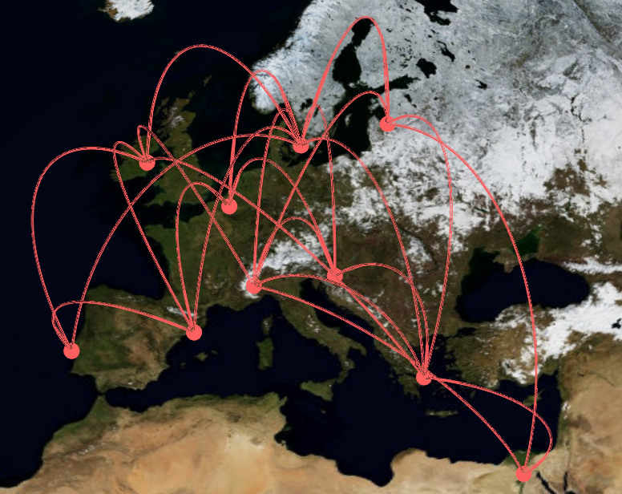

.. _workspace_geographic_toolbar:

Toolbar
-------

The tools available in this view represent a subset of those introduced in the Node-Link Diagram view earlier. You can recall the following:

* |icon_wst_navigate_graph|: navigate in graph.

* |icon_wst_get_edit_info|: get/edit node or edge information.

* |icon_wst_select_rect|: select nodes/edges in a rectangle.

* |icon_wst_move_reshape|: move/reshape rectangle selection.

* |icon_wst_add_nodes_edges|: add nodes/edges.

* |icon_wst_edit_edge_bends|: edit edges bends.

Otherwise, the toolbar should be used as usual, the left side containing the tool definition and the instructions on how to use it, whereas the rightside display a list of all the opened graphs. Just click on one to load it in the concerned view.

.. _workspace_geographic_geoloc:

Geolocation
-----------

.. image:: _images/i_geographic_geoloc.png

A geolocation tool has been embedded in the view, exploiting the `Nominatim <https://nominatim.openstreetmap.org/>`_ geocoding service. It can appropriately place the nodes on the map.

You can choose among two methods to place the elements, either by providing a valid address for each node, stored in a property you select, or by using the already computed latitude and longitude values, each contained in their respective properties.

Once the service is being queried, you have to specify the corresponding town/address for the ambiguous choices. You can choose to keep the result values obtained in latitude/longitude properties to ease a possible next use of your data.

The node placement should be instantaneous otherwise, close and reopen the view to update the new layout.

.. _workspace_geographic_options:

Options
-------

.. image:: _images/i_geographic_options.png

The polygon map shape can be switched to your convenience with another one. Choose if you want to use the default shape, or a new one imported through a *csv* or a *poly* file. The *help* button displays additional information about the file format and the available source addresses.

.. _workspace_geographic_scene:

Scene
-----

The settings displayed in this panel are completely similar to the ones in the Node-Link Diagram's scene rendering panel. Report to :ref:`the Scene dedicated section<workspace_diagram_scene>` if you need additional information.

.. _workspace_geographic_layers:

Layers
------

As for the scene panel, the layers settings behave like the one in the Node Link Diagram view. More information :ref:`Layers dedicated section<workspace_diagram_layers>`.

.. _workspace_histogram:

Histogram view
==============

To illustrate the use of this view, we need an example. You can create one by importing a new grid approximation with 500 nodes and a maximum degree of 40. You then add two new properties using the :ref:`spreadsheet view<workspace_spreadsheet>` (use the *Add property* button in the *Properties* tab): *Degree* and *Betweenness Centrality*. Then, use the appropriate algorithms to fill the properties with the needed information. A pre configured document can be found :download:`here <_documents/Histogram.tlpx>`.

Upon opening the file, you find something similar to the following screenshot:

.. image:: _images/i_histogram_main.png
    :width: 600

The view displays several histograms at the same time, double clicking onto one of them make the view to focus on it:

.. image:: _images/i_histogram_main1.png
    :width: 400

When creating the example yourself, a few additional steps must be followed in order to obtain such result, let us see how to do so.

.. _workspace_histogram_properties:

Properties
----------

In a similar way to what we have seen before, you can find tabs in the top right corner offering further options:

.. image:: _images/i_histogram_properties.png

In this panel, you can select the properties you are interested in. The nodes or edges presenting identical features are then grouped, creating one new histogram for each property selected. This panel is only available when you are in the view presenting every histogram, the fields are disabled otherwise.

.. _workspace_histogram_options:

Options
-------

The second tab offers options to customize the histogram. It can only be used when viewing a specific histogram :

.. image:: _images/i_histogram_options.png

These settings alter the initial histogram by customizing the discrete intervals used.

* **Background color**: changes the background color.

* **Uniform quantification**: adapts the intervals on the X axis to obtain a uniform quantification on the Y axis.

* **Cumulative frequencies histogram**: cumulates the values obtained from one interval to the next.

* **Number of histogram bins**: controls in how many intervals the X axis repartition is distributed.

* **Resulting bin width**: indicates the width of the small intervals on the X axis.

* **Show graph edges above histogram**: displays the edges existing between each bin.

* **X axis - tick count**: indicates the number of tick marks displayed along the X axis

* **X axis - use custom range**: indicates a specific range of values along the X axis

* **X axis - use log scale**: applies a logarithm scale on the X axis.

* **Y axis - tick step**: indicates the step between 2 tick marks along the Y axis

* **Y axis - use custom range**: indicates a specific range of values along the Y axis

* **Y axis - use log scale**: applies a logarithm scale on the Y axis.

.. _workspace_histogram_toolbar:

Toolbar
-------

.. |icon_his_metric_mapping| image:: ../../plugins/view/HistogramView/i_histo_color_mapping.png
    :width: 20
.. |icon_his_statistics| image:: ../../plugins/view/HistogramView/i_histo_statistics.png
    :width: 20

The view provides two exclusive tools, only available when viewing a sole histogram:

* |icon_his_statistics|: The statistics tool displays augmented markings above the histogram. A few customization can be done in the settings:

  .. image:: _images/i_histogram_statistics.png
      :width: 280

  * **Mean and standard deviation**: Tulip computes the mean and the standard deviation and displays these values on the histogram.

  * **Select nodes in range**: choose the lower and upper bound and select the nodes in between.

  * **Density estimation**: Tulip displays a curve representing the distribution according to a given function (Uniform, Gaussian, Triangle, Epanechnikov, Quartic, Cubic or Cosine).

  Do not forget to click on *Apply* to commit your changes.

* |icon_his_metric_mapping|: this interactor allows to perform a metric mapping on nodes colors, nodes borders colors, nodes sizes, nodes borders widths or nodes glyphs in a visual way. To select the mapping type, do a right click on the scale located at the left of the histogram vertical axis and pick the one wanted in the popup menu which appears.

  .. image:: _images/i_histogram_mappingtype.png

  To configure the metric mapping, double click on the scale located at the left of the histogram vertical axis and use the dialog which appears. More detailed instructions about the tool configuration can be found in the tool documentation panel.

.. _workspace_parallel:

Parallel coordinates view
=========================

To present this view, we use a dataset containing car specifications such as the city and highway autonomy, the engine displacement, the retail price, the physical dimensions... This document can be opened in Tulip as a project, available :download:`here <./_documents/Cars_data.tlpx>`, or can be imported with the :download:`original CSV file <./_documents/04cars_data.csv>`. The original file can be found on `this site <http://igva2012.wikispaces.asu.edu/file/detail/04cars.csv>`_.

More information about the CSV import tool and mechanism can be found in the section :ref:`csv`.

.. image:: _images/i_parallel_main.png
    :width: 600

Once the view is created, you need to specify the properties you want to compare, to do so, use the *Properties* tab.

.. _workspace_parallel_properties:

Properties
----------

This panel provides the list of properties which can be analyzed, in the previous example, we choose the three shown in the following screenshot:

.. image:: _images/i_parallel_properties.png

You can specify whether you want to use nodes or edges, but also, you can sort the properties according to your needs.

.. _workspace_parallel_draw:

Draw
----

The second tab displays advanced options to customize the drawing of the view:

.. image:: _images/i_parallel_draw.png

* **General draw parameters**: set the background color and the height of the axis

* **Lines colors alpha values**: select whether you want to use the usual *viewColor* property or new one, common for each node.

* **Draw nodes on axis**: enable the nodes (and their labels) to be displayed or not

* **viewSize Mapping configuration**: specify the minimum and maximum axis node sizes

* **Apply texture on lines**: select your own texture or choose the one provided by default.

.. _workspace_parallel_toolbar:

Toolbar
-------

.. |icon_par_axis_sliders| image:: ../../plugins/view/ParallelCoordinatesView/resources/i_axis_sliders.png
    :width: 20
.. |icon_par_axis_swapper| image:: ../../plugins/view/ParallelCoordinatesView/resources/i_axis_swapper.png
    :width: 20
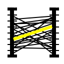
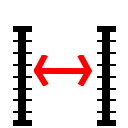

The parallel coordinates view provides a few exclusive tools which can be used to manipulate the axis and to highlight the correspondence between the properties:

* |icon_par_axis_box_plot|: axis boxplot
* |icon_par_axis_sliders|: axis sliders
* |icon_par_axis_swapper|: axis swapper
* |icon_par_highlight_elements|: highlight elements
* |icon_par_modify_space_axis|: modify spaces between consecutive axis

Further information about each of these tools can be found in their own help/configuration panel.

.. _workspace_parallel_special_menu:

Special menus
-------------

A right click anywhere but on the axis in the view displays the standard contextual menu seen before but with additional options related to the current view. Two items, *View Setup* and *Options*, are available:

* *View Setup*: 

  .. image:: _images/i_parallel_main_rightclick.png

  * *Layout type*: choose between the classic layout, where the axis are disposed in parallel, and the circular layout, where the axis are spread regularly over the radius of a circle.
  * *Lines type*: switch between the classic straight lines and the curved Catmull-Rom Spline.
  * *Lines thickness*: proposed to map the lines to the viewSize property or use a standard thin line.

* *Options*: the sole option *Tooltips* allows to display directly some information like the id of the hovered node.

When you perform a right click on one of the axis, Tulip proposes to either *Remove  [the] axis* or to enter a configuration panel:

.. image:: _images/i_parallel_main_axis_conf.png

Here you are able to specify, among others, the number of tick marks, the axis order and the use of a logarithm scale.

.. _workspace_pixel:

Pixel oriented view
===================

The pixel oriented view gives you four different solutions to sort your nodes depending of the values on a given property. To illustrate its use and its capabilities, we use the dataset introduced previously, which can be downloaded :download:`here <./_documents/Cars_data.tlpx>` in its Tulip project form, or :download:`here<./_documents/04cars_data.csv>`, in its CSV form.

.. image:: _images/i_pixel_main.png
    :width: 600

.. _workspace_pixel_properties:

Properties
----------

In order to use this view, you have to choose first the properties you want to analyze. To do so, open the *Properties* panel and select the appropriate data:

.. image:: _images/i_pixel_properties.png

Pixel oriented tools usually exploit a layout algorithm, moving the nodes into a specific configuration, following a space-filling curve, and ordering them according to one of the properties. The second parameter is used to perform a color mapping, similar to the one shown in our example, aiming at underlining the correlation between the two properties.

.. _workspace_pixel_options:

Options
-------

This second tab proposes to choose among four space-filling curve implementations.

.. image:: _images/i_pixel_options.png

The nodes disposition is arranged to match the chosen representation.

* Discrete spiral:

  .. image:: _images/i_pixel_discrete_spiral.png
    :width: 200

* Z-order curve (`original picture <http://en.wikipedia.org/wiki/File:Four-level_Z.svg>`_):

  .. image:: _images/i_pixel_z-order_curve.png
    :width: 200

* Peano curve:

  .. image:: _images/i_pixel_peano_curve.png
    :width: 200

* Square curve:

  .. image:: _images/i_pixel_square_curve.png
    :width: 200

.. _workspace_scatterplot:

Scatter plot 2D view
====================

The pixel oriented and the parallel coordinates views both aim to underline the correlation between two properties, the first one by displaying a tendency noticeable with a coloration, and the second one by showing the relation between two properties for the same element.

The scatterplot view can be used in a similar way. As a list of properties is selected, a plot for each couple of distinct properties is created.

.. image:: _images/i_scatterplot_main.png
    :width: 600

The data distribution allows to visually estimate and to formally compute a correlation coefficient.

.. _workspace_scatterplot_properties:

Properties
----------

The *Properties* tab works like in the previously presented view. You have to select a list of properties to analyze. You can sort them with the upwards and downwards arrows on the right.

.. image:: _images/i_scatterplot_properties.png

.. _workspace_scatterplot_faq:

Options
-------

.. image:: _images/i_scatterplot_options.png

In this tab, you can select the scene and the scatterplots background color. By default, the second one uses a color scale to indicate whether the plot correlation coefficient detects a link between the two current properties or not.
You can customize the colorscale with a click on the *-1*, *0* and *1* buttons to specify which color to use for each value.

The size mapping options adapts the size rendering in the plots depending on the initial node size.

The next check box allow to display the edges above the scatterplot.

Then you can customize the range of values to display along the X/Y axes.

In the end, by performing different mapping types on different properties, you can estimate the correlation between up to four properties (two depending of the plot axis, one with a color mapping and a last one with a size mapping).

.. _workspace_selforganizing:

Self Organizing Map view
=========================

As explain in the scatterplot view, we are blocked by the number of perceptible dimensions and the existing mapping when we are looking for a correlation between several properties.

This is where the SOM view comes to our help. 

.. image:: _images/i_som_main.png
    :width: 600

The self organizing map (or Kohonen map) is useful to visualize high-dimensional data in a low-dimensional representation.

.. _workspace_selforganizing_dimensions:

Dimensions
----------

.. image:: _images/i_som_dimensions.png

In a similar way to what we have already performed with the pixel oriented tool or with the scatterplot 2D view, the panel called *Dimensions* can allow you to select the properties to use for building the self organizing maps.

Options
-------

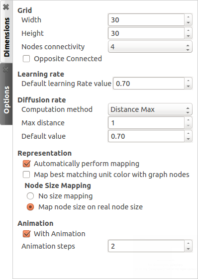

Beside offering the capability to work on high-dimensionnal data, the self organizing maps are able to use competitive learning.

.. _workspace_spreadsheet_example:

Example: Coloring a graph
==========================

.. |icon_add| image:: ../../library/tulip-gui/resources/icons/64/list-add.png
    :width: 40
.. |icon_addsmall| image:: ../../library/tulip-gui/resources/icons/64/list-add.png
    :width: 20
.. |tutorial_color-graph_color2| image:: _images/tutorial_color-graph_color2.png
    :width: 400
.. |tutorial_color-graph_color3| image:: _images/tutorial_color-graph_color3.png
    :width: 400
.. |tutorial_color-betweeness_settings| image:: _images/tutorial_color-betweeness_settings.png

We can apply some of these new knowledges to a small example aiming at coloring a graph. First we need to open the panels *Node Link Diagram* and *Spreadsheet View*, presented earlier in this chapter. To do so :

* Create a random graph by clicking on |icon_import|. The default Grid Approximation, under the Graph category is fine.

  .. image:: _images/tutorial_color-graph_grey.png
    :width: 400

* By default, new Spreadsheet and Node Link Diagram panels are automatically opened upon each graph import. If you are using a previously created graph, you can open these by clicking on |icon_add| or |icon_addsmall| **Add panel** and selecting the appropriate panel types.

* In the algorithm panel, search under the category *Measure*, subcategory *Graph*, the *Betweenness Centrality* button.

* Before launching it, check the settings by clicking on the gear on the left of the icon. The parameters should appear as follows:

  |tutorial_color-betweeness_settings|

Once those are correctly set, you can launch the algorithm.

* In the spreadsheet view, you can notice that the *viewMetric* column values have changed. 

* In the algorithms, under the category *Coloring*, find the *Color Mapping*. The parameters should be *viewMetric* in the input property, a *linear* progression, the *nodes* as target and any color scale. The computed colors must be sored into the *viewColor* property. Once everything is set, you can launch the color mapping.

* Now, we just have to enable the edge color interpolation by clicking on |icon_wsm_edge_color_interpol_dis| in the Node Link Diagram panel.

* The result should be similar to:

.. image:: _images/tutorial_color-graph_color.png
    :width: 400

* You can use different color scale to identify easily the progression, here is two examples using 7 and 13 custom colors instead of the 5 by default :

|tutorial_color-graph_color2|    |tutorial_color-graph_color3|

* Let us try now to modify the labels. In the algorithms, under the category *Measure*, subcategory *Misc*, select the *Id* button. The computed measure values must be stored into the *viewMetric* property.

* In the Spreadsheet view, perform a right click on the *viewMetric* column and select *To labels of → All nodes*.

* Back in the Node Link Diagram panel, you should now obtain a graph similar to this:

.. image:: _images/tutorial_color-graph_label.png
    :width: 400

If you do not see the labels, verify the parameters in the tab *Scene* or that the button |icon_wsm_label_visible_dis| is not toggled.

* From here, you can redo a *Color Mapping*. By selecting *viewMetric* or *viewLabel* as the source, you obtain a coloration following the Id of the nodes.

Do not hesitate to try different combinations of algorithms to further discover the application.

