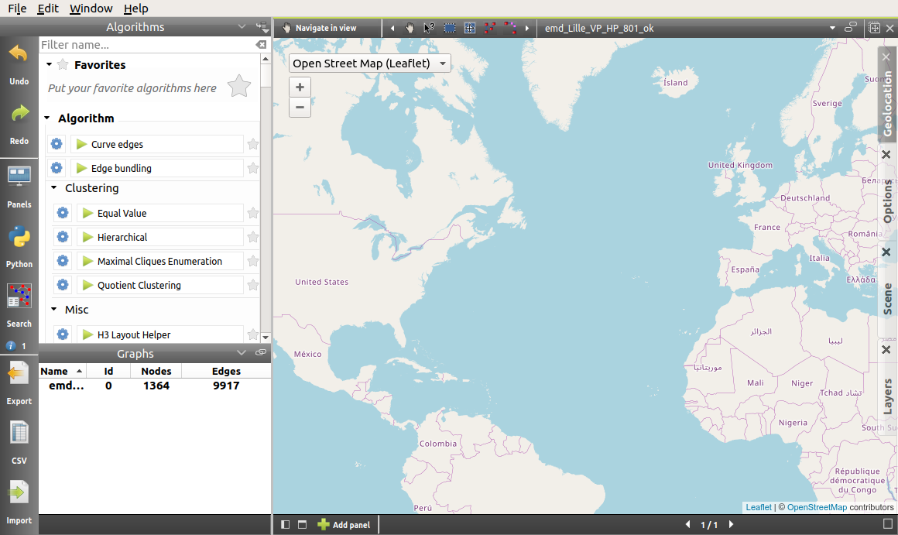
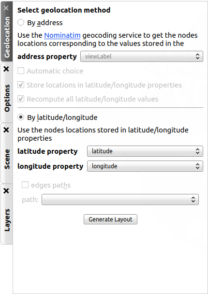
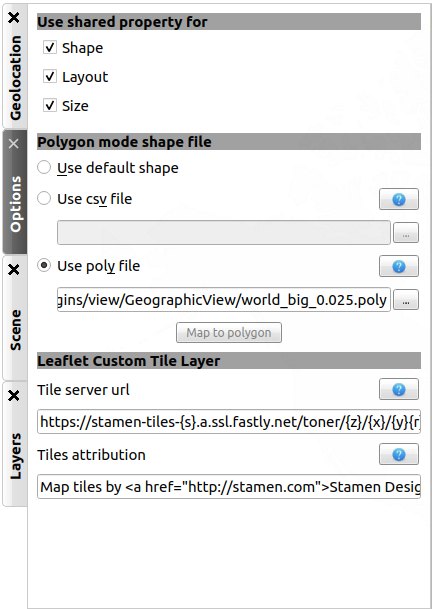

.. _workspace:

***********************
The Workspace in Detail
***********************

As it has been seen in :ref:`gui`, the workspace is where all the visualization views, or panels, are found. 

.. _workspace_panel:

Manage the panels
=================

.. |icon_workspace_macros| image:: _images/icon_workspace_macros.png
    :width: 384
.. |icon_panel_arrow| image:: _images/icon_panel_arrow.png
    :width: 89
.. |icon_panels| image:: _images/icon_panels.png
    :width: 173
.. |icon_close_panel| image:: _images/icon_close_panel.png
    :width: 21
.. |icon_move_panel| image:: _images/icon_move_panel.png
    :width: 19
.. |icon_list_graph| image:: _images/icon_list_graph.png
    :width: 23

When working on Tulip, you will need several panels to see all the informations you need. In order to easily compare or sort your results, you can find at the bottom of the workspace a toolbar containing three groups of buttons :

* |icon_workspace_macros|: here, only the first button, *Expose*, requires our attention. Clicking on it allows us to see icons representing every panel currently open.

.. image:: _images/i_workspace_expose.png
    :width: 600

You can then double-click on a panel icon to open it, click on the cross in the top-right corner of the icon to close it, or click again on the *Expose* button to return to the previously selected view.

* |icon_panel_arrow|: You can simply change the currently seen panels by clicking on the arrows.

* |icon_panels|: These icons appear depending of the number of opened panels. Clicking on one of those change the organization of the workspace according to the icon.

.. image:: _images/i_workspace_6panels.png
    :width: 600

On the top-right corner of the workspace window, you will find three different buttons:

* |icon_list_graph|: Clicking on this button will display a list of opened graphs. The current one name is displayed using a bold font. Choosing a new graph will modify the concerned panel and update the visualized informations.

* |icon_move_panel|: When using the tiled display, you can use this icon to reorganize the panels to yuour convinience. 

* |icon_close_panel|: Clicking on this icon will close the current panel. 

The creation of panels have already been presented earlier. Consult :ref:`workspace_view` for more informations.

.. _workspace_diagram:

The Node Link Diagram
=====================

.. |l_red| image:: _images/legend_red.png
    :width: 32
.. |l_yel| image:: _images/legend_yellow.png
    :width: 32
.. |l_pur| image:: _images/legend_purple.png
    :width: 32
.. |l_blu| image:: _images/legend_blue.png
    :width: 32

This panel gives you the main visualization view of Tulip, displaying graphs and offering you navigating tools to observe your data under every angle.

The view contains three distinctive elements colored differently in the following screen capture:

.. image:: _images/i_workspace-node_link_diagram-main_window.png
    :width: 400

|l_blu| the main window;

|l_red| the toolbar; 

|l_yel| the scene and layer subpanels.

.. _workspace_diagram_main:

Main window
-----------

.. |icon_wsm_map_node_color| image:: ../../library/tulip-gui/resources/icons/20/node_color_interpolation.png
    :width: 20
.. |icon_wsm_map_edge_color| image:: ../../library/tulip-gui/resources/icons/20/edge_color_interpolation.png
    :width: 20
.. |icon_wsm_map_node_size| image:: ../../library/tulip-gui/resources/icons/20/node_size_interpolation.png
    :width: 20
.. |icon_wsm_map_edge_size| image:: ../../library/tulip-gui/resources/icons/20/edge_size_interpolation.png
    :width: 20
.. |icon_wsm_screenshot| image:: ../../library/tulip-gui/resources/icons/20/camera-photo.png
    :width: 20
.. |icon_wsm_back_color| image:: _images/icon_wsm_back_color.png
    :width: 20
.. |icon_wsm_edge_color_interpol_dis| image:: ../../library/tulip-gui/resources/icons/20/color_interpolation_disabled.png
    :width: 20
.. |icon_wsm_edge_color_interpol_en| image:: ../../library/tulip-gui/resources/icons/20/color_interpolation_enabled.png
    :width: 20
.. |icon_wsm_edge_size_interpol_dis| image:: ../../library/tulip-gui/resources/icons/20/size_interpolation_disabled.png
    :width: 20
.. |icon_wsm_edge_size_interpol_en| image:: ../../library/tulip-gui/resources/icons/20/size_interpolation_enabled.png
    :width: 20
.. |icon_wsm_edge_visible_dis| image:: ../../library/tulip-gui/resources/icons/20/edges_disabled.png
    :width: 20
.. |icon_wsm_edge_visible_en| image:: ../../library/tulip-gui/resources/icons/20/edges_enabled.png
    :width: 20
.. |icon_wsm_label_visible_dis| image:: ../../library/tulip-gui/resources/icons/20/labels_disabled.png
    :width: 20
.. |icon_wsm_label_visible_en| image:: ../../library/tulip-gui/resources/icons/20/labels_enabled.png
    :width: 20
.. |icon_wsm_label_size_fit_dis| image:: ../../library/tulip-gui/resources/icons/20/labels_scaled_disabled.png
    :width: 20
.. |icon_wsm_label_size_fit_en| image:: ../../library/tulip-gui/resources/icons/20/labels_scaled_enabled.png
    :width: 20
.. |icon_wsm_node_color_set| image:: ../../library/tulip-gui/resources/icons/20/set_node_color.png
    :width: 20
.. |icon_wsm_edge_color_set| image:: ../../library/tulip-gui/resources/icons/20/set_edge_color.png
    :width: 20
.. |icon_wsm_node_border_color_set| image:: ../../library/tulip-gui/resources/icons/20/set_node_border_color.png
    :width: 20
.. |icon_wsm_edge_border_color_set| image:: ../../library/tulip-gui/resources/icons/20/set_edge_border_color.png
    :width: 20
.. |icon_wsm_node_shape_set| image:: ../../library/tulip-gui/resources/icons/20/set_node_shape.png
    :width: 20
.. |icon_wsm_edge_shape_set| image:: ../../library/tulip-gui/resources/icons/20/set_edge_shape.png
    :width: 20
.. |icon_wsm_node_size_set| image:: ../../library/tulip-gui/resources/icons/20/set_node_size.png
    :width: 20
.. |icon_wsm_edge_size_set| image:: ../../library/tulip-gui/resources/icons/20/set_edge_size.png
    :width: 20
.. |icon_wsm_label_color_set| image:: ../../library/tulip-gui/resources/icons/20/set_label_color.png
    :width: 20
.. |icon_wsm_label_position_set| image:: ../../library/tulip-gui/resources/icons/20/set_label_position.png
    :width: 20
.. |icon_wsm_label_font_set| image:: _images/icon_wsm_label_font_set.png
    :width: 40

.. |i_workspace_rclick_edge| image:: _images/i_workspace_rclick_edge.png
    :width: 297
.. |i_workspace_rclick_node| image:: _images/i_workspace_rclick_node.png
    :width: 297

This part of the panel shows the graph. From here, the user can exploit two elements to influence on it.

* The first one is the quick access bar located at the bottom of the view:

  .. image:: _images/icon_wsm_toolbar.png
    :width: 600

  The button actions are explained when hovered over with the mouse cursor.

  * |icon_wsm_map_node_color|: Show/hide a node color mapping metric filter.

  * |icon_wsm_map_edge_color|: Show/hide an edge color mapping metric filter.

  * |icon_wsm_map_node_size|: Show/hide a node size mapping metric filter.

  * |icon_wsm_map_edge_size|: Show/hide an edge size mapping metric filter.

  * |icon_wsm_screenshot|: Take a screenshot of the current scene view.

  * |icon_wsm_back_color|: Change the scene background color.

  * |icon_wsm_edge_color_interpol_dis| or |icon_wsm_edge_color_interpol_en|: Activate/deactivate the edge color interpolation.

  * |icon_wsm_edge_size_interpol_dis| or |icon_wsm_edge_size_interpol_en|: Activate/deactivate the edge size interpolation.

  * |icon_wsm_edge_visible_dis| or |icon_wsm_edge_visible_en|: Make the edges visible/invisible

  * |icon_wsm_label_visible_dis| or |icon_wsm_label_visible_en|: Display/Hide the labels.

  * |icon_wsm_label_size_fit_dis| or |icon_wsm_label_size_fit_en|: Make the label size fits or not to the node size.

  * |icon_wsm_node_color_set|: Set the color of the selected nodes, if any, of all the nodes, if none.

  * |icon_wsm_edge_color_set|: Set the color of the selected edges, if any, of all the edges, if none.

  * |icon_wsm_node_border_color_set|: Set the border color of the selected nodes, if any, of all the nodes, if none.

  * |icon_wsm_edge_border_color_set|: Set the border color of the selected edges, if any, of all the edges, if none.

  * |icon_wsm_node_shape_set|: Set the shape of the selected nodes, if any, of all the nodes, if none.

  * |icon_wsm_edge_shape_set|: Set the shape of the selected edges, if any, of all the edges, if none.

  * |icon_wsm_node_size_set|: Set the size of the selected nodes, if any, of all the nodes, if none.

  * |icon_wsm_edge_size_set|: Set the size of the selected edges, if any, of all the edges, if none.

  * |icon_wsm_label_color_set|: Set the label color of the selected elements, if any, of all the elements, if none.

  * |icon_wsm_label_position_set|: Set the label position of the selected nodes, if any, of all the nodes, if none.

  * |icon_wsm_label_font_set|: Change the default label font.

  When clicked on, some of these icons will change to adapt to the present situation, by either alterning between two versions for the toogle buttons, or by indicating the color or the font choosed.

* The second element is the menu displayed with a right-click.

  .. image:: _images/i_workspace_rclick.png
    :width: 297

  By default, the options are in two submenus : *View* et *Augmented display*.

  * *Force redraw*: Update the graph displayed.

  * *Center view*: Reset the camera position.

  * *Use orthogonal projection*: Switch to orthogonal projection to true perspective.

  * *Take snapshot*: Take a screenshot.

  * *Show overview*: Display/hide the overview in the upper-left of the window.

  * *Show quick access bar*: Display/Hide the quick access bar.

  * *Use Z ordering*: Adapt the display priority according to the Z position.

  * *Grid display parameters*: Open the grid setup wizard.

  When the right-click is done on an edge or a node, a new submenu appears displaying the object name and offers to select the node/edge (*Select*), add it to the current selection (*Toggle selection*) or to delete it (*Delete*).

  |i_workspace_rclick_edge|    |i_workspace_rclick_node|

.. _workspace_diagram_toolbar:

Toolbar
-------

.. |icon_wst_navigate_graph| image:: ../../library/tulip-gui/resources/icons/i_navigation.png
    :width: 20
.. |icon_wst_get_edit_infos| image:: ../../library/tulip-gui/resources/icons/i_select.png
    :width: 20
.. |icon_wst_select_rect| image:: ../../library/tulip-gui/resources/icons/i_selection.png
    :width: 20
.. |icon_wst_move_reshape| image:: ../../library/tulip-gui/resources/icons/i_move.png
    :width: 20
.. |icon_wst_select_free| image:: ../../plugins/interactor/MouseLassoNodesSelector/i_lasso.png
    :width: 20
.. |icon_wst_select_short_path| image:: ../../plugins/interactor/PathFinder/designer/pathfinder.png
    :width: 20
.. |icon_wst_add_nodes_edges| image:: ../../library/tulip-gui/resources/icons/i_addedge.png
    :width: 20
.. |icon_wst_edit_edge_bends| image:: ../../library/tulip-gui/resources/icons/i_bends.png
    :width: 20
.. |icon_wst_delete_nodes_edges| image:: ../../library/tulip-gui/resources/icons/i_del.png
    :width: 20
.. |icon_wst_zoom_rect| image:: ../../library/tulip-gui/resources/icons/i_zoom.png
    :width: 20

.. |icon_wst_fisheye| image:: ../../plugins/interactor/FishEye/i_fisheye.png
    :width: 20
.. |icon_wst_magnify_glass| image:: ../../plugins/interactor/MouseMagnifyingGlass/i_magnifying_glass.png
    :width: 20

This element of the node link diagram panel is located at the top of the window and is divide in three parts.

The first one, when clicked on, opens the configuration panel, giving explanations about the currently selected tool and proposing the advanced options.

.. image:: _images/i_workspace_toolbar_configuration.png
    :width: 300

.. image:: _images/i_workspace_toolbar_configuration_clicked.png
    :width: 300

The second part contains the tools icons:

.. image:: _images/icon_wst_toolbar.png
    :width: 342

The use of the tools will not be explained in detail here. More informations about their use can be found by selecting the tool and clicking on the configuration panel button.

* |icon_wst_navigate_graph|: Navigate in graph.

* |icon_wst_get_edit_infos|: Get/Edit node or edge informations.

* |icon_wst_select_rect|: Select nodes/edges in a rectangle.

* |icon_wst_move_reshape|: Move/Reshape rectangle selection.

* |icon_wst_select_free|: Select nodes in a freehand drawn region.

* |icon_wst_select_short_path|: Select the shortest path between two nodes.

* |icon_wst_add_nodes_edges|: Add nodes/edges.

* |icon_wst_edit_edge_bends|: Edit edges bends.

* |icon_wst_delete_nodes_edges|: Delete nodes or edges.

* |icon_wst_zoom_rect|: Zoom on rectangle.

* |icon_wst_highlight_neighbor|: Highlight node neighborhood.

* |icon_wst_fisheye|: Use the cursor "Fisheye".

* |icon_wst_magnify_glass|: Use the cursor "Magnifying glass".

The final element is a combo box, allowing the user to choose which graph to visualize.

.. image:: _images/i_workspace_toolbar_list.png
    :width: 300

.. image:: _images/i_workspace_toolbar_list_clicked.png
    :width: 300

.. _workspace_diagram_scene:

Scene
-----

The scene rendering settings can be opened by clicking on the scene tab, in the upper-right corner of the node link diagram panel. The following view appears :

.. image:: _images/i_workspace_scene.png
    :width: 452

* **Labels**: Manage the labels display by ordering them according to a metric, adapting their size so they can fit into their respective nodes, choosing the number of labels simultaneously displayed and setting their limit size. 

* **Edges**: Manage the edge display by enabling the 3D edges, showing the arrows, enabling the color or the size interpolations.

* **Colors**: Customize the selection and background colors.

* **Projection**: Select the orthogonal or classic perspective projection.

Note that some of the settings mentionned above can be modified through the quick access bar or with the right-click menu in the main window.

You might need to click on the refresh button, in the right-upper corner of the tab to apply the changes made in this tab. The tab can be closed by clicking on the cross near the tab's name.
	

.. _workspace_diagram_layers:

Layers
------

The layers settings can be accessed to by clicking on the Layers tab. The following view is displayed:

.. image:: _images/i_workspace_layers.png
    :width: 450

The first column, *Visible*, authorizes you to select the elements you want to display in the graph. The second column, *Stencil*, gives you another level of visibility by setting the objects on the foreground. 

.. _workspace_diagram_faq:

FAQ
---

The Node-Link Diagram being one of the mostly used view, it is also the one we are asked the more about. We will list here some of the more frequently asked questions in order to allow you to maybe find a direct answer to your problem.

**Labels**

* *Why are some of the labels not displayed ?*

  Because we want to allow people working with large graphs to use Tulip too, displaying each and every label is a poor choice.
  The rendering becomes demanding and the visibility is not really at its best. 
  By default, the density of labels displayed is set in order to forbid any overlap. 
  This options can be customized in the Scene Rendering Settings (see :ref:`workspace_diagram_scene`).

* *The size of the labels is not adapted. Even when I try to augment it for each node, nothing happens; what should I do?*

  By default, the label size is set to a certain interval. The size appreciation in Tulip can be deceptive so we have decided to implement a dynamic font size, scaling the font according to your view. However, some people may need more control upon the label size. You will find in the Scene Rendering Settings (see :ref:`workspace_diagram_scene`) options to manage the font size interval or to use a fixed value. Checking the *Fit labels size to nodes size* option also adapts the labels to the corresponding nodes according to their size.

* *I have set a few label for some edges but I can not see them. The label density is set to* Show all *and I am sure the labels are not hidden. How can I fix this?*

  By default, the visibility of some elements is restricted to keep the graph clean. The edges labels and the meta-node content labels are not visible. To change this option, open the layer settings (see :ref:`workspace_diagram_layers`) and set to visible the wanted elements.

**Edges**

* *I am sure my graph is oriented, but I do not see any arrow displayed, have I forgot something?*

  By default, the arrows are not displayed in Tulip. You can address this issue by checking the option *Show arrows* in the scene rendering settings (see :ref:`workspace_diagram_scene`). If your graph is quite large, they may also be too small, in that case, you should try to enlarge them using the |icon_wst_get_edit_infos| interactor.

* *I have change the source/target anchor shape/size but I still do not see them, what is the problem?*

  Do not forget to check the *Show arrows* option as explained above to indicate to Tulip you want them to be displayed.

* *When I change the size of my edges, the layout stays identical, how should I proceed to modify that?*

  Just like the colour and the arrows issues, the program will not use the size value given for each edge if the size interpolation is enable. To resolve your issue, click on the size interpolation icon (|icon_wsm_edge_size_interpol_en|) in the quick access menu (see :ref:`workspace_diagram_main`) or check/uncheck the *Enable size interpolation* option in the Scene Rendering Settings (see :ref:`workspace_diagram_scene`).

**Colour/Transparancy**

* *I can not see the edges/nodes. Changing their colour is not helping, what happened?*

  Before changing every parameter in your graph, check if the edges/nodes are *visible*. This option can be verified by checking the *Nodes* and *Edges* box in the column *Visible* in the *Layer* panel. For the edges, clicking on |icon_wsm_edge_visible_dis| in the quick access bar will realize the same action.

  If you have change the nodes or edges colour manually, maybe you also have modified the alpha component, changing the colour to be transparent. Selecting the edges or nodes and setting the alpha value to 255 in the color picker should solve the issue. Use the icons |icon_wsm_node_color_set| and |icon_wsm_edge_color_set| to do so.

* *I have changed the edge colour but nothing happens, what is the problem?*

  Tulip proposes an option to colour the edges using an interpolation. When this option is selected, the edge colour is set to match its in and out nodes colours. You can activate/deactivate this option by clicking on |icon_wsm_edge_color_interpol_en| in the quick access bar (see :ref:`workspace_diagram_main`) or by checking/unchecking the option in the Scene Rendering Settings (see :ref:`workspace_diagram_scene`).

* *I do not like the selection colour or the default node colour, any suggestion ?*

  The default colour can actually be customized in the *Settings* window. To open it, go through the *Edit* menu and the *Preferences* element. More informations in :ref:`preferences`.
  

.. _workspace_spreadsheet:

Spreadsheet view
================

This panel displays the properties of the nodes and edges of the graph.

.. _workspace_spreadsheet_main:

Main window
-----------

Properties are an important concept in Tulip, they are used to store informations about each node and edge. By convention, the properties used by the rendering engine begin with the “view” prefix but it is possible to define an unlimited number of additional properties to your convinience. 

Here is the list of all the rendering properties (e : used with edges, n: used with nodes):

* *viewBorderColor*: Border color (e/n).

* *viewBorderWidth*: Border width (e/n).

* *viewColor*: Color (e/n).

* *viewFont*: Font used to render the label (e/n).

* *viewFontSize*: Font size of the label (e/n).

* *viewLabel*: Label (e/n).

* *viewLabelColor*: Label color (e/n).

* *viewLabelPosition*: Label position (center, top, bottom, left, right) (e/n).

* *viewLayout*: Position (x,y,z) of a node, or vector of the bends positions of an edge (e/n).

* *viewMetric*: Property used by the algorithms (e/n).

* *viewRotation*: Rotation (n)

* *viewSelection*: True if the element is selected, false if not (e/n).

* *viewShape*: Select the shape of a node (circle, square, cube, sphere...) or an edge (Bezier curve, polyline...) (e/n). 

* *viewSize*: Set the size, for a node: (height, width, depth); for an edge: (width at source, width at end, arrow size). The edge size interpolation must be unchecked for this property to be consider (e/n).

* *viewSrcAnchorShape*: Shape of the source anchor of the edge. For this setting to take effect, the option *Show arrow* must be checked (e).

* *viewSrcAnchorSize*: Size (along the x, y, z axis) of the source anchor (e).

* *viewTexture*: Texture to replace the color (e/n).

* *viewTgtAnchorShape*: Like *viewSrcAnchorShape* (e). 

* *viewTgtAnchorSize*: Size (along the x, y, z axis) of the target anchor (e).

The spreadsheet view allows you to select the elements you want to watch by choosing *Nodes* or *Edges* in the *Show* combo box. A filter is available to pick elements depending of their selection in the *node link diagram*, *filtered by* combo box, or to match a given pattern in a specific column.

The value stocked in the table can be modified by several ways. A double click on one of the case will offers to enter the value for one property and one element (edge or node). A right-click in one of the case opens the following sub-menu :

.. image:: _images/i_workspace_rclick_elements.png
    :width: 159

Two types of action can be done, the ones concerning the property and the ones concerning the selection of the element. The property value can be set for all nodes, the ones selected (where *viewSelection = true*) or the ones highlighted (current element and the ones clicked on while maintaining *Ctrl* pushed). The values of the present property can also be transfered to *viewLabel* in order to display them in the graph.

.. _workspace_spreadsheet_properties:

Properties
----------

In the upper right of the panel, you can find the tab *Properties*.

.. image:: _images/i_workspace_properties.png
    :width: 430

Here you can manage the properties. The eye-shaped button makes visible the properties in the table in the main window. A right-click will open a sub-menu offering to create new properties (also realizable with the *Add property* button) and to copy or delete old ones.

.. image:: _images/i_workspace_rclick_properties.png
    :width: 248

.. _workspace_adjacency:

Adjacency matrix view
=====================

This view gives you a general glimpse of the adjacency matrix of your graphe.

.. image:: _images/i_adjacency_matrix.png
    :width: 400

.. _workspace_adjacency_settings:

Settings
----------

By clicking on the tab in the right upper corner, you can open the display settings panel.

.. image:: _images/i_adjacency_settings.png
    :width: 308

As you can notice, several parameters such as the background color, the node ordering and the grid and edges display visibility.

.. _workspace_geographic:

Geographic view
===============

.. _workspace_geographic_mods:

Map mods
--------

The geographic view proposes six differents map mods. You can switch between them by clicking on the button in the top left corner. Test them in order to adapt the visualization background to your need.

* Roadmap:

.. image:: _images/i_geographic_main_roadmap.png
    :width: 400

* Satellite:

.. image:: _images/i_geographic_main_satellite.png
    :width: 400

* Terrain:

.. image:: _images/i_geographic_main_terrain.png
    :width: 400

* Hybrid: 

.. image:: _images/i_geographic_main_hybrid.png
    :width: 400

* Polygon:

.. image:: _images/i_geographic_main_polygon.png
    :width: 400

* Globe:

.. image:: _images/i_geographic_main_globe.png
    :width: 400

.. _workspace_geographic_toolbar:

Toolbar
-------

The tools available in this view represent a subset of those introduced in the Node-Link Diagram view earlier. You can recall the following:

* |icon_wst_navigate_graph|: Navigate in graph.

* |icon_wst_get_edit_infos|: Get/Edit node or edge informations.

* |icon_wst_select_rect|: Select nodes/edges in a rectangle.

* |icon_wst_move_reshape|: Move/Reshape rectangle selection.

* |icon_wst_add_nodes_edges|: Add nodes/edges.

* |icon_wst_edit_edge_bends|: Edit edges bends.

Otherwise, the toolbar should be used as usual, the left side containing the tool definition and the instructions on how to use it, whereas the rightside propose a list of all the opened graphs. Just click on one to load it in the concerned view.

.. _workspace_geographic_geoloc:

Geoloc
------

A geolocalization tool has been embedded in the view, exploiting the Google Maps web service. It is used to appropriatly place the nodes on the map.

You can choose among two methods to place the elements, either by providing a valid address for each node, stocked in a property you will select, or by using the latitude and longitude value, each contained in their respective properties.

The above europe map snapshots for example have been build in such a way, by giving to each node a town name.

Once the service is being querried, you will have to specify the corresponding town/address for the ambiguous choices. With the layout finished, you can choose to keep the result value obtained in complementary properties to ease the possible next computation.

The node placement should be instantaneous otherwise, close and reopen the view to update the new layout.

.. _workspace_geographic_options:

Options
-------

The polygon map shape can be switch to your convinience with another one. Choose if you want to use the default shape, or a new one imported through a *csv* or a *poly* file. The *help* button displays additionnal informations concerning the file format and available source addresses.

.. _workspace_geographic_scene:

Scene
-----

.. image:: _images/i_geographic_scene.png
    :width: 449

The properties proposed in this panel are completely similar to the ones in the Node-Link Diagram's scene rendering panel. Report to :ref:`the concerned section<workspace_diagram_scene>` if you need additional informations.

.. _workspace_geographic_layers:

Layers
------

.. image:: _images/i_geographic_layers.png
    :width: 449

As for the scene panel, the layers settings behave like the one in the Node Link Diagram view. More informations :ref:`this way<workspace_diagram_layers>`.

.. _workspace_histogram:

Histogram view
==============

To illustrate the use of this view, we need an example. You can create one by importing a new grid approximation with 500 nodes and a maximum degree of 40. You will then need to add two new properties using the :ref:`spreadsheet view<workspace_spreadsheet>` (use the *Add property* button in the *Properties* tab): *Degree* and *Betweenness Centrality*. Then, use the appropriate algorithms to fill the properties with the wanted informations. A preprepared document can be found :download:`here <_documents/Histogram.tlpx>`.

Upon opening the file, you will find something similar to the following screenshot:

The view displays several histograms at the same time, double clicking onto one of them make the view to focus on it:

.. image:: _images/i_histogram_main1.png
    :width: 400

When creating the example yourself, a few additionnal steps must be followed in order to obtain such result, let us see how to do so.

.. _workspace_histogram_properties:

Properties
----------

In a similar fashion to what we have seen before, you can find tabs in the right-upper corner offering further options:

.. image:: _images/i_histogram_properties.png
    :width: 392

In this panel, you can select the properties you are interested in. The nodes or edges presenting identical features will then be grouped, creating one new histogram for each property selected. This panel is only available when you are in the view presenting every histogram, the fields will be disabled otherwise.

.. _workspace_histogram_options:

Options
-------

The second tab offers options to adapt the histogram. It can only be used when viewing a specific histogram :

.. image:: _images/i_histogram_options.png
    :width: 391

These settings will alter the initial histogram by adapting the discrete intervals used.

* *Background color*: changes the background color.

* *Uniform quantification*: adapts the intervals on the X axis to obtain a uniform quantification on the Y axis.

* *Cumulative frequencies histogram*: cumulates the values obtained from one interval to the next.

* *Number of histogram bins*: controls in how many intervals the X axis repartition is distributed.

* *Resulting bin width*: indicates the width of the intervals on the X axis.

* *X axis graduation count*: 

* *X axis logscale*: applies a logarithm scale on the X axis.

* *Y axis graduation step*:

* *Y axis logscale*: applies a logarithm scale on the Y axis.

* *Show graph edges above histogram*: displays the edges existing between each bin.

.. _workspace_histogram_toolbar:

Toolbar
-------

.. |icon_his_metric_mapping| image:: ../../plugins/view/HistogramView/i_histo_color_mapping.png
    :width: 20
.. |icon_his_statistics| image:: ../../plugins/view/HistogramView/i_histo_statistics.png
    :width: 20

The view proposes two exclusive tools, only availables when viewing a sole histogram:

* |icon_his_statistics|: The statistics tool displays augmented markings above the histogram. A few customization can be done in the settings:

  .. image:: _images/i_histogram_statistics.png
      :width: 280

  * **Mean and standard derivation**: Tulip computes the mean and the standard derivation and displays these values on the histogram.

  * **Select nodes in range**: Choose the lower and upper bound and select the nodes inbetween.

  * **Density estimation**: Tulip will display a curve representing the distribution according to a given function (Uniform, Gaussian, Triangle, Epanechnikov, Quartic, Cubic or Cosine).

  Do not forget to click on *Apply* to commit your changes.

* |icon_his_metric_mapping|: This interactor allows to perform a metric mapping on nodes colors, nodes borders colors, nodes sizes, nodes borders widths or nodes glyphs in a visual way. To select the mapping type, do a right click on the scale located at the left of the histogram vertical axis and pick the one wanted in the popup menu which appears.

  .. image:: _images/i_histogram_mappingtype.png

  To configure the metric mapping, double click on the scale located at the left of the histogram vertical axis and use the dialog which appears. The rest of the instructions on how to fully configure the tool can be find in the tool documentation panel.

.. _workspace_parallel:

Parallel coordinates view
=========================

To present this view, we will use a dataset containing car specifications such as the city and highway autonomy, the engine displacement, the retail price, the physical dimensions... This document can be opened in Tulip as a project, available :download:`here <./_documents/Cars_data.tlpx>`, or can be imported with the :download:`original CSV file <./_documents/04cars_data.csv>`. The original file can be found on `this site <http://igva2012.wikispaces.asu.edu/file/detail/04cars.csv>`_.

More informations about the CSV import tool and mechanism can be found in the section :ref:`csv`.

Once the view is created, you will need to specify the properties you want to compare, to do so, use the *Properties* tab.

.. _workspace_parallel_properties:

Properties
----------

This panel provides the list of properties which can be analysed, in the previous example, we choose the three shown in the following screenshot:

.. image:: _images/i_parallel_properties.png
    :width: 429

You can specify whether you want to use the nodes or the edges, but also, you can sort the properties according to your taste and needs.

.. _workspace_parallel_draw:

Draw
----

The second tab proposes advanced options to customize the drawing of the parallel coordinates:

.. image:: _images/i_parallel_draw.png
    :width: 428

* **General draw parameters**: set here the background color and the height of the axis

* **Lines colors alpha values**: select whether you want to use the usual *viewColor* property or new one, common for each node.

* **Draw nodes on axis**: enable the nodes (and their labels) to be displayed or not

* **viewSize Mapping configuration**: specify the minimum and maximum axis node sizes

* **Apply texture on lines**: select your own texture or choose the one offered by default.

.. _workspace_parallel_toolbar:

Toolbar
-------

.. |icon_par_axis_box_plot| image:: ../../plugins/view/ParallelCoordinatesView/i_axis_boxplot.png
    :width: 20
.. |icon_par_axis_sliders| image:: ../../plugins/view/ParallelCoordinatesView/i_axis_sliders.png
    :width: 20
.. |icon_par_axis_swapper| image:: ../../plugins/view/ParallelCoordinatesView/i_axis_swapper.png
    :width: 20
.. |icon_par_highlight_elements| image:: ../../plugins/view/ParallelCoordinatesView/i_element_highlighter.png
    :width: 20
.. |icon_par_modify_space_axis| image:: ../../plugins/view/ParallelCoordinatesView/i_axis_spacer.png
    :width: 20

The parallel coordinates view proposes a few exclusif tools which be used to manipulate the axis and to highlight the correspondance between the properties:

* |icon_par_axis_box_plot|: axis boxplot
* |icon_par_axis_sliders|: axis sliders
* |icon_par_axis_swapper|: axis swapper
* |icon_par_highlight_elements|: highlight elements
* |icon_par_modify_space_axis|: modify spaces between consecutive axis

Further informations on each of these tool can be found in their personnal help/configuration panel.

.. _workspace_parallel_special_menu:

Special menus
-------------

A right-click anywhere but on the axis in the view will display the classical right-click menu seen before but with additional options related to the current view. Two fields, *View Setup* and *Options*, are available:

* *View Setup*: 

  .. image:: _images/i_parallel_main_rightclick.png
    :width: 500

  * *Layout Type*: choose between the classic layout, where the axis are disposed in parallel, and the circular layout, where the axis are spread regularly over the radius of a circle.
  * *Lines Type*: switch between the classical straight lines and the curved Catmull-Rom Spline.
  * *Lines Thickness*: proposed to map the lines to the viewSize property or use a standard thin line.

* *Options*: The sole option *Tooltips* allows to display directly some informations like the id of the hovered node.

When you realize a right-click on one of the axis, Tulip proposes to either *Remove  [the] axis* or to enter a configuration panel:

.. image:: _images/i_parallel_main_axis_conf.png
    :width: 300

Here you will be able to specify, among others, the number of graduations, the axis order and the use of a logarithm scale.

.. _workspace_pixel:

Pixel oriented view
===================

The pixel oriented view gives you four different solutions to sort your nodes depending of the values on a given property. To illustrate its use and its possibilities, we will exploit the dataset introduced previously. It can still be downloaded :download:`here <./_documents/Cars_data.tlpx>` in its Tulip project form, or :download:`here<./_documents/04cars_data.csv>`, in its CSV form.

.. _workspace_pixel_properties:

Properties
----------

The first steps to follow in order to use this view is to choose the properties you want to analyse. To do so, open the *Properties* panel and select the appropriate data:

.. image:: _images/i_pixel_properties.png
    :width: 392

Pixel oriented tools usually exploit a layout algorithm, moving the nodes into a specific configuration, following a space-filling curve, and ordering them according to one of the properties. The second parameter will be used to realize a color mapping, similar to the one shown in our example, aiming at underlining the correlation between the two properties.

.. _workspace_pixel_options:

Options
-------

This second tab proposes to choose among four space-filling curve implementations.

.. image:: _images/i_pixel_options.png
    :width: 391

The nodes disposition will be arranged to match the chosen representation.

* Discrete spiral:

  .. image:: _images/i_pixel_discrete_spiral.png
    :width: 200

* Z-order curve (`original picture <http://en.wikipedia.org/wiki/File:Four-level_Z.svg>`_):

  .. image:: _images/i_pixel_z-order_curve.png
    :width: 200

* Peano curve:

  .. image:: _images/i_pixel_peano_curve.png
    :width: 200

* Square curve:

  .. image:: _images/i_pixel_square_curve.png
    :width: 200

.. _workspace_python:

Python script view
==================

.. _workspace_python_script:

Script editor
-------------

If you are willing to implement graph manipulation algorithms, directly heading to program a C/C++ module or plug-in can be rather tricky. Instead, Tulip proposes to use the dynamic programming language `Python <http://www.python.org>`_ to easily and interactively try and implement your solutions.

.. image:: _images/i_python_script_main.png
    :width: 600

.. _workspace_python_doc:

Documentation
-------------

*Python* is a whole, complete programming language and must be treated as such. A proper initiation is required if you want to fully exploit its possibilities. No such help will be provided here; however, for those who are already familiar with this language, a Tulip-Python integration documentation exists and can be found under the tab *Documentation*.

.. image:: _images/i_python_doc_main.png
    :width: 600

It references and contains help about every existing function translated from the Tulip core library. Do not hesitate to consult it if you need additional informations.

.. _workspace_scatterplot:

Scatter plot 2D view
====================

The pixel oriented and the parallel coordinates views both aim to underline the corelation between two properties, the first one by displaying a tendency noticable with a coloration, and the second one by showing the relation between two properties for the same element.

The scatterplot view can be used in a similar fashion. As a list of properties is selected, a plot for each possible couple will be created.

The data repartition allows to visually estimate and to formally compute a correlation coefficient.

.. _workspace_scatterplot_properties:

Properties
----------

The property tab works like the previously presented view. You have to select a list of properties to analyse. You can sort them with the upper and downer arrows on the right.

.. image:: _images/i_scatterplot_properties.png
    :width: 392

.. _workspace_scatterplot_faq:

Options
-------

.. image:: _images/i_scatterplot_options.png
    :width: 392

In this tab, you can select the scene and the scatterplots background color. By default, the second one uses a colorscale to indicate whether the plot correlation coefficient detect a link between the two current properties or not.
You can customize the colorscale with a click on the *-1*, *0* and *1* buttons to specify which color to use for each value.

The size mapping options will adapt the size rendering in the plots depending on the initial node size.

The last checkbox will display the edges above the scatterplot if you are willing to.

In the end, by realizing different mapping type on different properties, you can estimate the correlation between up to four properties (two depending of the plot axis, one with a color mapping and a final one with a size mapping).

.. _workspace_selforganizing:

Self Organizing Map view
=========================

As explain in the scatterplot view, we are blocked by the number of perceptible dimensions and the existing mapping when we are looking for a correlation between several different properties.

This is where the SOM view comes to our help. 

The self organizing map (or Kohonen map) is useful to visualize high-dimensional data in a low-dimensional representation.

.. _workspace_selforganizing_dimensions:

Dimensions
----------

.. image:: _images/i_som_dimensions.png
    :width: 395

In a similar fashion to what we have already realized with the pixel oriented tool or with the scatterplot 2D view, the panel called *Dimensions* can allow you to select the properties to use for building the self organizing map.

.. _workspace_selforganizing_learning:

Learning
--------

.. image:: _images/i_som_learning.png
    :width: 395

Beside offering the possibility to work on high-dimensionnal data, the Self-Organizing Map are able to use competitive learning. This panel offers to the user to specify the learning coefficient.

.. _workspace_selforganizing_diffusion:

Diffusion
---------

.. image:: _images/i_som_diffusion.png
    :width: 395

.. _workspace_selforganizing_representation:

Representation
--------------

.. image:: _images/i_som_representation.png
    :width: 395

This panel 

BMU = Best Matching Unit

.. _workspace_selforganizing_animation:

Animation
---------

.. image:: _images/i_som_animation.png
    :width: 395

.. _workspace_spreadsheet_example:

Example : Coloring a graph
==========================

.. |icon_import| image:: ../../plugins/perspective/GraphPerspective/resources/icons/32/document-import.png
    :width: 32
.. |icon_add| image:: ../../library/tulip-gui/resources/icons/64/list-add.png
    :width: 40
.. |icon_addsmall| image:: ../../library/tulip-gui/resources/icons/64/list-add.png
    :width: 20
.. |tutorial_color-graph_color2| image:: _images/tutorial_color-graph_color2.png
    :width: 400
.. |tutorial_color-graph_color3| image:: _images/tutorial_color-graph_color3.png
    :width: 400
.. |tutorial_color-betweeness_settings| image:: _images/tutorial_color-betweeness_settings.png
    :width: 300

We can apply some of these new knowledges to a small example aiming at coloring a graph. First we need to open the panels *Node Link Diagram* and *Spreadsheet View*, presented earlier in this chapter. To do so :

* Create a random graph by clicking on |icon_import|. The default Grid Approximation, under the Graph category will be fine.

  .. image:: _images/tutorial_color-graph_grey.png
    :width: 400

* By default, new Spreadsheet and Node Link Diagram panels will automatically open upon each graph importation. If you are using a previously created graph, you can open these by clicking on |icon_add| or |icon_addsmall| **Add panel** and selecting the appropriate panel types.

* In the algorithm panel, search under the category *Measure*, subcategory *Graph*, the *Betweenness Centrality* button.

* Before launching it, check the settings by clicking on the gear on the left of the icon. The parameters should be as follow:

  |tutorial_color-betweeness_settings|

Once those are correctly set, you can launch the algorithm.

* In the spreadsheet you can notice how the *viewMetric* column values are now changed. 

* In the algorithms, under the category *Coloring*, find the *Color Mapping*. The parameters should be *viewMetric* in the enumerated property, a *linear* progression, the *nodes* as target and any color scale. The results must be send into *viewColor*. Once everything is set, you can launch the color mapping.

* Now, we just have to enable the edge color interpolation by clicking on |icon_wsm_edge_color_interpol_dis| in the Node Link Diagram panel.

* The result should be quite similar as this one :

.. image:: _images/tutorial_color-graph_color.png
    :width: 400

* You can use different color scale to identify easily the progression, here is two examples using 7 and 13 custom colors instead of the 5 by default :

|tutorial_color-graph_color2|    |tutorial_color-graph_color3|

* Let us try now to modify the labels. In the algorithms, under the category *Measure*, subcategory *Misc*, select the *Id* button. The parameters should send the results into the *viewMetric* property.

* In the Spreadsheet view, realize a right click on the *viewMetric* column and select *To labels of → All nodes*.

* Back in the Node Link Diagram panel, you should now obtain a graph similar to this one :

.. image:: _images/tutorial_color-graph_label.png
    :width: 400

If you do not see the labels, verify the parameters in the tab *Scene* or that the button |icon_wsm_label_visible_dis| is not toggled.

* From here, you can redo a *Color Mapping*. By selecting *viewMetric* or *viewLabel* as the source, you will obtained a coloration following the Id of the nodes.

Do not hesitate to try different combinations of algorithm to further discover the application.

.. _workspace_complements:

Complements about the workspace
===============================

We had say a few words about the toolbar located at the bottom of the workspace in :ref:`workspace_panel` but we have not yet explained the use of the buttons 2 and 3 : Search and Python.

.. _workspace_complements_search:

Search
------

The tool Search can be used in parallel of any panel. It proposes a solution of selection according to specific criterias. 

You start by selecting the graph and the elements targeted and by choosing the selection mode. The result (respecting the criteria or not) is stored in a boolean property, *viewSelection* by default. You then choose the values to compare and hit the button *Search* to launch the tool.

If you have choose *viewSelection* as the result storing property, the selected elements can be seen in the node link diagram view.

.. _workspace_complements_python:

Python
------
			
.. image:: _images/i_workspace_python.png
    :width: 600

The python prompt provides an interactive mean to treat the data. Consult the Python documentation for more informations.

