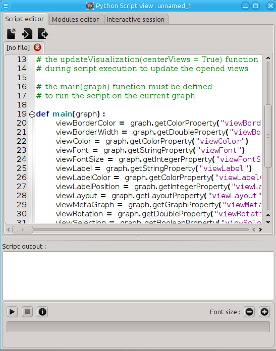
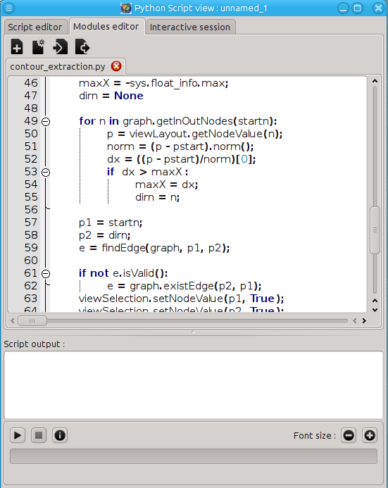
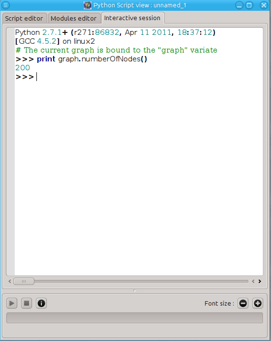
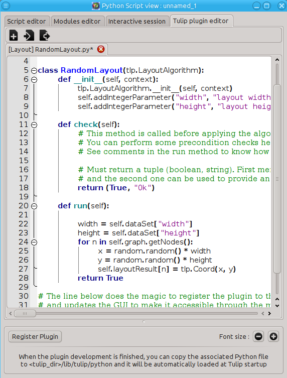

.. py:currentmodule:: tulip

Getting started
===============

.. _usingBindingsInTulipGUI:

Using the bindings from the Tulip Software GUI
-----------------------------------------------

A lightweight Python IDE can be accessed through the graphical interface of Tulip in order to run scripts on
the graph currently visualized. Starting Tulip 3.6, it is integrated as a view plugin named "Python Script view"
and can be accessed through the "View" menu. The interface of this component is composed of four tabs :

	* the "Script editor" tab (see :ref:`Figure 1`) that allows to write scripts that can be applied to the
	  graph currently loaded in Tulip. To do so, the "main(graph)" has to be defined
          and is used as the script entry point. The graph currently loaded is wrapped 
          as a :class:`tlp.Graph` object and provided as parameter of the "main" function.
	  The currently edited script can be launched through the control panel located
          in the lower part of the interface. Once started, the script execution can be
          stopped at any time.

   Figure 1: Screenshot of the "Script editor" tab from the Tulip Python Script view.

	* the "Modules editor" tab (see :ref:`Figure 2`) that enables to write and edit 
	  Python modules that can be immediately imported in the main script.

   Figure 2: Screenshot of the "Modules editor" tab from the Tulip Python Script view.

	* the "Interactive session" tab (see :ref:`Figure 3`) that provides an interactive
          Python shell. The graph currently loaded in Tulip is wrapped to a :class:`tlp.Graph`
          object and bound to the "graph" variable.

   Figure 3: Screenshot of the "Interactive session" tab from the Tulip Python Script view.

       * The "Tulip plugin editor" tab (see :ref:`Figure 4`) that allows to develop Tulip plugins in Python and registers them immediately in the interface to test them.
         Different kinds of plugins can be develop : General Algorithms, Property Algorithms, Import plugins and Export plugins. 

   Figure 4: Screenshot of the "Tulip plugin editor" tab from the Tulip Python Script view.

.. warning:: If you installed Tulip from a bundle and want to import external Python modules from the Python Script view, proceed the following way according to your sytem :

      * Windows : Simply install Python 2.7 (32 bits version) from the installer downloadable from the Python website.

      * Mac OS : Nothing to do, you should be able to import all the modules installed on the system.

      * Linux : Unfortunately, our linux bundle does not allow to import the majority of Python external modules as the Python library included in the bundle lacks some important built-in modules
	(like math, cPickle, ...). The only solution you have is to compile Tulip yourself (don't forget to install the Python development package on your system to be able to build the bindings).

.. _usingBindingsInShell:

Using the bindings from the Python Interpreter
----------------------------------------------

Setting up the environment
^^^^^^^^^^^^^^^^^^^^^^^^^^

The Tulip Python bindings can also be used through the classical Python Interpreter. But some setup has to be done
before importing the :mod:`tulip` module. 

First, the path to the :mod:`tulip` module must be provided to Python.
In the following, <tulip_install_dir> represents the root directory of a Tulip installation.
The Tulip Python module is installed in the following directory according to your system :

        * Linux : <tulip_install_dir>/lib/python

        * Windows : <tulip_install_dir>/bin/python

        * Mac OS : <tulip_install_dir>/Contents/Frameworks/python (if you install Tulip from a bundle, <tulip_install_dir> should be /Applications/Tulip-3.X.Y.app/)

This path has to be added to the list of Python module search path. To do so, you can add it in the **PYTHONPATH**
environment variable or add it to the :data:`sys.path` list.	

Second, your system must be able to find the Tulip C++ libraries in order to use the bindings. These libraries are
also installed in the directory provided above. You have to add this path to :
	
	* the **LD_LIBRARY_PATH** environment variable on Linux

	* the **DYLD_LIBRARY_PATH** environment variable on Mac OS

	* the **PATH** environment variable on Windows.

You should now be able to import the :mod:`tulip` module through the Python shell. Issue the following command
at the shell prompt to perform that task::

	>>> from tulip import *

.. note:: 
  If you have installed Tulip from a bundle, the Tulip bindings were built against a specific version of Python 
  and you need to use the same to be able to import the :mod:`tulip` module. The Python version differs according to your system:

	* Linux and Windows : Python 2.7

	* Mac OS : Python 2.5  (as we use Mac OS Leopard to build the bundle). 

.. _loading-plugins:

Loading Tulip plugins
^^^^^^^^^^^^^^^^^^^^^

If you want to use Tulip algorithms implemented as plugins written in C++ (e.g. graph layout algorithms),
you have to load them before being able to call them (see :func:`tlp.applyAlgorithm`, :meth:`tlp.Graph.computeLayoutProperty`, ...).
To load all the Tulip plugins written in C++, you have to execute the :func:`tlp.initTulipLib` and :func:`tlp.loadPlugins` functions
the following way if you compiled Tulip yourself::
	
        >>> tlp.initTulipLib()
	>>> tlp.loadPlugins()

If you installed Tulip from a bundle, you need to specify the path to the Tulip binary as parameter of the :func:`tlp.initTulipLib` because some paths were hardcoded during the compilation::

	>>> tlp.initTulipLib("<path_to_tulip_binary>")
	>>> tlp.loadPlugins()

The path to the Tulip binary is given below according to your system:

        * Linux and Windows : <tulip_install_dir>/bin

	* Mac OS : <tulip_install_dir>/Contents/MacOS
